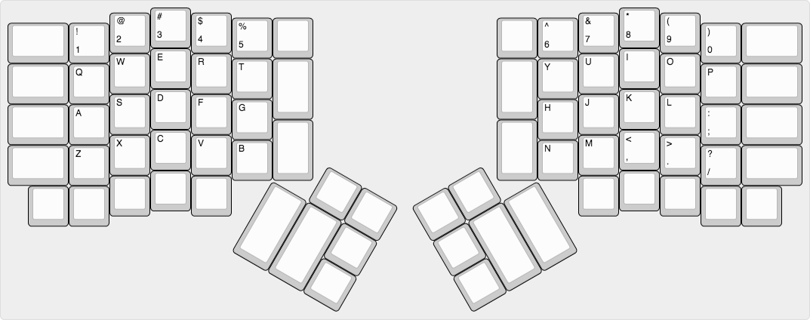

## Who is this article for

This article is for people who have some familiarity with mechanical keyboards
already. If not, you should read my first article,
[Mechanical Keyboards 101](/blog/2018/mechanical-keyboards-101/). You might be
considering building your own keyboard or trying out more niche hardware.

## Why you might build your own

There are a few main reasons you might want to build your own keyboard: it's a
learning experience, you want to try hobbyist keyboard switches, or you want to
try an obscure keyboard layout (small, split, etc).

## Why you might not build your own

Before we embark on this journey I do caution you that it is not without its
perils. First of all, building custom keyboards and getting into niche hardware
is an expensive hobby. It is also filled with FOMO (fear of missing out). Many
things in this hobby are done as Group Buys (GB), where you pay to pre-order a
product that may only ever get made once, if it doesn't get canceled.
Additionally, if you want to create a full size or ten-keyless keyboard, there
are _very_ few custom options for those form factors.

## Jargon dictionary

This little dictionary should help you understand some of the incomprehensible
jargon thrown around by keyboard enthusiasts.

### Keeb

> Short for keyboard, keeb is a fun word for talking about keyboards. You may
> also see "MK" for mechanical keyboard. I think keeb is more fun though.

### Stab

> Stabilizers are often called stabs. They are used to keep long keys from
> becoming misaligned while typing.

### Lube

> Lubricant is usually just called lube, and it's applied to stabilizers and key
> switches in order to make them smoother and quieter. It's generally a liquid
> or thin paste which fills in the rough surface on the metal or plastic pieces
> that are touching each other.

### MoQ (minimum order quantity)

> The smallest order size a factory will take. Running a factory is hard work,
> and calibrating everything just to make a single keycap set is expensive. This
> number allows the factories to make a profit.

### GB (group buy)

> This is a selling method usually used for custom keycaps. Keycaps are
> generally made in large factories, but such factories have high MoQs, so it's
> too expensive for one person to buy enough keycap sets to cover the MoQ
> themselves. With a group buy, many people online pre-order the keycaps
> (several months in advance), and if the MoQ is reached, eventually get their
> keycaps in the mail.

### IC (interest check)

> Usually a Google Form, this is a survey about a potential group buy, in order
> to gauge interest and receive feedback (e.g. I really wish this keycap set
> supported my Ergodox, that shade of blue is not pretty, etc)

### QMK (quantum mechanical keyboard)

> This is the most common custom firmware for keyboards. It is written in C and
> hosted on GitHub. It is designed to be extensible so that new keyboards can be
> easily added to the QMK project, allowing the PCB to communicate with a
> computer as a keyboard.

### PCB (printed circuit board)

> This is the "chip" that powers the keyboard, which all the components plug
> into.

### Nippers

> These are basically specialized pliers designed for cutting thin soft plastics
> and metals. Please do not use scissors instead.

### OEM, DSA, SA, DCS, XDA, Cherry profile

> These are keycap profiles (shapes). See this
> [helpful comparison image](http://i.imgur.com/kFxqOm8.jpg) from
> [u/jacobolus](https://www.reddit.com/user/jacobolus).

### ABS (acrylonitrile butadiene styrene)

> ABS is the most common type of plastic used for cases and keycaps. It is
> versatile, but tends to become "shiny" (smooth and reflective) over time and
> with repeated typing. This leads to the perception of it as lower quality than
> PBT.

### PBT (polybutylene terephthalate)

> PBT is a type of plastic that is much more resistant to "shining". Many PBT
> keycaps are also made thicker than ABS keycaps, which gives a deeper sound
> when typing.

### POM (polyoxymethylene)

> POM is a very smooth plastic. It does not get used much for keyboards, but a
> few keycap sets are available using it, and the NovelKeys Cream switches.

### dye-sub (dye-sublimated)

> Dye-sublimation is a durable printing process used for making the legends
> (letters) on keycaps. Note that because this process uses dye, you can only
> make colors darker, not brighter. This means that you cannot print white text
> on a black plastic, for example. This method is usually used for PBT keycaps.
> Complex multicolor graphics can be printed using this technique.

### double-shot

> Double-shot injection molding is a technique that involves using two separate
> plastics (usually ABS) in order to make a keycap. This is the ideal method for
> two-colors designs on keycaps. It will never wear off, and you can combine any
> colors you'd like (such as white text on black plastic). This is generally not
> done for PBT plastic.

## Parts: Case

This is the base of your keyboard. Either the PCB or the plate screws into this
piece in order to hold everything together. It usually has rubber feet to give
it grip to keep from sliding. Cases also add weight to keep your keyboard solid
and in place.

## Parts: PCB

This is the part that the key switches and USB cable plug into. Some PCBs are
very barebones and require soldering your own diodes and microcontroller in
order to work, while others only require soldering switches, and the most
convenient ones don't require a single drop of solder.

Technically this part can be replaced with hand-wiring, but you should look up
how to do that yourself.

## Parts: Plate

Plates are generally sheets of aluminum with holes that key switches slot into.
They are optional depending on your case, but can provide additional rigidity
and weight to your build. That being said, they also complicate a build and make
keyboard maintenance harder (especially if the switches are soldered on).

## Parts: Key switches

Most keyboards come stock with Cherry MX switches. If you are building your own,
you can also use most Gateron or Kailh switches. These come in two varieties:
PCB mount (also called 5-pin) and plate mount (also called 3-pin). If you are
using a plate, you can generally use either. If you are not using a plate you
_must_ use the PCB mount variety or else the switches will not align correctly.

Everything related to keyboards comes down to personal preference, but that's
never more pronounced than with key switches. The only real way to see what you
like is to use them. If you can afford it, a
[switch tester](https://kbdfans.cn/products/kbdfans-72-switches-tester-all-in-one)
can help you narrow down your options, but it's still quite a bit different from
actually typing on those switches in a real keyboard.

## Parts: Stabilizers

Stabilizers are required for most keyboards. Keys are measured in "units", which
are the width of alphabet keys. This is typically abbreviated as 1u, 1.5u, 2u,
6.25u, etc. Keys that are at least 2u wide require stabilizers (also called
"stabs") to keep from tilting side-to-side. Most keyboards use "Cherry"
stabilizers which mount directly to the PCB. Most keyboards have several 2u
stabilizers and one 6.25u stabilizer for the spacebar.

Most stabilizers are poorly made. They usually rattle like a jar full of coins
when pressed. Fortunately, a small bit of lube and nippers can fix stabilizers
to be quiet and smooth. See the
[stabilizer mod video](https://www.youtube.com/watch?v=cD5Zj-ZgMLA) by Taeha
Types for instructions on how to do this.

## Parts: Lube

This is technically optional, but I highly recommend buying lube at least for
your stabilizers if you build your own keyboard. It will make a huge difference
in smoothness and volume. If you have the patience for it, you can also lube
each switch in your board, as demonstrated in this
[switch lube video](https://youtu.be/qSgPKPoFo2k?t=109) by Taeha Types.

## Parts: Keycaps

Little pieces of plastic (generally ABS or PBT) that fit on top of the switches
so they are comfortable to push with your fingers. They are removable using a
keycap puller, and are the most fun part of customizing your keyboard. Generally
these are built to be MX compatible. They come in a myriad of different profiles
(shapes) depending on how you like it to feel when you type (Cherry, OEM, DCS,
DSA, SA, etc).

## Equipment

Most cases come with all screws necessary, and I assume you have access to a
Phillips (+) head screwdriver.

For _lubing_, you will need access to the following items:

- A [thin paint brush](https://www.amazon.com/gp/product/B01HWCAGQQ) to apply
  the lube

- A
  [key switch opener](https://kbdfans.cn/collections/keyboard-part/products/gb-2-in-1-machined-aluminum-switch-opener)
  is technically optional, but will save you a lot of time and effort

- Lube such as
  [Krytox GPL 205](https://www.1upkeyboards.com/shop/misc/krytox-gpl-205/), or
  other
  [similar lubes](https://www.1upkeyboards.com/shop/parts-and-tools/lubricant/switch-lubricant-2ml/)

For _soldering_, you will need access to the following items:

- A soldering iron
  ([budget kit](https://www.amazon.com/ANBES-Soldering-Iron-Kit-Electronics/dp/B06XZ31W3M)
  with some extra goodies or a
  [deluxe model](https://www.amazon.com/Hakko-FX888D-23BY-Digital-Soldering-Station/dp/B00ANZRT4M)
  without extras)

- A damp sponge or
  [brass sponge](https://www.amazon.com/Hakko-599B-02-Wire-type-soldering-cleaner/dp/B00FZPGDLA)
  for cleaning the soldering iron tip (**do NOT use your kitchen sponge unless
  you want lead poisoning**)

- A
  [solder sucker and a solder wick](https://www.amazon.com/Tabiger-Solder-Desoldering-Sucker-Remover/dp/B0777LMVTT)
  (or a
  [desoldering iron](https://www.amazon.com/American-HAKKO-Products-FR301-03-Desoldering/dp/B07BFVFMS9)
  if you have lots of money)

- [Solder](https://www.amazon.com/gp/product/B00B1JKEHS), ideally 67/37 tin/lead
  split with rosin core for fast melting

If you use a _plate_, you should get an
[IC puller](https://www.amazon.com/a13032100ux0040-Anti-Static-Motherboard-Circuit-Extractor/dp/B00CQI99K6)
(also called a switch puller), to easily remove switches from the plate without
breaking them.

You should also buy a
[keycap puller](https://www.amazon.com/WASD-Keyboards-Wire-Keycap-Puller/dp/B00AZCGF7K)
to safely and easily remove keycaps.

## Soldering vs hot-swap

The first decision you need to make when you're considering building your own
keyboard is whether you want to solder or not. I was initially scared of
soldering, but I promise you can learn it if you want to.

You can search for soldering tutorials yourself, but at the end of the day it's
using a hot stick to melt metal and glue two things together. Don't be afraid,
just treat it with respect and be careful.

That being said, solder-free builds can be really nice. They are typically made
using boards that come with "hot swap sockets" preinstalled. These are basically
a tight fitting hole that the plugs on the keyboard switches can fit snugly
into, like a cable into a port. It's less durable than soldering, but way faster
if you want to change things later.

## Kits and builds

### Solder-free hot-swap plate-free build for quick maintenance and trial:

- [1upkeyboards RGB PCB hot-swap edition](https://www.1upkeyboards.com/shop/controllers/1up-rgb-pcb-hse)
- [Frosted acrylic 60% case](https://www.1upkeyboards.com/shop/bases-and-cases/acrylic-60-base-frosted)
- [GMK screw-in stabilizers](https://www.1upkeyboards.com/shop/parts-and-tools/parts/gmk-screw-in-stabilizers)

This is a great setup for getting started. It's \$108, ships from the US, and
the only things left to buy are switches and keycaps. Because there's no plate
or solder, you can remove the switches and stabilizers at any time. This is
great if you don't want to lube your switches and stabilizers before your build,
but you feel like doing it later.

### More expensive hot swap kit:

- [DZ60RGB hot-swap DIY kit](https://kbdfans.cn/collections/diy-kit/products/kbdfans-dz60rgb-ansi-hot-swap-diy-kit)

This is a top of the line case and PCB. The only things you need to buy for this
build are switches and keycaps. The kit is \$159, plus the cost of your switches
and keycaps.

Please note that if you want to actually see the RGB under-glow you will need to
choose the acrylic case.

As for plate options, this is really a personal preference thing. Polycarbonate
is transparent and would look really good with the acrylic case, whereas brass
is really heavy and will provide a very solid feel for your keyboard.

### Cheaper 65%:

- [Tada68 keyboard DIY kit](https://kbdfans.cn/collections/diy-kit/products/tada68-keyboard-diy-kit)

Still not sure you can live without dedicated arrow keys? Don't worry, the \$89
DIY kit for the Tada68 is a great deal. If you have a bit more money, you can
upgrade to the aluminum case option for a bit more weight and elegance.

### Minimal soldering 40% keyboard kit:

- [Zlant 40% keyboard kit](https://www.1upkeyboards.com/shop/keyboard-kits/diy-40-kits/zlant-40-keyboard-kit)

This \$70 DIY kit has everything you need to make your first 40% keyboard, and
at only 48 keys the build should go by quickly.

### Good soldering tutorial macro pad:

- [Sweet 16 macro pad](https://www.1upkeyboards.com/shop/keyboard-kits/macro-pads/sweet-16-macro-pad-black)

This \$19-29 macro pad kit is a low stress option for your first soldering
project. Note that this macro pad requires you to solder your own
microcontroller (Pro Micro) and diodes, a step that is often not required for
other PCBs. This will make the build take a bit longer, but it's also great
practice for building other niche keyboards that do not come with these
components preinstalled on the PCB.

## QMK

QMK is the firmware that powers most custom built keyboards. If you're feeling
nerdy, you can clone the [QMK GitHub repo](https://config.qmk.fm) and compile
your own keymap locally, though it's easier to get started using their
[online keyboard editor](https://config.qmk.fm). You will then need to install
[QMK Toolbox](https://github.com/qmk/qmk_toolbox/releases) in order to install
the firmware on your keyboard. Please note that Windows users must install
[some drivers](https://github.com/qmk/qmk_driver_installer/releases) first.

This part can be a bit confusing, but the plus side is that QMK firmware is code
that runs _on_ the keyboard, so your keyboard will work exactly how you want
when plugged into _any_ device.

The biggest feature of QMK is layers. They are basically like the `Fn`
(function) key on many laptop keyboards, except you can have up to 15 of them.
This allows you to do things like add a numpad mode to your keyboard, media
hotkeys, hidden arrow keys on WASD, or anything you can dream up. You can also
use them to toggle between modes sort of like caps lock or num lock.

## Niche layouts

60% layouts have the most options for keycaps, cases, and PCBs. They are a great
starting point for building your keyboard. Note that most 60% keyboards do not
have dedicated arrow keys, so you will need to program your keyboard to have
arrow keys in a different way (many people use the Function key with WASD or
IJKL).

**ANSI (US) 60% layout**

**ISO (European) 60% layout**

40% keyboards are relatively quick to build, and some don't even have
stabilizers. However there are far fewer options. These keyboards lack number
keys, so you have to hold down a function key in order to type those. This is my
personal favorite kind, but be advised it will take a few weeks to get back up
to good typing speed if you need to type a lot symbols or numbers.

**JD40 40% layout**

**Zlant 40% layout**

Ortholinear keyboards make the rows of keys all line up to form a perfect grid,
instead of the jagged edge you see on most keyboards. There's no research
showing if this has any benefits, but I personally think it's more comfortable.

**Planck 40% ortholinear layout**

Split keyboards are great for maintaining good posture and a healthy shoulder
spread through your work day. They are harder to build, and there are few
options, but many people never go back once trying them.

**Ergodox split layout**

**Let's Split split layout**

## My favorite shops

These are my favorite shops I've purchased from (shipping to the US). Please
note that some of these sites primarily deal in group buys, and thus may not
have much of interest to order right now depending on when you look.

[NovelKeys](https://novelkeys.xyz/) is my overall favorite shop. They have an
amazing selection of switches and desk mats, and run many group buys. They also
work closely with Gateron to make new types of switches available (NovelKeys
Creams, Gateron Silent Yellow, etc).

[Signature Plastics](https://pimpmykeyboard.com/) is my number one stop for
keycap sets. They have high quality DSA profile caps made from PBT in many
colors, and produce sets to fit specialty keyboards like the Planck, Ergodox,
and more. I recommend any of the DSA sets, especially the
[dye sublimated sets](https://pimpmykeyboard.com/dsa-sublimated-keysets/).

[1upkeyboards](https://www.1upkeyboards.com/) has a variety of items, including
lube, as well as some nice budget options for DIY kits. Their skeleton kits are
very affordable, and the 1up RGB PCB hot-swap edition is a fantastic PCB.

[KBDfans](https://kbdfans.cn/) has an extremely large selection, though some of
their listings are a bit confusing to me. The DZ60 PCB from them is one of the
most flexible 60% PCBs on the market, and their Tofu case is highly regarded for
its weight and shape. Please note they ship from China, so shipping is a bit
slower than other shops on this list.

[TheKey.Company](https://thekey.company/) runs many excellent keycap group-buys,
as well as offering the unique CandyBar layout keyboard.

[Cannon Keys](https://cannonkeys.com/) makes the affordable Ortho48 alternative
to the Planck.

[OLKB](https://olkb.com/) is the official seller of the Planck and Preonic
ortholinear keyboards, but they are very slow to fill orders (over half a year
for me).

[KeyHive](https://keyhive.xyz/shop) has the parts you need to build the Corne
40% split keyboard.

[Little Keyboards](https://www.littlekeyboards.com) has many excellent split
keyboard cases and the PCBs to go with them.

[Keebio](https://keeb.io/) is the home of the Iris and Levinson split keyboards,
as well as many parts needed for more advanced builds (spacers, diodes, LEDs,
microcontrollers, etc).

## What now?

I normally check out
[r/MechanicalKeyboards](https://www.reddit.com/r/MechanicalKeyboards/) for
updates and photos about what's new in the world of keebs.

Depending on where you live, there might be a regional meetup. I highly suggest
checking out this
[meetup list](https://www.reddit.com/r/MechanicalKeyboards/wiki/meetups) to see
if there's one near you.

## Updates

**2019-08-12**

- Added link to _Little Keyboards_.
