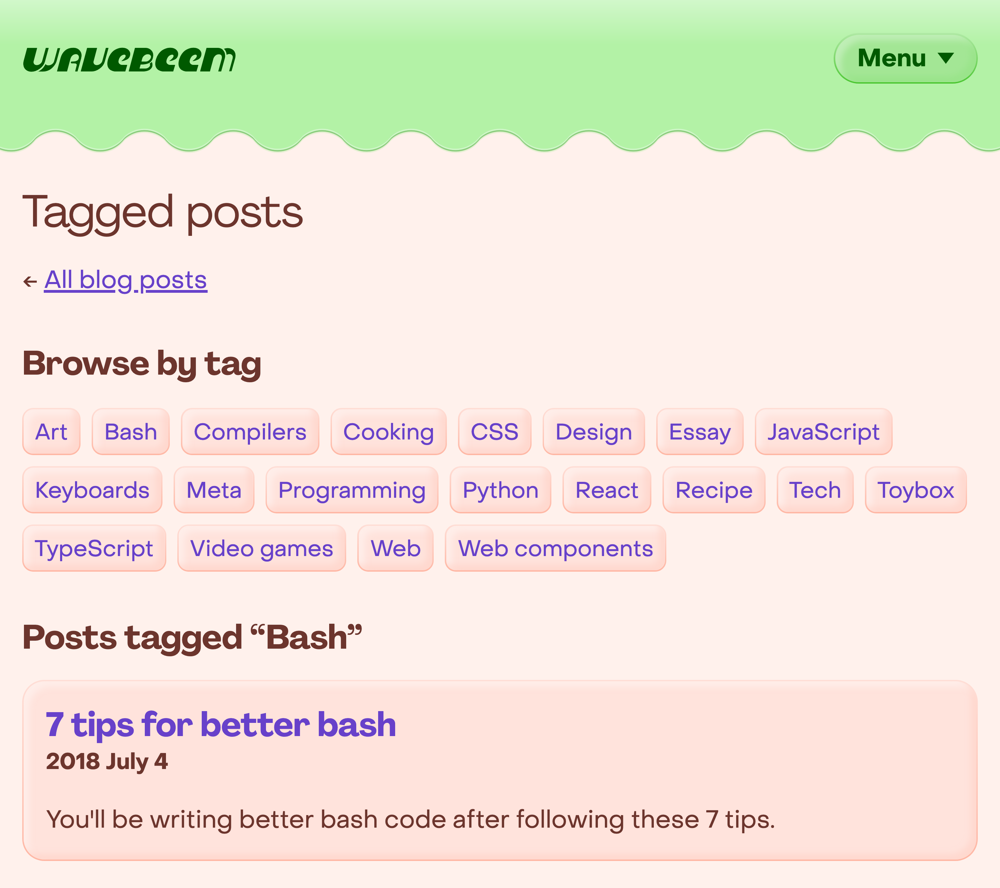
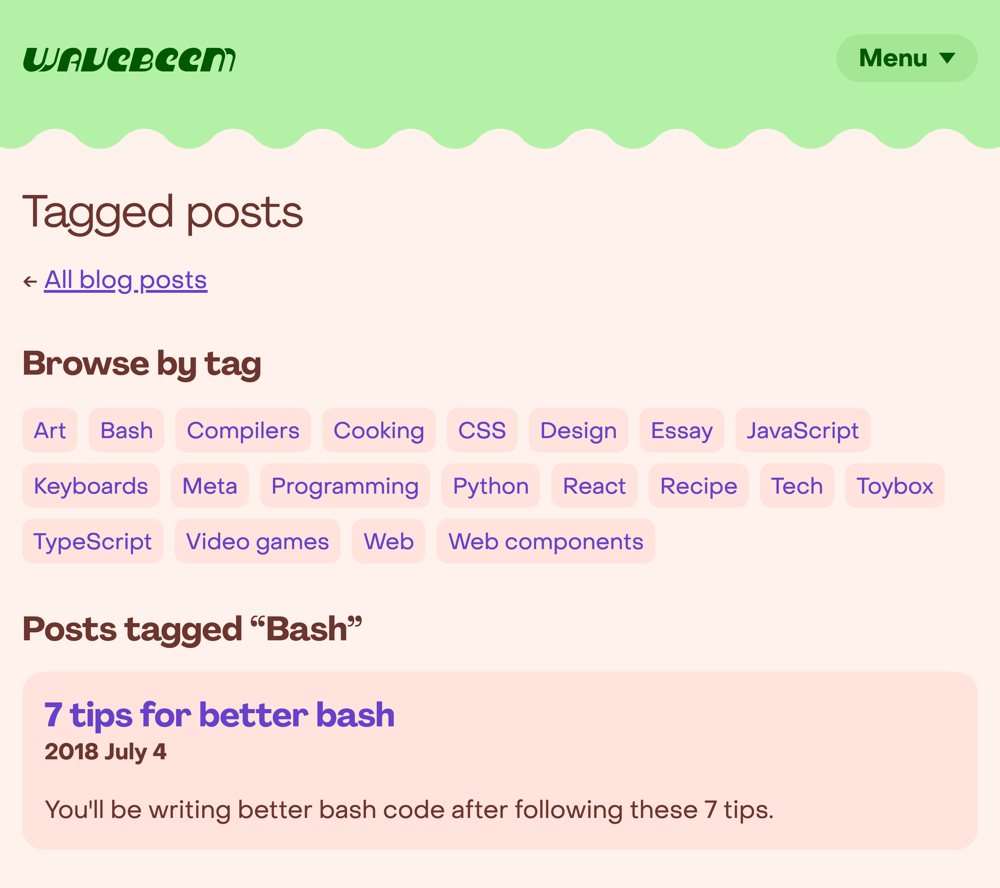

## The hottest design trend from... 2 years ago

I finally decided to play around with claymorphism! It's basically a trend about
making everything look like puffy 3D shapes. It was... really popular for both
"Metaverse" and NFT things. Heck, even my local\* grocery store started using
the design trend.

\*Owned by a national chain for most of my life.

## Show me the clay!

I can really feel things jumping off the page at me! Which also means that pages
with fewer containers (e.g. blog posts) can feel weirdly flat compared to
others.

**Experimental puffy 3D design**

Yeah, flat design is played out, but it's "cheap and easy", and I'm learning to
appreciate that right now. The whole point of the [toybox](/toybox/) and
[shrines](/shrines/) was to give me a place to mess around with CSS that
_wasn't_ running the rest of my site lol.

**Current flat design**

## Why bother?

It turns out that people love 3D and borders and shadows and lighting. Hyper
flat design can be mentally taxing, and people want things that look like things
again.

## Don't underestimate the extra work

I actually quite like how the puffy 3D version of my page looks, but it's hard
to pull off! Suddenly each shape requires four colors instead of one. And you
need to match the roundedness to the padding of the object for optimal
puffiness. Not to mention dark mode.

I think that a puffy 3D design benefits from having a wider variety of bold
color choices than my website is currently using, as well.

## Coming soon to the toybox?

I think maybe next I'll make a toybox toy that's just a bunch of claymorphism
buttons and stuff. I think the effect probably works best if you have a full
page done in the style, but folks liked my previous post about 3D buttons, so I
think even something minimal will be fun.

## Further reading

- [Claymorphism: Will It Stick Around?](https://www.smashingmagazine.com/2022/03/claymorphism-css-ui-design-trend/)
  &ndash; Smashing Magazine

- [Claymorphism CSS Generator](https://hype4.academy/tools/claymorphism-generator)
  &ndash; SquarePlanet
