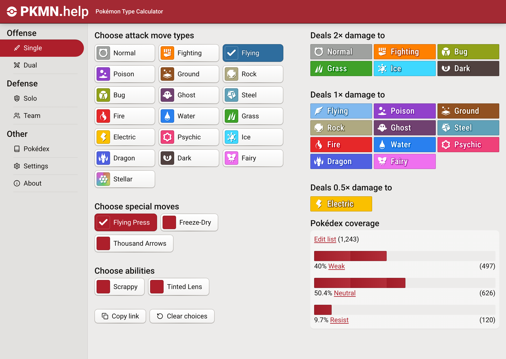
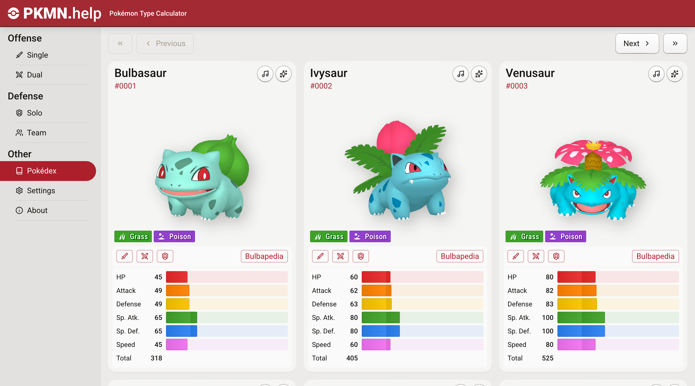

---

All this despite what I said in my last post. I even did a big redesign that I'm
really proud of. I'm commissioning my pal Z.H. to work on icons and a new logo
for the site, too. I can't wait to unveil the new icons and logo when they're
done. But for now, the new features and new design are pretty big.

<figure>
  
  <figcaption>The new type images and site theme really make the content pop</figcaption>
</figure>

<figure>
  
  <figcaption>The new Pokédex card view feels more balanced</figcaption>
</figure>

## Listening to feedback

Not everyone is great at giving feedback in an entirely kind way, but I've been
practicing seeing through tone and understanding what's ailing the site's
visitors. It became clear that there was _too much red_ on screen, especially in
dark mode. I needed to design something more minimally accented, so that my
hardcore\_ visitors could focus on their calculations---totally fair!

I still value keeping an open email inbox for the website. I get some great
ideas and feedback from people who contact me. And I really enjoy the human
connection. Additionally, basically nobody ever doubles down on being rude to
me. Basically every time someone is rude to me, I remind them that I am a
singular person donating my free time to make something for them, and they
usually are quick to apologize and have a delightful conversation with me. I
think there's something different about email as a medium vs social media. I can
hardly imagine having such an interaction over 280 characters at a time and with
quote reposts or whatever nonsense.

One of these conversations even ended recently with the visitor deciding to
donate monthly to a transgender rights charity, which absolutely made my day.

## Accessibility is complicated

In an effort to be accessible, my site used a lot of high contrast colors for a
very long time. After recently re-reading the
[WCAG 2.1 Non-text Contrast](https://www.w3.org/WAI/WCAG21/Understanding/non-text-contrast.html)
document, I realized I was going a little overboard.

### Buttons

Buttons only need their text to meet contrast guidelines, though a 3:1 contrast
ratio is recommended. Parts of my button still meet 3:1, but the overall
presentation feels a lot more "button shaped" this way.

> A button which has a distinguishing indicator such as position, text style, or
> context does not need a contrasting visual indicator to show that it is a
> button, although some users are likely to identify a button with an outline
> that meets contrast requirements more easily.

### Meters

There are several meters on PKMN.help, representing either percentages or
Pokémon stats (out of 255). Since all of these use cases have accompanying 4.5:1
contrast ratio text, it's ok to keep the contrast lower on these meters. I
referenced the example about pie charts from this page:

> To understand the pie chart you have to discern each slice of the pie chart
> from the others.
>
> The graphical objects are the slices of the pie (chart).
>
> Note: If the values of the pie chart slices were also presented in a
> conforming manner (see the Pie Charts example for details), the slices would
> not be required for understanding.

## An external contribution

I recently received a surprise pull request for adding a
[clear choices button](https://github.com/wavebeem/pkmn.help/pull/385). It's
pretty rare to receive pull requests for PKMN.help, and even more rare for
developers to actually address my code review feedback and ultimately get the
code merged.

I have a whole
[32 issues in the backlog](https://github.com/wavebeem/pkmn.help/issues), and
honestly I've wondered if I should advertise that I would love help with working
on them. Half the time what I end up working on is stuff that's not even in
there anyways.

## PKMN.help changelog

### 2025-12-20

- Pokédex search now supports English in addition to your currently selected
  language

  - e.g. Searching for "Clefable" in German will now return "Pixi"

- Updated German translation

- Fixed an issue where the "Copy link" and "Clear choices" buttons were
  sometimes cramped on the screen

- Fixed an issue where the select menus looked really bad on Windows, especially
  in dark mode

- Fixed an issue where clicking the dual type calculator link in the Pokédex
  didn't select the correct types

- Added Desolate Land and Primordial Sea

### 2025-12-18

- Updated French translation

### 2025-12-17

- Restored the previous height of the mobile page header

- Minor changes to theme highlights and shadows

### 2025-12-16

- Updated the visual style of the website a lot

  - Hopefully you can better focus on the content of the website now

- Pokédex entries now have separate buttons for Dual Offense and Single Offense
  calculator links

- Increase density of dual offense matchup results

- Changed the order of Offense "Dual" and "Single" calculators

  - Sorry! I realized the order wasn't consistent between offense and defense

- The Pokémon easter egg button is now at the bottom of the "About" page

  - Sorry for surprising everyone who clicked it on accident before

- Improve text rendering on macOS

- Renamed "Combination" to "Dual" in the Offense calculator URL

- Fixed a text wrapping bug in Chinese in the team defense table

- Fixed a text overflow bug in Russian in the dual offense matchup results

### 2025-12-15

- Added a "clear choices" button to the calculators

- Updated Pokédex with new Mega Evolutions

### 2025-12-07

- Type matchups are now more compact, especially on mobile

- The Team Defense matchup table is now shown even if no Pokémon are selected

- Type badges have centered text again
