---

Is anyone else sick of flat design? Humans have a remarkable ability to
interpret lighting, and we so rarely lean on that. Maybe it's because I bounce
back and forth between video games---where ornamental user interfaces are
common---and enterprise software, where everything is a big flat labyrinth of
shit. I know how much more fun we can have, and the web is absurdly powerful
compared to the early days of CSS.

It feels like the moment we got gradient support in every browser, we stopped
giving a shit about them! Of course, I blame Jony Ive and iOS 7 for this
influence. Granted, iOS 8 was loaded with gradients on its home screen icons,
but they were tacky and unimportant compared to the new drab white and blue
aesthetic across the app interfaces (See this
[iOS 6 vs iOS 7 comparison](https://iphoneroot.com/ios-6-vs-ios-7-side-by-side-comparison-86-photos/)
for more).

<figure>
  

    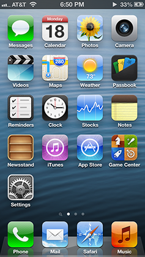
    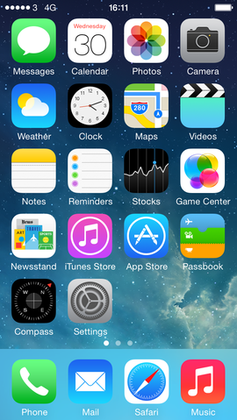
  

  <figcaption>iOS 6 vs iOS 7</figcaption>
</figure>

[USA Today interviewed Jony Ive and Craig Federighi](https://www.usatoday.com/story/tech/2013/09/19/apple-jony-ive-craig-federighi/2834575/),
who had some interesting quotes about the iOS 7 redesign:

> **Jony Ive:** "When we sat down last November (to work on iOS 7), we
> understood that people had already become comfortable with touching glass,
> they didn't need physical buttons, they understood the benefits," says Ive.
> "So there was an incredible liberty in not having to reference the physical
> world so literally. We were trying to create an environment that was less
> specific. It got design out of the way."

I feel like in hindsight this was either incredibly naive or genius. Juice is
expensive to create. Why spend more time (which is money) tasking your designers
with crafting lickable buttons, when they can spit out a fully flat rounded
rectangle in seconds.

> **Craig Federighi:** "This is the first post-Retina (Display) UI (user
> interface), with amazing graphics processing thanks to tremendous GPU
> (graphics processing unit) power growth, so we had a different set of tools to
> bring to bear on the problem as compared to seven years ago (when the iPhone
> first launched)," he says. "Before, the shadowing effect we used was a great
> way to distract from the limitations of the display. But with a display that's
> this precise, there's nowhere to hide. So we wanted a clear typography."

I'm guessing by clear typography that Craig is referring to the razor thin text
with insufficient background contrast that plagued iOS 7. The last iPhone I
personally owned was the iPhone 6. It came out in 2014, about a year after iOS
7's debut.

iOS 6 looked pretty tacky overall, especially the game center (🤢), but the
reaction to that should've been refinement, not throwing everything away. I'll
admit that I thought Microsoft's Metro UI was incredibly cool, and is the most
stark text heavy flat design that had any decent popularity (at least under its
bastardized Windows 8 variant that married existing Windows aesthetics and Metro
UI like oil and water).

<figure>
  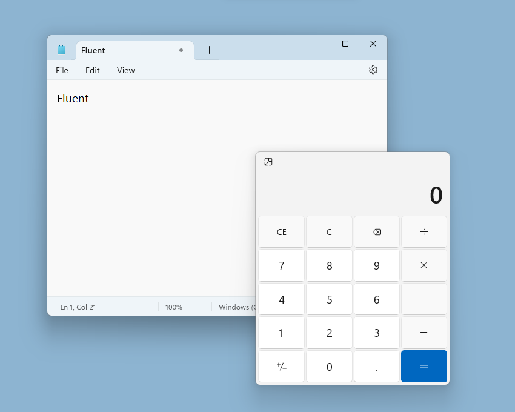
  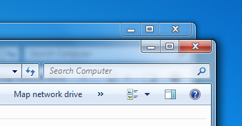
  <figcaption>Windows 11 Fluent vs Windows Vista Aero</figcaption>
</figure>

Both Aero and Fluent attempt to "get out of the way", but Aero maintains shapes
and lighting in a way that helps guide the user. Fluent has flattened everything
and removed so many borders that nothing makes sense any more.

---

Anyway, this is all to say that one random little piece of my website's UI, the
gradient faded card, has inspired me to add even more "juice". I worked hard on
lighting approach that looks classy and functional. Lighting subtly draws your
attention to where it needs to go, without needing big ugly bordered boxes
everywhere. Despite all the squares, I think the gradients and partial borders
keep it looking slick.

<figure>
  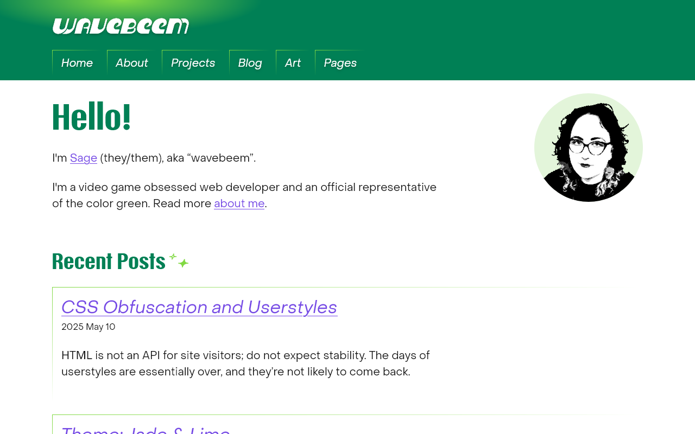
  <figcaption>Desktop <q>above the fold</q></figcaption>
</figure>

This image shows how the "lighting" (a gradient background on the logo) casts
its light onto the edges of the navigation

<figure>
  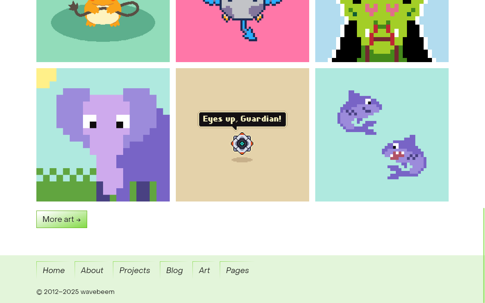
  <figcaption>Desktop at the bottom of the page</figcaption>
</figure>

<figure>
  

    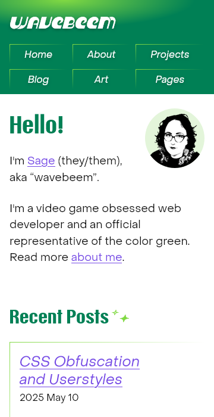
    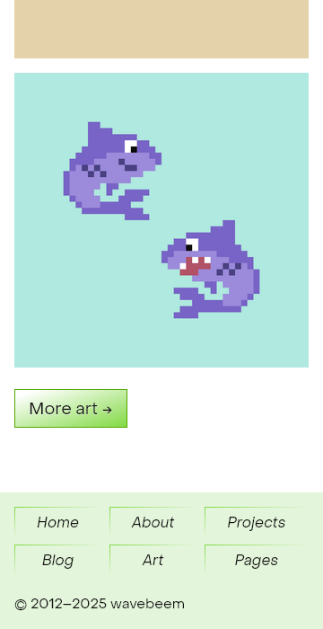
  

  <figcaption>Mobile view with grid-based navigation</figcaption>
</figure>

---

I wanted to include a few video game UIs I've looked at recently with some good
"juice" to them.

<figure>
  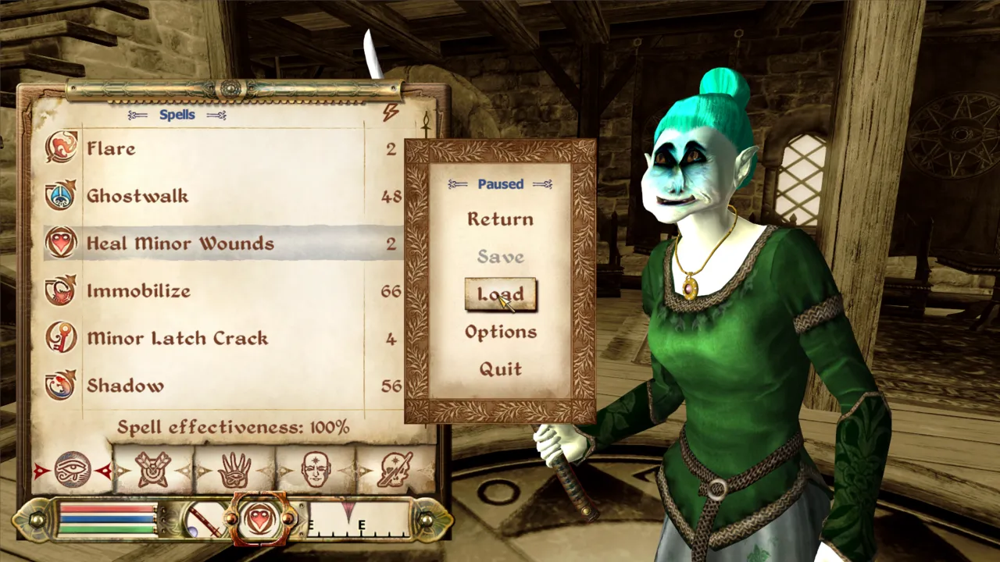
  <figcaption>The Elder Scrolls IV: Oblivion</figcaption>
</figure>

Strictly speaking the UI looks dry and dusty, but this is a kind of stone and
parchment juice that gives Oblivion a lovely old timey feel.

<figure>
  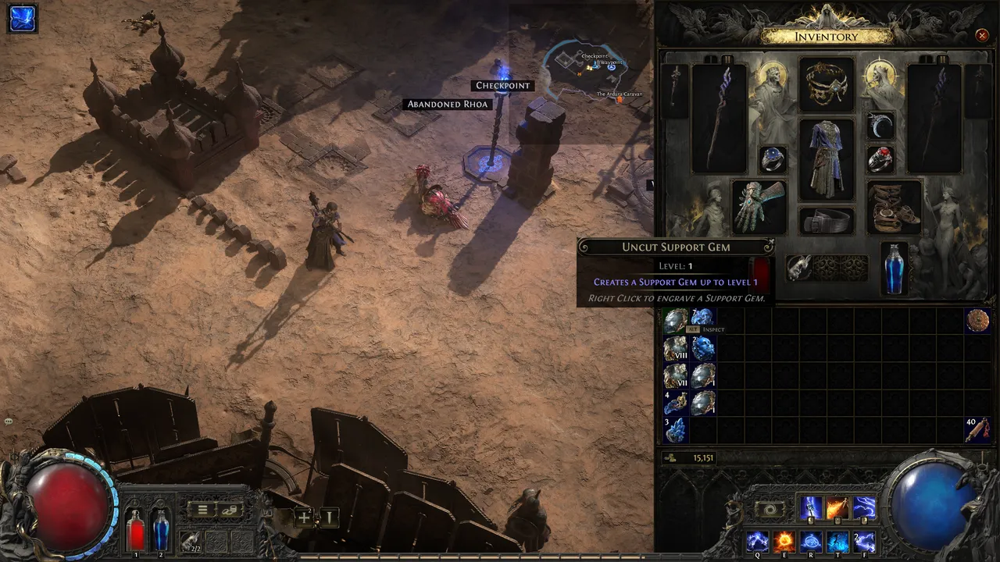
  <figcaption>Path of Exile 2</figcaption>
</figure>

The mouse cursor emits a small light source that is lightly reflected by the UI
elements... an incredible addition to this juicy UI.

<figure>
  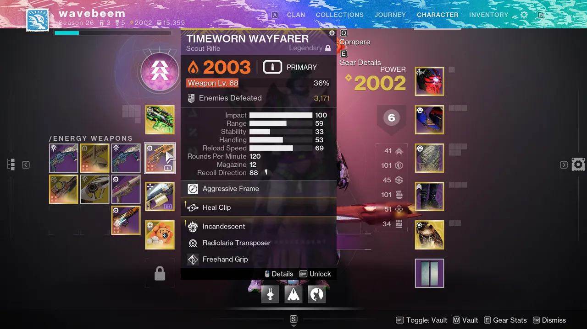
  <figcaption>Destiny 2</figcaption>
</figure>

Destiny is actually pretty modern with its flat squares design, but even then we
have little bits of juice, like ornamental textures, and gold borders that
appear to be glowing. Perhaps subconsciously I was thinking of these boxes when
I designed my cards...
