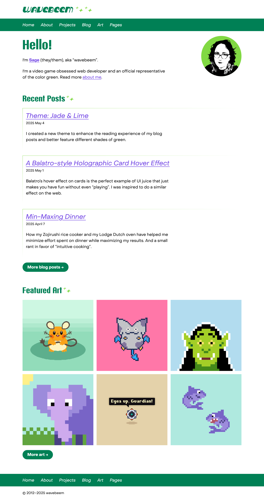
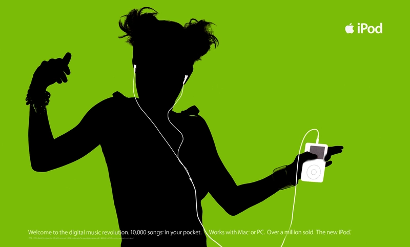
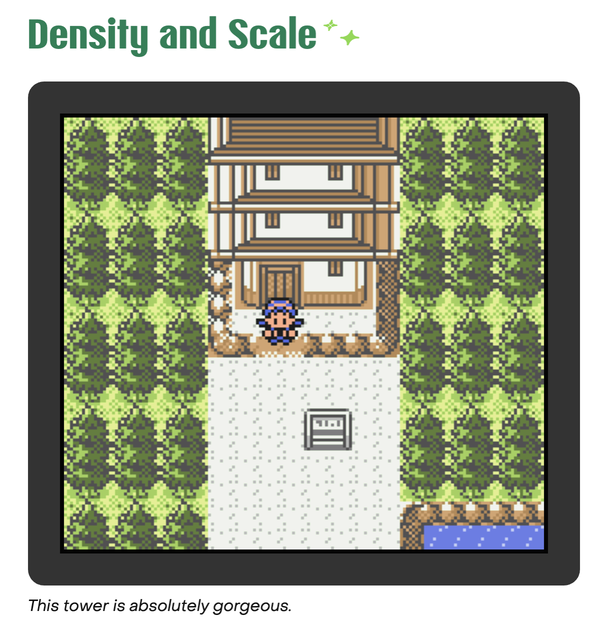

---

Yeah, I made a [new design for my web page](/past-designs/). Again.

This one is partially a throwback to my older themes that were more "white and
green". I might still play around with the specific greens in the future, but
I'm happy enough with this theme to ship it.

The amount of effort to come up with _and_ execute a new design is pretty high,
and I usually end up a bit exhausted after a redesign. And even if I like it, it
can be hard to remember that I'm just _tired_, not that I wasted my time or
anything.



---

I'm particularly happy with how the "card" component came out. The faded
half-card design suggests enough card shape to guide the eye without making the
"open" design feel too boxed in.

The new avatar styling was done via dithering my photo in Aseprite, then
resizing it repeatedly to smooth everything out into a few shades of gray. I
overlaid it on my accent green for fun. The whole thing is kinda reminding me of
those old iPod ads in the best way.



---

I removed my [Balatro hover effect](/toybox/2025/balatro/) easter egg from the
main page, but you can see it now in the toybox. I didn't stop loving it. In
fact, I made it cooler and bigger. But I was tired of its presence on the main
page. Perhaps I will add another easter egg in the future.

---

I also updated my Pokémon Crystal screenshots to have a cool new Game Boy
Color-style frame around them:



---

There seems to be a bug with `text-wrap: balance` in Safari right now where it's
line wrapping headings on every single word. It looks absolutely awful, so I've
turned off this feature in just Safari right now.

I borrowed this approach from a Stack Overflow post. Apparently only Safari has
this weird Apple Pay button style thing you can detect without using any JS.
Maybe at some point I'll add my own tiny script like Modernizr or whatever to
detect features and browsers for CSS to hook into, but I can't be bothered right
now.

```css
@supports (-apple-pay-button-style: inherit) {
  /* Safari CSS goes here */
}

@supports (not (-apple-pay-button-style: inherit)) {
  /* non-Safari CSS goes here */
}
```

**WebKit issue:**
[text-wrap balance doesn't work correctly with non-zero word-spacing](https://bugs.webkit.org/show_bug.cgi?id=292563)
