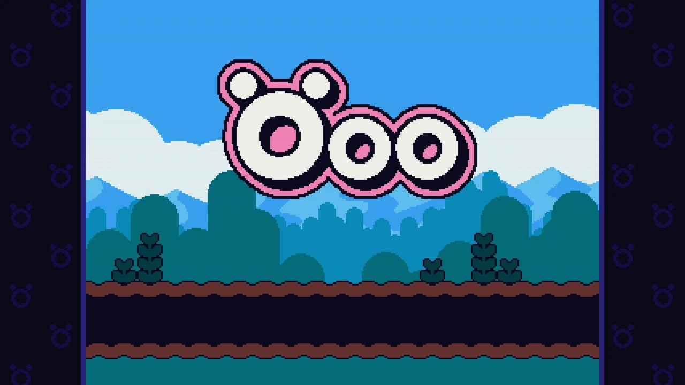
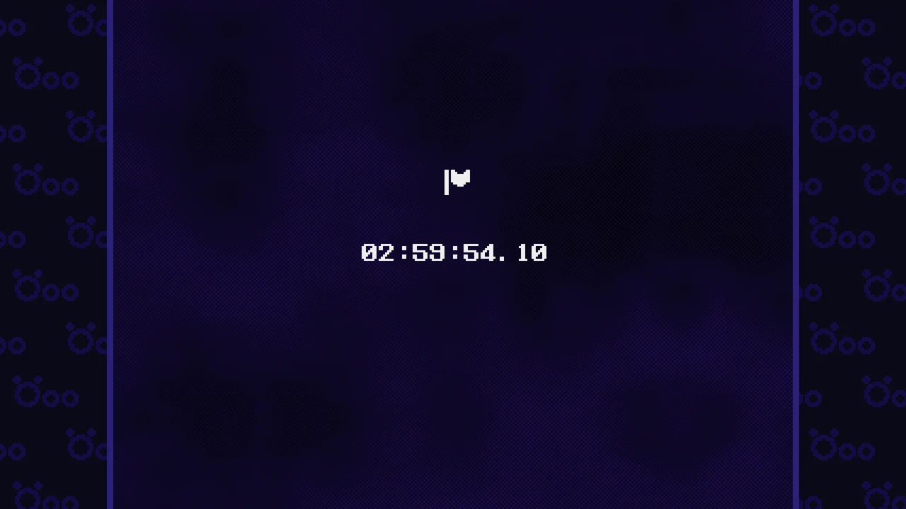
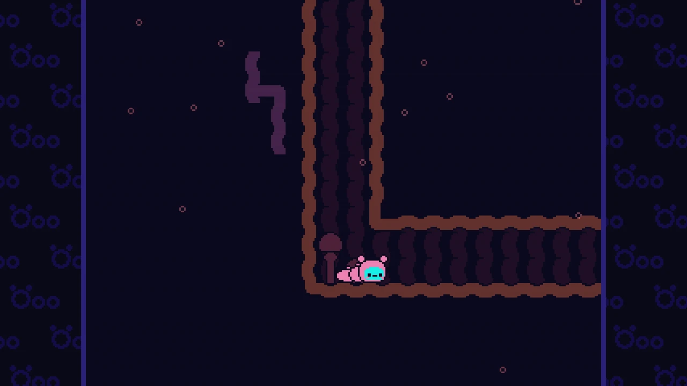
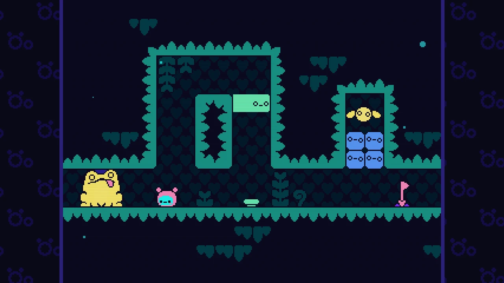

---

I beat [Öoo](https://store.steampowered.com/app/2721890/oo/) a few weeks ago,
but I forgot to post my review at the time.

<figure>
  
</figure>

The game took me just under 3 hours, but I did look up a puzzle solution on one
puzzle after being stuck without making progress for 10-15 minutes or so.

<figure>
  
</figure>

The hook in this game is that you're a little tiny caterpillar (you look like
Öoo) whose body is made of bombs. Rather than jumping, you detonate the little
bomb pieces of your body to propel yourself, and then they eventually
regenerate. It's genius.

<figure>
  
</figure>

Like [ElecHead](https://store.steampowered.com/app/1456880/ElecHead/) before it,
some puzzles involve persisting changes to the map across screen transitions...
which can be a bit challenging to remember lol. But I don't think they overdid
it, personally! I definitely didn't find 100% of the secrets in this game,
though, like I did in ElecHead.

<figure>
  
</figure>

I think I liked ElecHead a little bit more since it had a more direct style of
locomotion, which resulted in a little bit less "galaxy brained" puzzles at
times. But they're both great games :)
