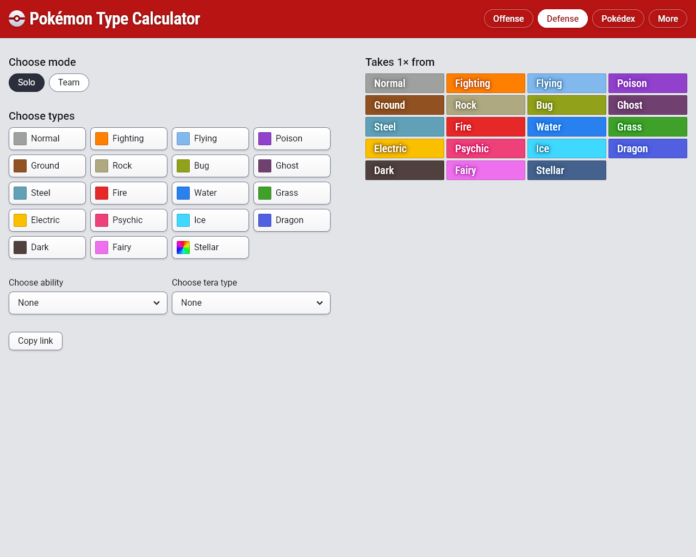
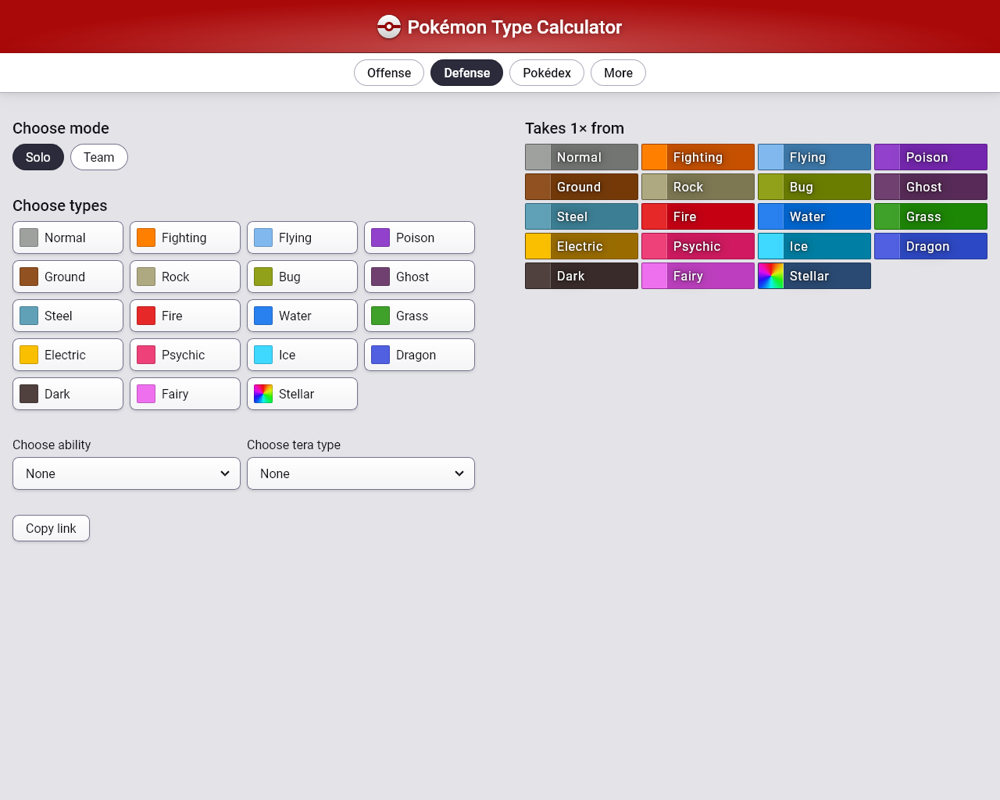
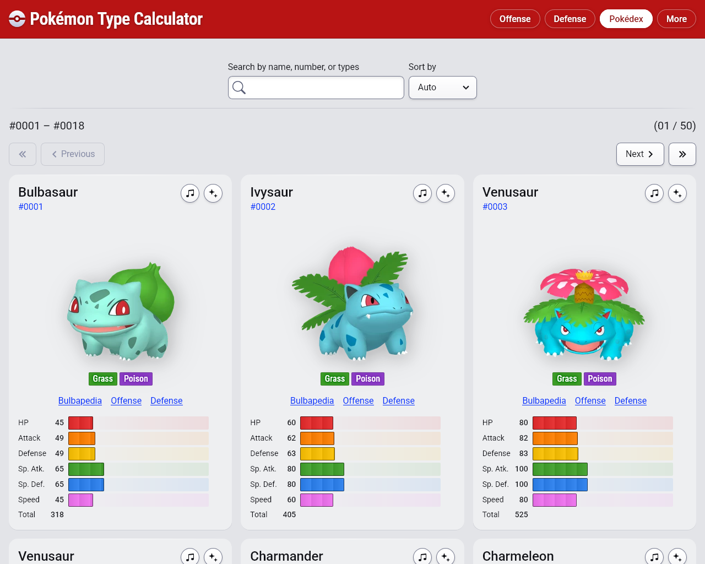
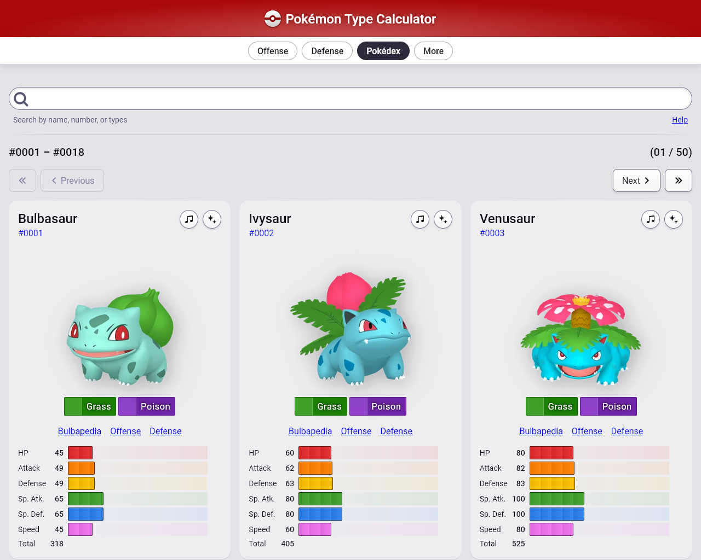
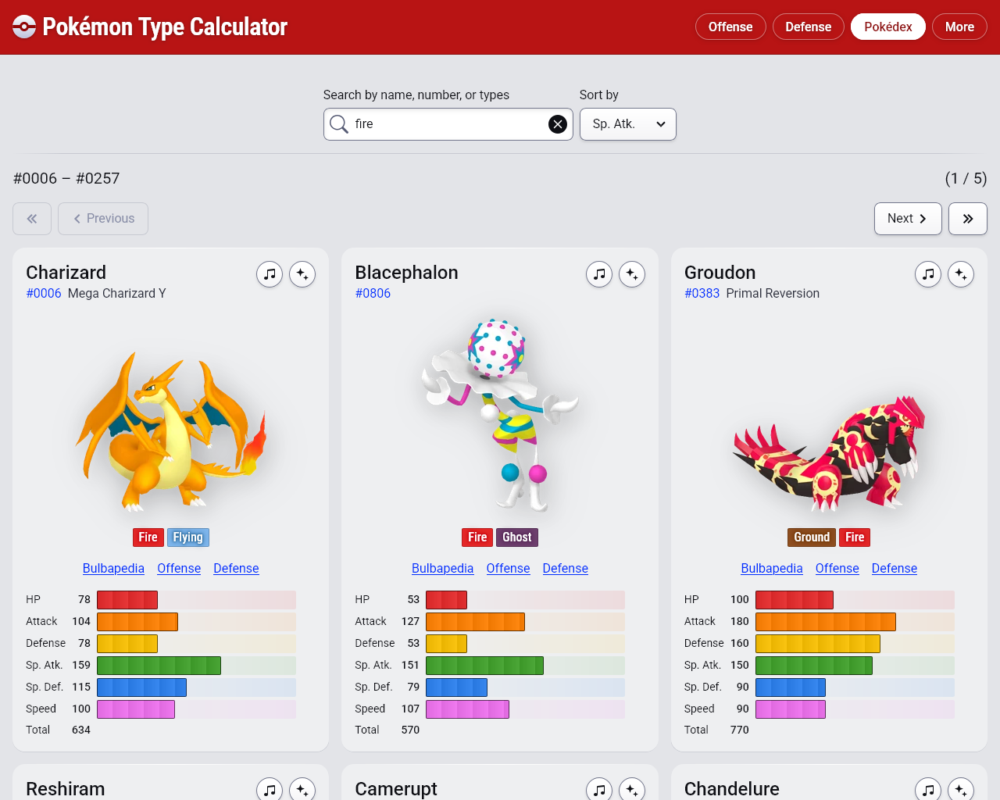
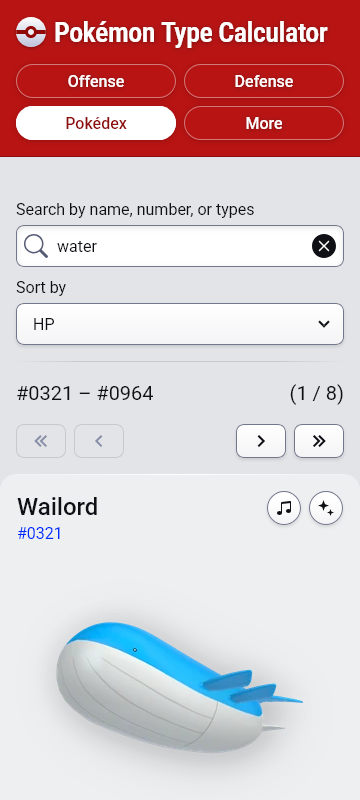

---

Recently I received a nice Pokéfan email about
[Pokémon Type Calculator](https://www.pkmn.help/). They didn't request anything,
but I decided to ask them if they had any suggestions. They told me that being
able to sort the Pokédex by stats would be really useful. I agree! It wasn't too
bad to implement either.

While I was in the code... well... I haven't done much with the site in the last
3 months, and certain UI problems have really been weighing on me.

I started working on the new feature on Friday and accidentally stayed up until
2am. And I woke up to a bug report about a mistake I made in it. Of course, lol.
So I fixed that (it was a silly code typo)... but then I ended up spending
nearly the rest of the day changing other things in the UI.

<figure>
  
  <figcaption>Defense (new)</figcaption>
</figure>

<figure>
  
  <figcaption>Defense (old)</figcaption>
</figure>

- The header area is much more space conscious now

- The logo is nicer looking (especially the text)

- The type labels are much simpler and easier to read

  - I very carefully generated extra darkened text shadow colors and simulated a
    text stroke to make the text readable against the type colored backgrounds

<figure>
  
  <figcaption>Pokédex (new)</figcaption>
</figure>

<figure>
  
  <figcaption>Pokédex (old)</figcaption>
</figure>

- Added the "Sort by" select, allowing you to sort automatically, or descending
  by any stat (or BST)

- Type labels are much smaller in the Pokédex

- Shrunk the search field and centered it

<figure>
  
  <figcaption>Sorting</figcaption>
</figure>

I don't love making monochrome icons, so I've been replacing some of mine with
[icons from Bootstrap](https://icons.getbootstrap.com/). It's super quick to
copy/paste their SVG source code into JSX code and avoid pulling in a whole huge
library for a few icons.

<figure>
  
  <figcaption>Mobile layout</figcaption>
</figure>

I love the look of the large red header area on mobile especially :3

---

Switching from two versions of the Roboto font to Roboto (Variable) barely
increased the overall font payload, but this allowed me to gain variable weight
_and_ variable width. As I've become better at typography, I've realized that
more condensed fonts can be really useful! Roboto is already fairly narrow, but
logo text in particular can look much nicer when narrower. I increased the size
of the text but decreased its width, making it look less like body text and more
like a logo.
