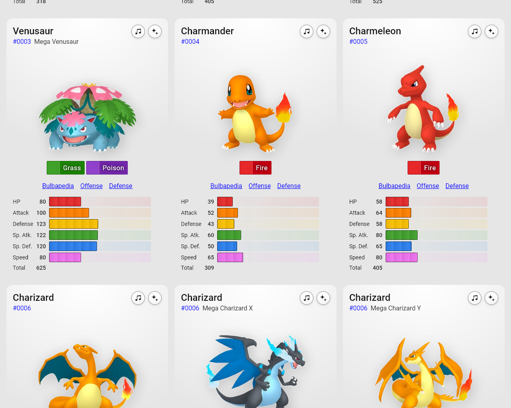
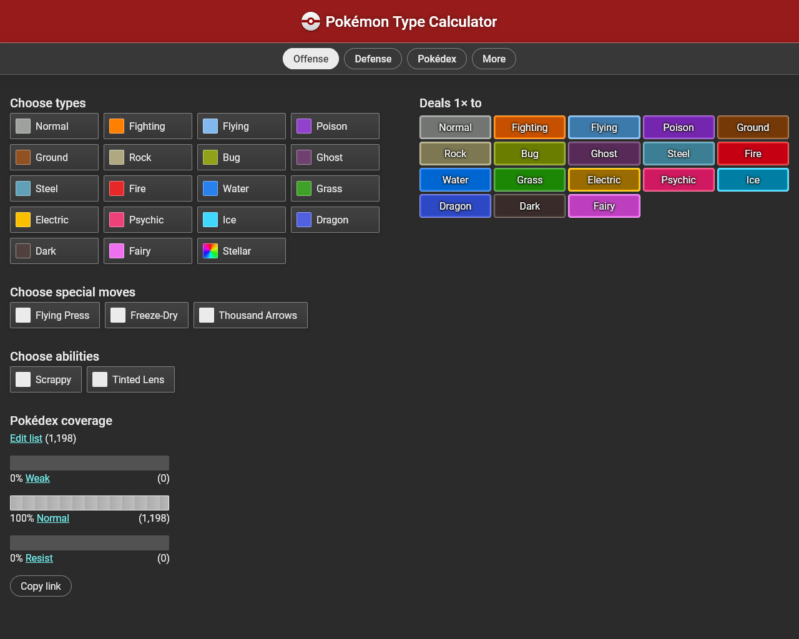

---

The [**Pokémon Type Calculator**](https://www.pkmn.help/) is
[juicier](/blog/2025/i-need-juicier-interfaces/) than ever before. See for
yourself in these before & after screenshots!

<figure>
  
  <figcaption>Offense (old)</figcaption>
</figure>

<figure>
  
  <figcaption>Offense (new)</figcaption>
</figure>

- Shiny buttons and header

- Darker background helps content stand out better

- Types are now more colorful and easier to recognize

---

<figure>
  
  <figcaption>Pokédex (old)</figcaption>
</figure>

<figure>
  
  <figcaption>Pokédex (new)</figcaption>
</figure>

- The more subtle card design helps avoid information overload

  - The screen is already very dense with information, so a full border and
    shadow around each element wasn't necessary and made the page harder to scan

  - I also fixed an ancient bug here where the Pokémon would only bounce when
    becoming shiny, not on every button press

    - The solution? You just need two animations with different names but the
      same content, that way the animation will restart when you apply the
      "other" animation

---

<figure>
  
  <figcaption>Dark mode (old)</figcaption>
</figure>

<figure>
  
  <figcaption>Dark mode (new)</figcaption>
</figure>

- Dark mode is even darker than before

- Night mode still exists, but this was in service of making the buttons pop

- A fun gradient on the empty progress bars which helps indicate what that area
  will do

---

See [the changes](https://github.com/wavebeem/pkmn.help/pull/329) for yourself
in the pull request.
