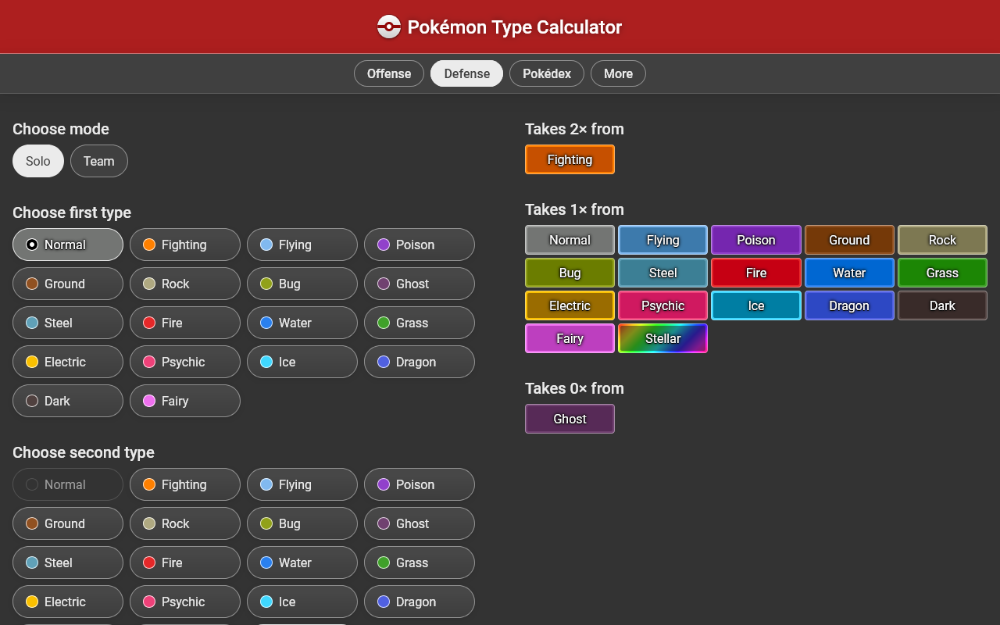
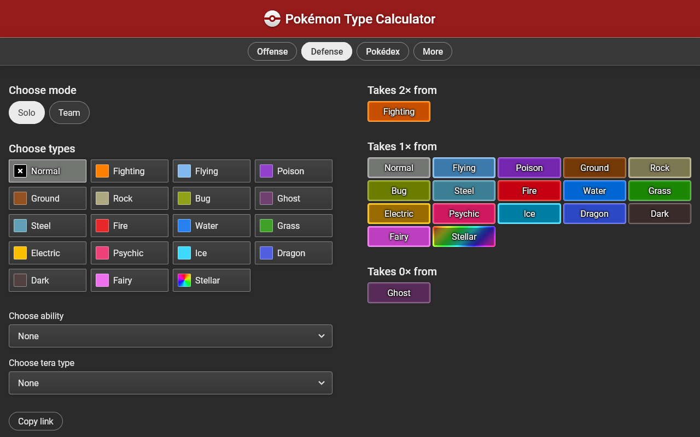
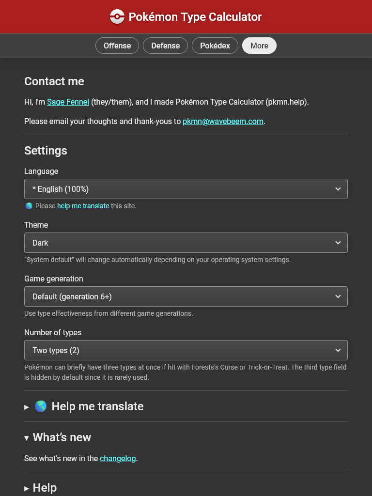
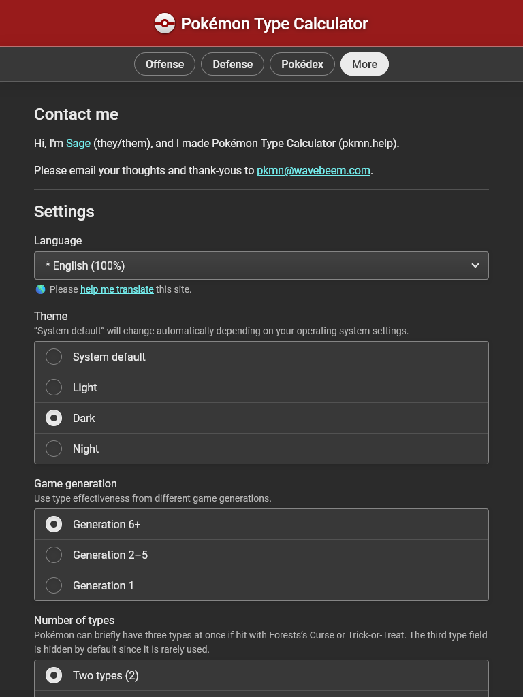
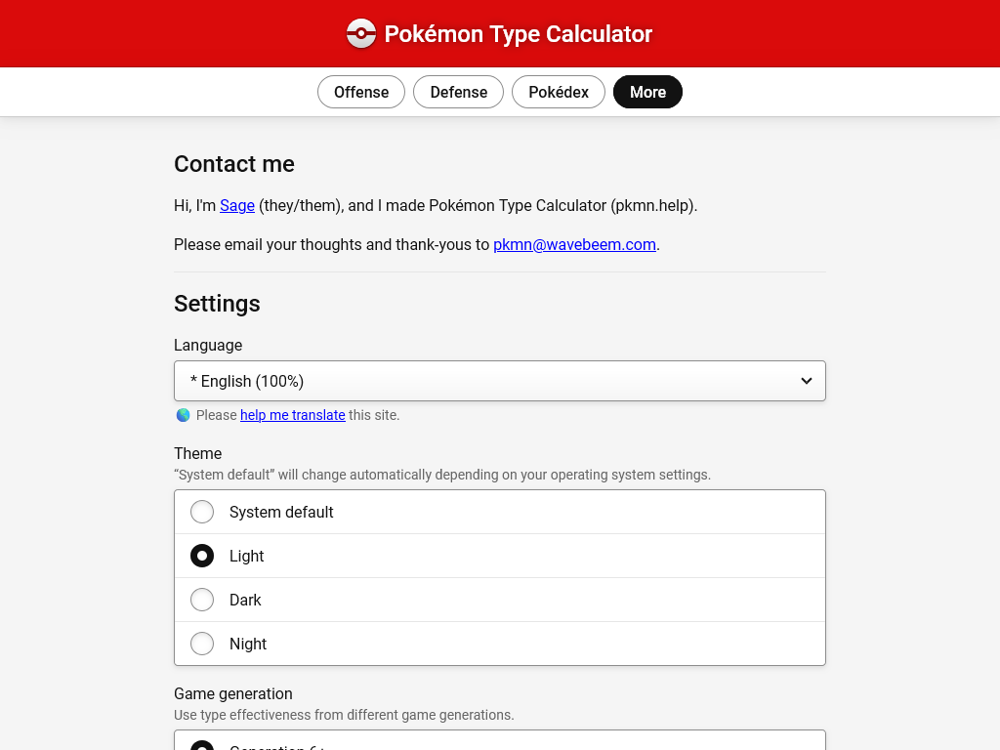
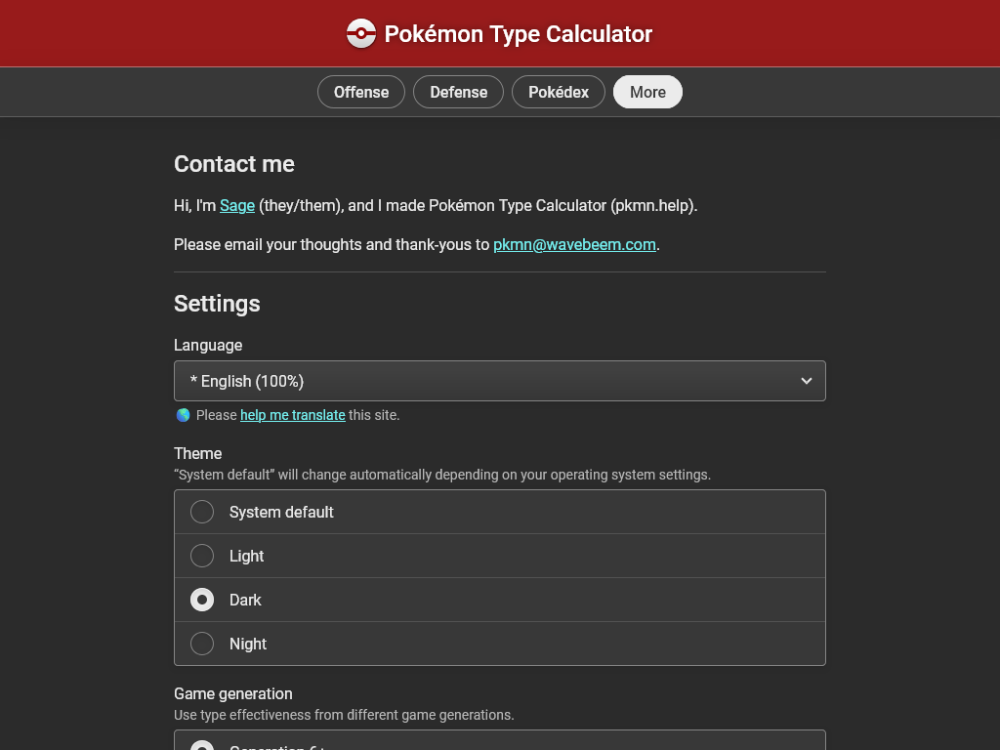
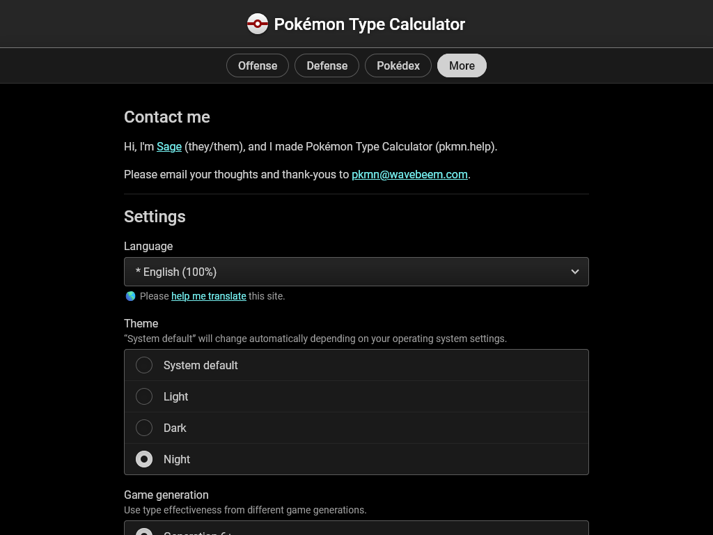
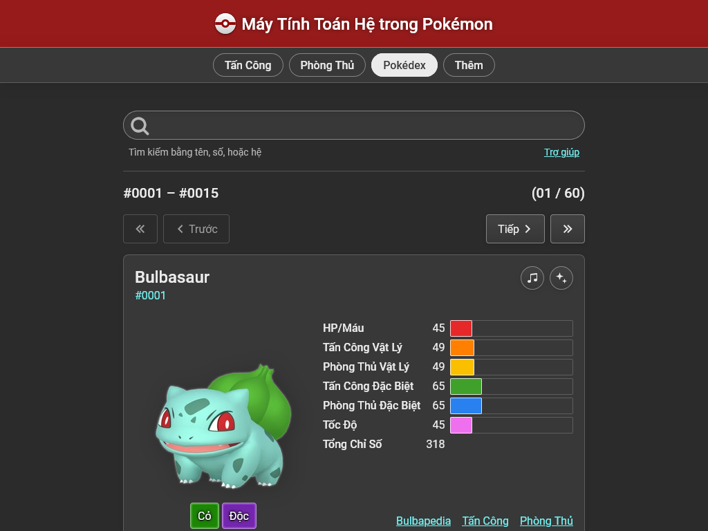

## Improving information density on the main screen

A few things bothered me about the defense screen:

1. Users have to scroll just to add a second type, which is an extremely common
   operation

2. Selecting multiple types as separate fields is different to how the Offense
   screen works

3. Type colors are small and hard to see

So I consolidated the 2-3 type pickers into a single type picker and increased
the size of the type color area without changing the overall component size.

**Before: The defense screen is very tall**

**After: The defense screen fits better without scrolling, a huge boon for
mobile users (~44.6% of my traffic)**

## Improving the settings experience

Let me know if this sounds familiar to you: selects (aka dropdowns) are
overused. Presenting the user with a list of radio buttons is usually nicer,
because it doesn't hide information. Sometimes you have too much information to
show as radio buttons, but in the settings screen that's usually not true for my
site.

So I designed a custom component `<RadioGroup>` that wraps around native
`<label>` and `<input type="radio">` with fancy CSS to make it look really
inviting, somewhat like an iOS settings screen.

**Old: Most information is hidden off screen**

**New: Most information is shown on one screen without clicking**

Given that most users shouldn't need to adjust their language settings, and
there are a _lot_ of languages, I decided to keep those as a select element.

## A new theme

If you're really keen, you may have noticed that the dark theme got a little bit
darker. But that's not all, I also added a new theme: Night. I received fanmail
from a visitor who recently got a new OLED screen, and they told me they've been
loving pure black themes. Though they're not generally my favorite, I realize
that these can be an accesibility boon for many people, and I decided I would
take on the challenge of designing one.

I initially used a lot of pure black, but realized the UI felt flat and hard to
navigate. I had to add a few subtle background colors, but I still kept the main
page background as pure black. Ideally the type colors would be toned down
somewhat in this mode too, but that's something I'll think about later, if ever.

**Light theme**

**Dark theme**

**Night theme**

## Translations

I truly can't thank the translation community enough, especially Kaishidow for
always sending me French updates. Recently a fan named Khang sent full
translations to Vietnamese! I was thrilled to get an entirely new language.
Despite its smaller population, I actually get
[more visitors](https://plausible.io/pkmn.help) from Vietnam than Japan or even
China!

**Vietnamese translations on the Pokédex page**

I'm so glad that the font Roboto has good international support, because there
is seemingly no end to the typographical sins committed against the Vietnamese
language. No weird mismatched letters here!
