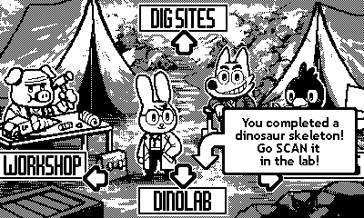
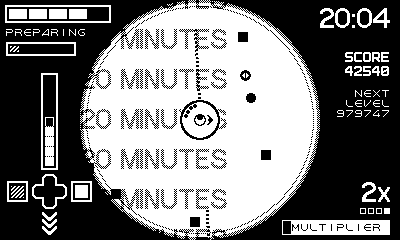
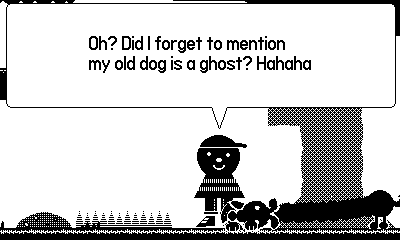
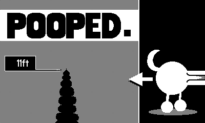
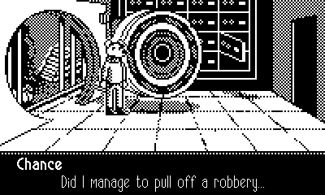

## Overview

It's [12 games for $39](https://play.date/games/seasons/two/), what's not to
love? Well, some of the games, apparently. I found four of them fantastic,
though, so it's a good deal! Plus I get to try all these other games for a bit,
when I probably would've never bought them.

## Dig Dig Dino!

<figure>
  
</figure>

[A chill game](https://play.date/games/dig-dig-dino/) with some minor UX
problems that hold it back from perfection. I'm never a fan of simply binding
"next item" to a button and having that be the only way to cycle through more
than like 3 items (one of the few issues I have with Super Metroid), and this
game makes it even worse by introducing consumables that change the number of
items you're carrying during each level. Also, the game encourages you to button
mash to accumulate resources, but then punishes you by covering the lower third
of the screen with a message telling you you're using the wrong kind of item. A
small fix to relocate the alert to the top of the screen when your cusror is
near the bottom would've alleviated a lot of my problems with the game.

That being said, it's fun! The idea of uncovering weird dinosaur fossils,
ancient aliens, uncovering the story, buying upgrades, and digging for treasure
with no time limit is just fun! The story had a really weird ending, but it was
so charming. It's just a good easy game!

## Fulcrum Defender

<figure>
  
</figure>

[A relaxing shmup](https://play.date/games/fulcrum-defender/) by the creators of
FTL and Into the Breach. Despite using the crank nonstop for all aiming... I
think it works! My aim can be a little "shaky" at times, but once you get in the
groove and get some upgrades, it doesn't realy matter. You play as a turret
while enemies come at you from all 360 degrees around you.

You "win" at 10 minutes, but the game keeps going afterward (did Balatro come up
with this concept? I love it).

Recently this game was updated with 5 new difficulty modes and _tons_ of new
enemy types. It honestly feels like "Fulcrum Defender 2" with these changes, and
I'm enjoying it a lot more now.

## Long Puppy

<figure>
  
  
</figure>

[A super weird game](https://play.date/games/long-puppy/) that makes good use of
the crank. Like Katamari, this game is more fun with time limits turned off. You
control a dog who gets longer when he eats food. You have to aim your head with
the crank and press Up on the d-pad to extend your body forward. You can get
into all kinds of wild areas with this traversal mechanic. I haven't bothered
beating the game, but it's been a lot of fun!

## Chance's Lucky Escape

<figure>
  
</figure>

Maybe the easiest
[point and click adventure game](https://play.date/games/chances-lucky-escape/)
I've played, but the pacing and writing is great. There's no branching or
exploration, so I guess you could call it a cross between a point and click
adventure game with a kinetic visual novel. I had a lot of fun with this one. I
played it almost nonstop until completion.

## Other Games

### Wheelsprung

I'm skipping [this one](https://play.date/games/wheelsprung/) since...

> The developer used generative AI to create game code and text or dialog.

### The Whiteout

[A dark apocalyptic point and click adventure game](https://play.date/games/the-whiteout/).
It seems well made, but I'm not a huge fan of the genre, and I wasn't in the
mood for a story this sad. This is the first Playdate game I've seen with a
content warning

> This game depicts acts of violence, implies a suicide and features mature
> themes. There are curse words, but a word filter is enabled by default.

### Otto's Galactic Groove

I've never played
[Trombone Champ](https://store.steampowered.com/app/1059990/Trombone_Champ/),
but I assume [this game](https://play.date/games/ottos-galactic-groove/) is
pretty similar. It was fun, but I didn't feel compelled to keep playing.

### Shadowgate PD

[A turn based dungeon crawler](https://play.date/games/shadowgate-pd/) feels
like a perfect fit for the Playdate, but unfortunately this game was too retro
for my level of patience. You have to move a mouse cursor around the screen
using the d-pad, then navigate a menu of like 10 items to choose which verb you
want to use... literally constantly.

It's just death through UX pain, and given the old school nature there's no
hints, so you're gonna fumble a lot. I think this game might be fun if you were
playing with a mouse, but I don't have the patience for it in this form factor.

### CatchaDiablos

[A cute arcade-y action game](https://play.date/games/catchadiablos/) where
you're constantly rotating. You start by cranking to choose the center of a
circle, then you hold a button to plant down on that circle and rotate along its
circumference, catching (defeating?) whatever monsters you encircle.

It's a great idea, but it was really challenging for me to control and got too
hard to fast, so I set it down.

### Tiny Turnip

[A wild platforming game](https://play.date/games/tiny-turnip/) where you
control everything by rotating your arms with the crank. You grab and release
with the d-pad, making traversal _visceral_. Honestly this game seems really
fun, but I got a little bit tired of futzing with the controls and didn't play
super long. It's a recurring theme here, but circular motion doesn't feel
anywhere near as intuitive as a d-pad or analog stick... though to be fair it's
kind of unexplored territory in video games.

### Black Hole Havoc

[A shooting oriented puzzle game](https://play.date/games/black-hole-havoc/) in
the vein of
[Puzzle Bobble (Bust-a-Move)](https://en.wikipedia.org/wiki/Puzzle_Bobble).
Without a color screen, though, they had to come up with a different gimmick.
Rather than match-3... you just match two bubbles together... by size. You
adjust the size before firing a bubble, and the _difference_ in size of your
target is subtracted from your HP. Eyeballing relative sizes of swirling voids
is... not fun to me. So I gave it up pretty quickly.

### Taria & Como

[Another grappling hook based platforming game](https://play.date/games/taria-and-como/).
The game felt sluggish and awkward to control, though I'll admit some of the
videos I've seen look neat. I didn't play much.

### Blippo+

I haven't tried [Blippo+](https://play.date/games/blippo/), so I'll let their
marketing copy do the talking. It seems neat, but I don't care enough to bother.

> Blippo+ is an 11-week, live-action, over-the-top television experience. New
> episodes, programs, and messages arrive every Thursday at 10am PT.

## Final Thoughts

I didn't care for Season 2 as much as Season 1, but I still had fun with it. I
hope they continue making Playdate seasons, but maybe a bit shorter.

I'm gonna dust off some of my older Playdate games I didn't give a fair shake
the first time.
