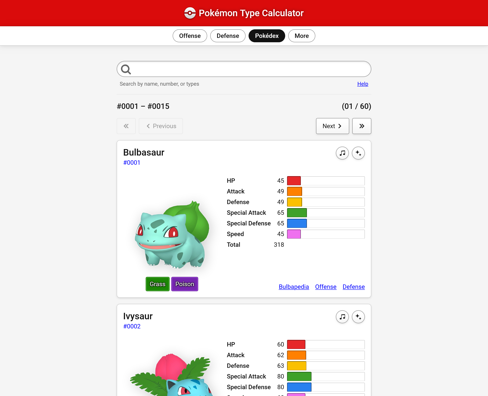
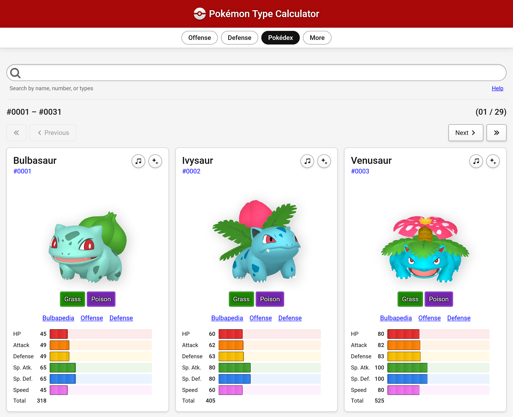

---

[Pokémon Type Calculator](https://www.pkmn.help/)

**Before**

**After**

## Changelog

- The Pokédex now shows up to 3 Pokémon columns depending on screen size

- The Pokédex uses a consistent layout regardless of screen size

- The Pokédex stats bars have been redesigned

  - The colored background helps guide your eyes to the stats you want to see

  - The segmented appearance helps you compare the size of one bar to another

- Increased Pokédex page size from 20 to 42

- Removed the default "Normal" type selected on the defense screens

  - This should make setting up your team less annoying since you won't have to
    click an extra time to unselect "Normal" if setting up a single typed
    Pokémon

- Improved usability of the website when using an increased browser default font
  size

- Reduced the brightness of the header in light mode and night mode

- Increased the speed of the Pokédex search a little

- The Pokédex search now dims the results while a search is happening, so you
  know it's working

  - I know this section is slow, and increasing the page size made it slower.
    I'm still trying to come up with a way to make it faster. I've received
    requests to make the page size bigger, and the main reason I haven't done
    much with that is that the search gets really slow...

- Emphasized the stat numbers in the Pokédex instead of the stat labels

## Technical details

I'm so tired of using React lol. This was my first time adding
[useDeferredValue](https://react.dev/reference/react/useDeferredValue) to the
code. The Pokédex has historically been a slow screen to render, and keystrokes
can lag. If there's one thing I hate on computers, it's input lag. So
traditionally I papered over this by keeping the page size really small, so
renders could complete in relatively short order even on low powered devices.

Multiple people have asked me for larger page sizes, though, and I'm trying to
work towards supporting this. I know that `useDeferredValue` can be really
helpful for making this happen. I should probably read
[Josh W. Comeau's post about it](https://www.joshwcomeau.com/react/use-deferred-value/)
again.

I found that the Chromium DevTools have an [INP](https://web.dev/articles/inp)
measurement tool, and I saw some improvements to those numbers after making
changes. The React docs mentioned a nice UI pattern of fading out "stale"
results while the user waits for new ones, which I enjoy. The first thing you
need after keyboard input is for the character to appear on screen, and users
(especially me) are highly sensitive to _any_ lag there. Personally, anything
more than 100 ms is really distracting. If you think for a moment about
framerates, 16.67 ms approximately the timing for a single frame at 60 fps.
Ideally your UI would redraw faster than that. I'm currently typing this on a
360 Hz display, but I definitely don't need my keystrokes to appear withi 2.78
ms on screen. That being said, I can see the difference between 30, 60, 120, and
360 Hz refresh rates when it comes to moving my mouse. If you don't believe me,
come over to my house. Silly rhymes aside, I bet you could notice the difference
too, in a side-by-side setting.

Another piece of advice from the React docs was something I had already
considering: not using
[controlled inputs](https://react.dev/reference/react-dom/components/input#controlling-an-input-with-a-state-variable).
This means not supplying a `value` prop. Instead, you just listen to `onChange`.
The problem is, sometimes I need to programatically change the value of the
input. You can instead do this with a `ref`, but then you also have to manually
trigger your `onChange` function. It's a bit messy, but because you're
circumventing the entire React rendering pipeline, keystrokes only have the
intrinsic delay created by the web browser (which is not enough for me to
notice). Maybe I'll try this next, honestly. I don't really need controlled
inputs here, I'm just being stubborn. I'm increasingly tired of the solution to
every JS-created problem being "add more JS to it", and `useDeferredValue` is no
different.

Maybe one day I'll rewrite Pokémon Type Calculator with a different framework,
or perhaps none at all? But it's such a large application that this is a
grueling task. And any cross-framework compatibility stuff tends to be super
not-fun. If I do any change at all, it would be to migrate towards vanilla
[web components](https://developer.mozilla.org/en-US/docs/Web/API/Web_components),
or a small library that makes web components more palatable. I loathe updating
my packages for this side project.

It's not like this is the main source of "bloat" on the site though: the static
JSON files I load for translations and especially the Pokédex dwarf the JS
bundle. And if you skim the entire Pokédex, you'll load quite a few images into
memory (despite my best attempts to
[optimize these with WebP](/blog/2025/imagemagick), the Pokémon Home images are
about 20 kB each for the 512px versions loaded on retina screens).
