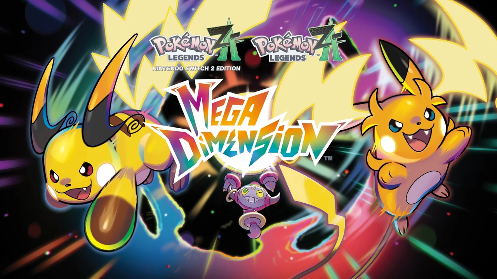
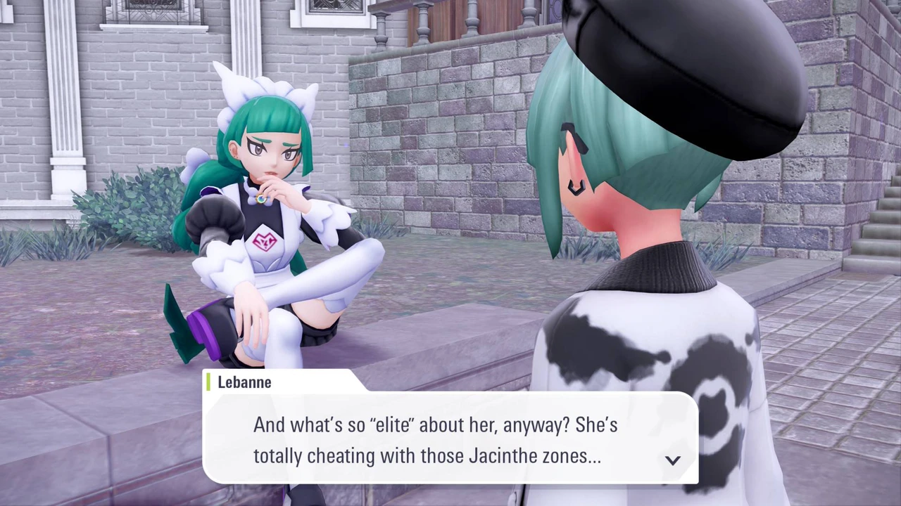
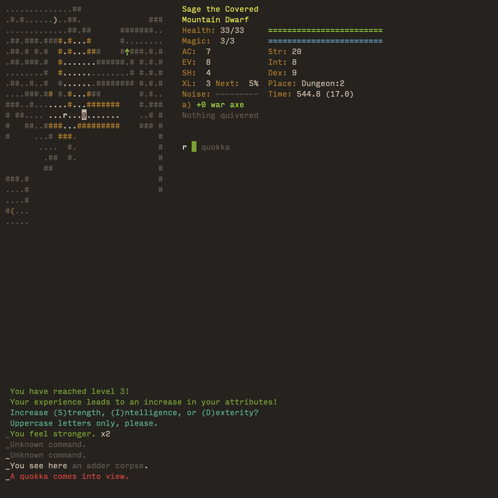

## What I played

Besides the new core gameplay loop of the _Mega Dimension_ zones, there are some
side quests, new characters, donuts, and new
[Mega Evolutions](https://bulbapedia.bulbagarden.net/wiki/Mega_Dimension#New_Pok%C3%A9mon_and_forms).

I played till I hit credits on the DLC, but I didn't do any of the "postgame"
DLC content (catching the four or so legendary Pokémon that require lots of
grinding).

I think this was about 15-20 hours. My save file is nearing 100 hours on record,
but I forgot how many I had before starting _Mega Dimension_.

## Things I liked

Of the quests I did, I thought the writing was great, probably even better than
the main game. I liked it quite a lot in Scarlet/Violet, too. That part of Game
Freak is doing well.

The donut creation UI is extremely beautiful---though it's clumsy to actually
use when it matters.

Mega Raichu X and Y are super cute. Actually, quite a lot of the new Mega
Evolutions are cute or cool, and I just love seeing the new guys.

<figure>
  
  <figcaption>I prefer Mega Raichu Y (right), but they're both so cute...</figcaption>
</figure>

The Rogue Mega Evolution battles are overall pretty fun, but the controls are
still a little awkward at times. I think if they continue these, they could be
really fun in another game or two.

Jacinthe and Lebanne continue to be the writing highlight of the game for me.

<figure>
  
</figure>

## Things I did not like

The entire base gameplay loop of Pokémon Legends Z:A is grinding timed missions
with randomized objectives in random areas in order to rank up. At least the
Wild Areas are less random and not timed, and the platforming/exploration areas
of the base game are not timed either.

In _Mega Dimension_, **everything** is on a timer. And early on, that timer is
offensively short. Sometimes as low as two and a half minutes. In a game where
Pokémon routinely get stuck pathfinding for 10 seconds, then have their attack
miss, then have the attack go on cooldown for 12 seconds, this is infuriating.
You also have to pay in-game currency for the privilege of entering one of these
new randomized portals.

Each _Mega Dimension_ portal requires a donut to enter. Donuts require berries
to craft and are consumed on entering the portal. Each donut gives calories
according to its ingredients, and each portal has a difficulty rating that
causes it to consumes calories at a different rate. Basically, harder portals
require more calories.

Each portal gives you three randomized objectives. Each objective you complete
gives you research points needed to advance the DLC. If you can complete all
three objectives, then a Golden Pokéball will spawn. If you can find and destroy
that Pokéball before the timer runs out, you will get a fantastic reward of high
ranking berries. By the latter half of the DLC, failing to destroy the golden
Pokéball during a run constitutes a massive resource failure, and your
punishment is to grind lower level portals until you can get more high ranking
berries the hard way again.

This entire DLC is $30, which would be fine if it felt like half-again a new
game, fresh and interesting. But it's worse than a Symphony of the Night "upside
down castle" segment, since it's littered with random shitty obstacles, an
interminable grind, buggy gameplay, punishing time limits, and randomness on top
of randomness on top of randomness in a way that feels low even for Pokémon.

---

In Pokémon Legends Arceus, stealth was an extremely fun and viable way to catch
Pokémon. In this game, something has changed about the Pokémon AI to make this
extremely challenging. Most Pokémon are so alert that it's nearly impossible.
Dopier Pokémon like Slowpoke can be sneaked up on, but most will almost
instantly be alerted to your presence even from quite a distance. Additionally,
Pokémon routinely detect you through hedges, bushes, walls, and even buildings,
with zero line of sight. It's extremely frustrating considering that you'd think
a nearly 100% city locale would be perfect for stealth, but they ruined it. AND
the DLC introduces tons of randomized objectives for "catch 3 Pokémon without
being detected", which is really hard when the Pokémon all detect you from 50
feet away and scream to alert the entire herd lol.

---

The action combat system is absolutely not working for trainer battles for me at
all. The 2v2 trainer battles with mega evolutions are insufferable. Half the
battles are just unskippable transformation cutscenes that nullify any
in-progress attacks. Battles are too fast and chaotic to even think about type
matchups while I'm fighting.

---

The maps for the different portals are very much not created equal. Combining
maps, objectives, and creatures (presumably) fully randomly is so hot right now
with how much "roguelike" has become the magic pixie dust of game design for the
past while now (I'm a bitter old who remembers when roguelike games were
actually somewhat like the game
[rogue](<https://en.wikipedia.org/wiki/Rogue_(video_game)>))

<figure>
  
  <figcaption>Dungeon Crawl Stone Soup&mdash;I played hundreds of hours of this in college.</figcaption>
</figure>

## What's next?

Something has been rotten at Game Freak for a while now. I liked Sword/Shield
decently well, though I was worried about the direction they were hinting at
with the wild zone in it---the preview of Scarlet/Violet.

Somehow Pokémon Legends Arceus was a freak accident, a miracle, a nearly perfect
unique interesting Pokémon game that gave me hope for them not losing their way.
So this game being as bad as it was really crushed me. And I have had a policy
of not buying their mediocre-looking DLCs up to this point. But Mega Raichu,
Raichu, my boy, my baby boy, my beloved, he lured me in to this overpriced pile
of poo.

My plea to Game Freak is to please, please partner with another game studio.
They clearly don't internally have _the sauce_ to make these new game genre
infusions work. The gameplay loops are poorly thought out, the user experiences
are frustrating, and everything just reeks of trying to make a huge game on a
shoestring budget.

I really need the next Pokémon game to actually be fun again. Especially because
I don't want to let [PKMN.help](https://www.pkmn.help/) die, but it's in no
state to be taken up by anyone in the community. So until that ever happens, I'm
going to at least play every new main entry to stay up on what's new, lol. Who
knows, maybe it's just an abusive relationship and I'll be playing Pokémon on my
death bed. But I think I need some Shin Megami Tensei as a palate cleanser after
this.
