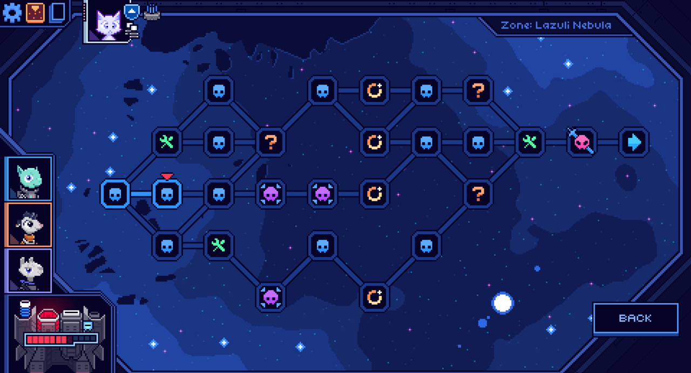
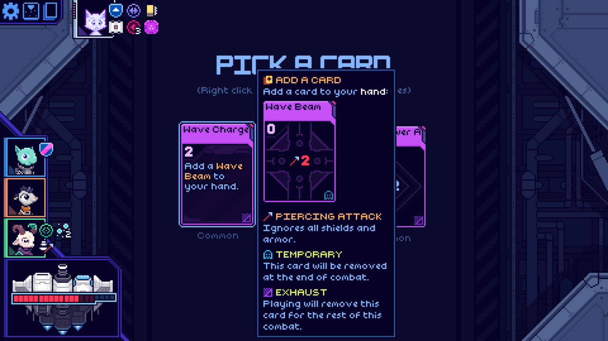
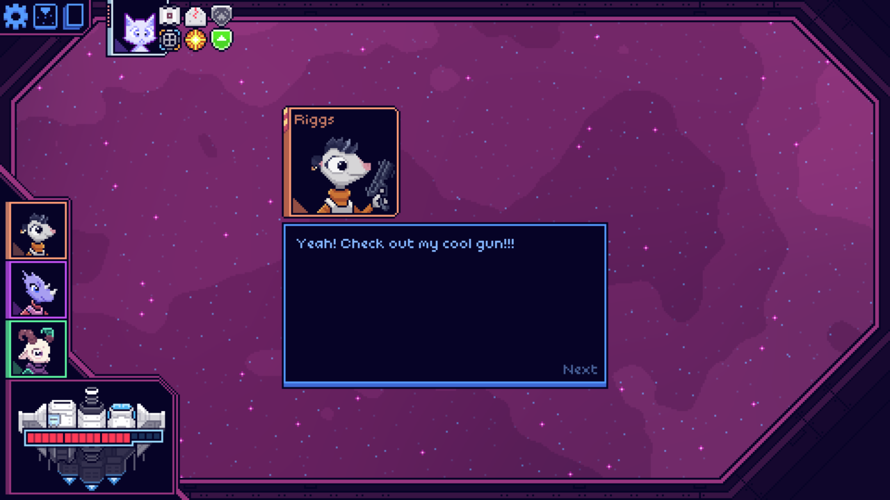
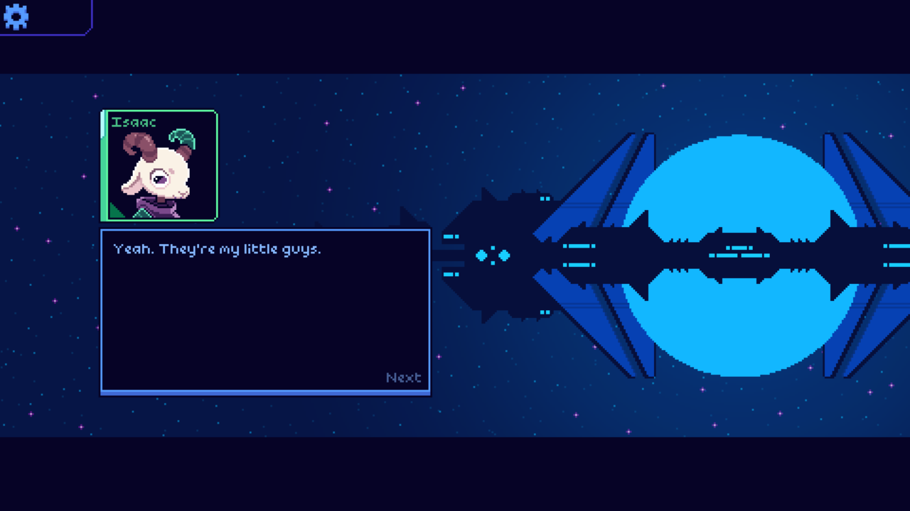
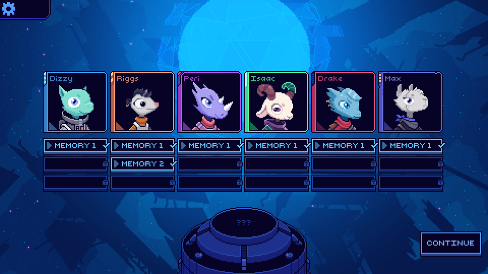
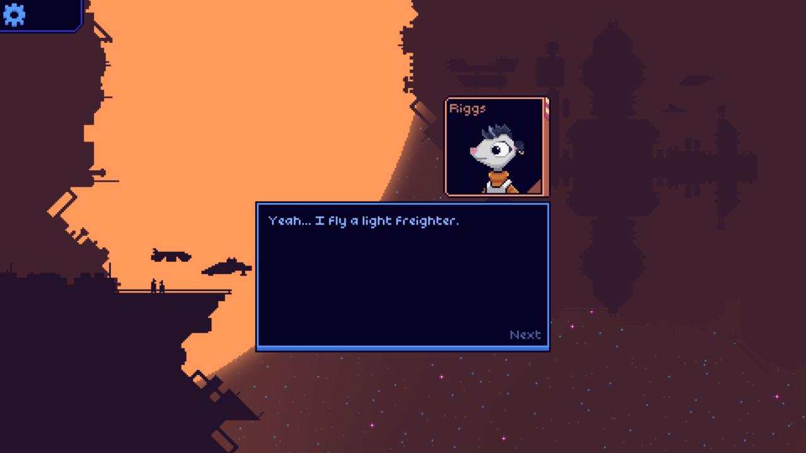
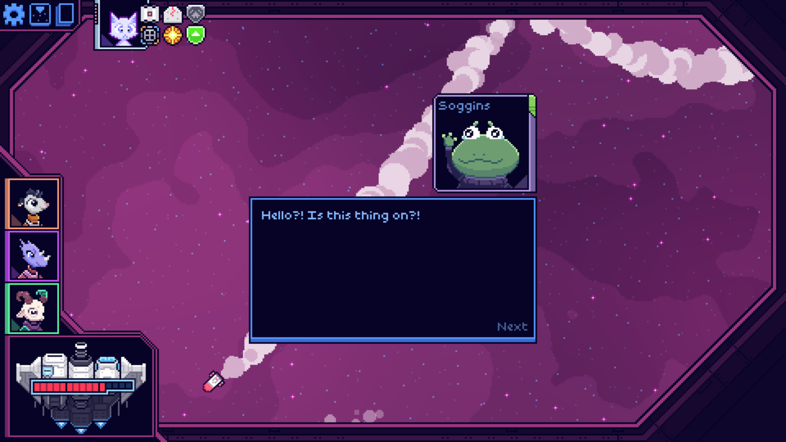

## How I played it

I loved playing Cobalt Core (2023). Like Balatro, I primarily played this one
"co-op" style on the couch with my partner, [Ash](https://ash.fish/).

It took us around 40 hours as recorded by Steam, but much of that time was
discussing strategy out loud or me getting up to cook dinner and leaving the
game on. I think you could probably finish it in half the time. It's not a
terribly hard game if you leave it on the default difficulty, and there's no
need to play harder difficulties to see the story's conclusion.

I primarily played with its fantastic gamepad controls, but it definitely works
a little bit nicer with a mouse. A small quibble: the game doesn't seem to frame
limit by default, and my gaming PC was getting over 4500 fps (!!) until I used
the NVIDIA Control Panel to set a framerate limit lol.

## Gameplay

<video src="./gameplay.mp4" width="1280" height="720" controls preload></video>

**A short gameplay example. I wasn't trying very hard, I just wanted to go fast.
Love the music. Also, for some reason, the cursor is really laggy. Seems like an
issue with Steam video recording. I was having problems using Windows Game Bar,
my normal method for screenshots and clips.**

I've been told this game is pretty heavily inspired by Slay the Spire (yeah, I
still haven't played it... it's on sale and I just bought it, ok?). You build a
deck of cards, move through a map with nodes and paths, fight bosses and such,
then hopefully win. You take three characters, and the characters change which
cards and relics you can acquire during your run. I honestly felt like I was
learning something every run, so the game really stimulated my mind.

**Each run has you complete three maps with basically the same boss fights each
time**

**OMG WAVE BEAM MENTIONED (also this card was quite good)**

## Story

**Grandma is one of many silly characters you'll find at the random events on
the map**

Your party members will "speak" (little speech bulbs, no voice overs) while you
play, which is a fun little detail that you can also completely ignore if you
don't care. Unlike voiced lines, these can't get annoying because you hear them
too many times. Genius. Sometimes less is more. I found these lines helped
endear me to the characters when I wasn't getting more direct story moments
(there's not a ton of that outside of the memory cutscnes you unlock).

**Riggs has the best writing and is my favorite character in the game**

The game tells the story of a space ship crew of furries trapped in a time loop.
You don't get a lot of details at first, but you unlock moore of the story as
you complete loops and unlock memories. Sometimes memories carry over between
loops, which can get funny. One character frequently meets an alternative
version of themselves, which is one of my favorite story aspects of the game.

**Isaac is the cutest character in the game, but I didn't love his playstyle**

## Controls and UI

Virtually no complaints here. The tooltips can be a little awkward when using
controller, but at least you can turn them on or off. It's definitely a
mouse-first type of game, but fully playable without much fuss on a controller.

**Each run you unlock one memory for one character in your party**

**Memories play out as short cut scenes**

## Music

I loved the music in this game. It didn't immediately hook me, but it strikes a
really good balance between being interesting and not overbearing. It
complements the games story well, I think. Especially the time loop aspect.
There's like a melancholy at times, but also it's a good vibe.

**You can even play soccer in one of the random encounters by shooting the ball
towards the goal**

## Art

The pixel art portraits are perfection. I love the ships too. The sprite work is
very detailed on them. The cards are nice too. I just think this game absolutely
nails some high quality pixel art, and I really like the animated backgrounds to
make ship fights feel more engaging.

**Soggins is one of the funniest characters you encounter, and has a really
unique "battle" mechanic**

## Replay value

I'm not in the mood for it, but the game has "daily challenges". I can see these
being a fanastic way to keep the game fresh. If I wasn't rushing off to play
other games, I might give it a shot.

## Conclusion

It's got cute furries, good music, good gameplay, good art, and little wasted
time. This game is a gem. I highly recommend buying it if you think it sounds
fun :)
