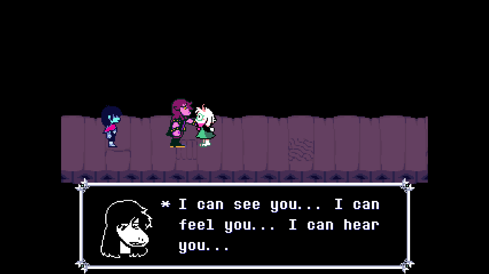
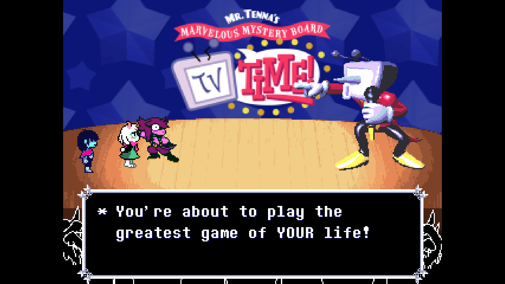
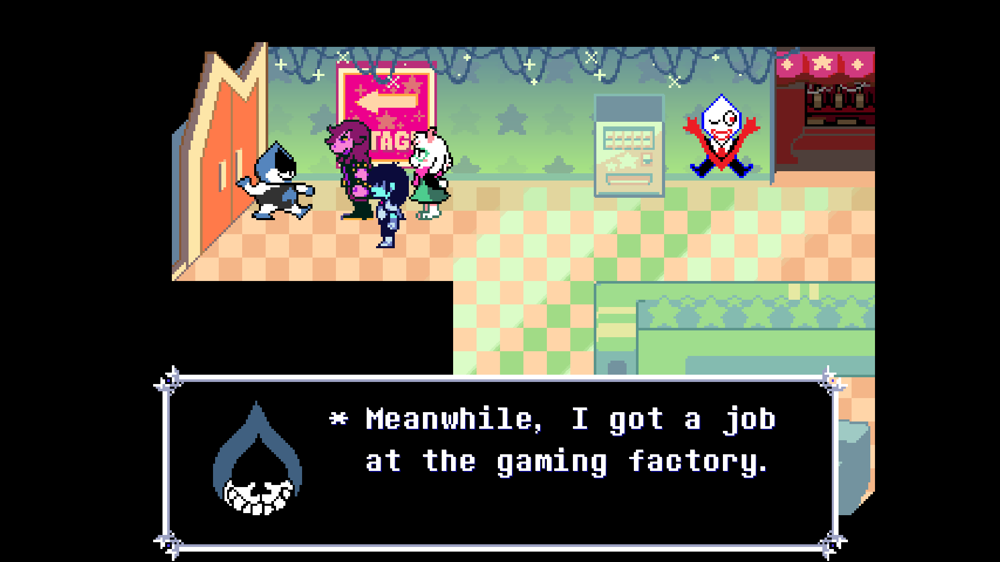

---

Due to various reasons, I restarted from Chapter 1 before playing this. It's
incredible seeing the evolution of Deltarune across these three chapters.
Chapter 3 especially has _so much_ gameplay that's wholly different from the
previous chapters (and Undertale)... and it feels **great**!

<figure>
  
  <figcaption>Susie's character development has been such a treat.</figcaption>
</figure>

Mr. "Ant" Tenna is simply incredible. I've always loved how expressive
characters are in these games, with different sprites indicating their emotions,
and unique "beep beeps" for their dialogue, giving each character a "voice"
while retaining the feel of a text-driven game. Tenna, though? Holy _shit_ they
went all out. His giant Donkey Kong Country-esque pre-rendered 3D ass in the
middle of Chapter 3 feels incongruent and perfect.

<figure>
  
  <figcaption>The minigames are super fun in this chapter.</figcaption>
</figure>

Most of the chapter involves you playing on Tenna's game show, and it was just
really freaking fun! I loved the game-within-a-game concept for keeping things
fresh, and I had fun with the entire thing.

<figure>
  
  <figcaption>My idiot son Lancer shows up <em>again</em>.</figcaption>
</figure>

The writing is once again fun, funny, serious, and sad. Despite the episodic
nature of Deltarune, this one did a good job of progressing the overarching
story about the Roaring Knight and the connection between the Light World and
Dark World. I even teared up a little bit at one part.

Bless [everyone](https://deltarune.wiki/w/Deltarune_Developers) who worked on
[this game](https://store.steampowered.com/app/1671210/DELTARUNE/).
