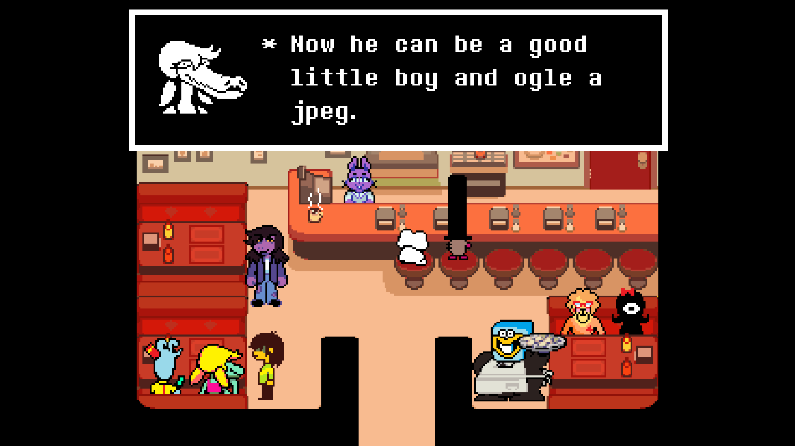

---

Fuck, this series is good. I was in no rush to get caught up on DELTARUNE
considering that I'm gonna have to wait until at least 2026 to get the next
chapter. But damn, I'm so glad to have finally finished chapters 3 and 4.

I loved the entire scene in Noelle's house. The new climbing puzzles and 3D
gameplay were super fun. Jackenstein, the old man, the piano puzzles. GREAT
stuff.

The entire Jackenstein fight was hilarious, unique, and challenging. And I love
all the story stuff you get with him later, too.

I normally hate "darkness" game mechanics but honestly they weren't overdone
here and felt original with the "sonar" mechanic. The final boss of the chapter
was great too. Very stressful but not too hard.

The artwork was stunning. You can really see the results from the extra
time/budget/help on chapters 3 and 4. I don't remember if she worked on chapter
3, but I noticed Marial Cartwright ([Kinuko](https://kinucakes.carrd.co/)) in
the credits for animation this time around. I'm a massive fan of her work on
Skullgirls and Indivisible, so it was cool to see her in the credits.

In this chapter we see a breaking point for Ralsei, and I loved it. With every
chapter, we find out more complicating details about these characters, and the
scenes just feel written perfectly to me. Susie also gets a lot of interesting
development.

This chapter leaned in to the dark and spooky aspect of this world a lot more,
and I think they nailed it. We're really seeing more of this important
"darkness" come through heavily and it I just love the execution.

As always there's tons of gags throughout the whole playthrough, and the light
world sections provide some nice levity to counter the dark world's tone.

The DELTARUNE train is chugging along at full speed, and I'm thrilled to see the
full arc of this story.

Oh, also, I love that they expanded the Guitar Hero-esque minigame in chapter 4.
I had a lot of fun getting T-rank on all 3 songs on both difficulties.

<figure>
  
  <figcaption>Mama Miba</figcaption>
</figure>

<figure>
  
  <figcaption>Deltarune</figcaption>
</figure>

<figure>
  
  <figcaption>Now he can be a good little boy and ogle a jpeg</figcaption>
</figure>

<figure>
  
  <figcaption>Ralsei after learning forbidden knowledge</figcaption>
</figure>

<figure>
  
  <figcaption>I love the pancake breakfast scene lol</figcaption>
</figure>
