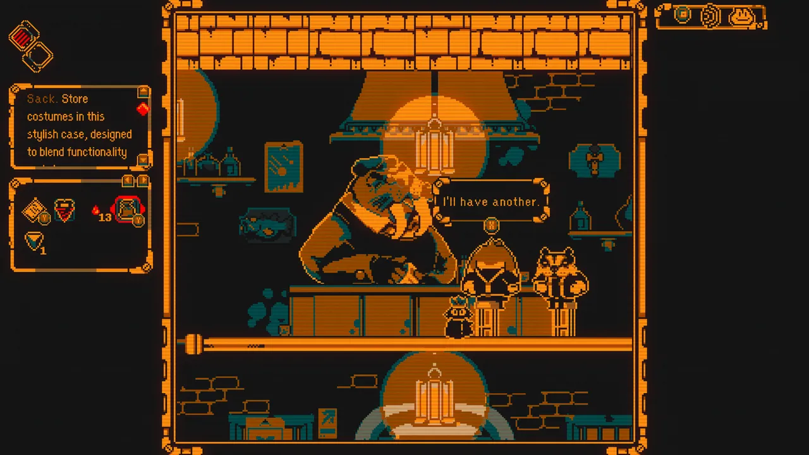
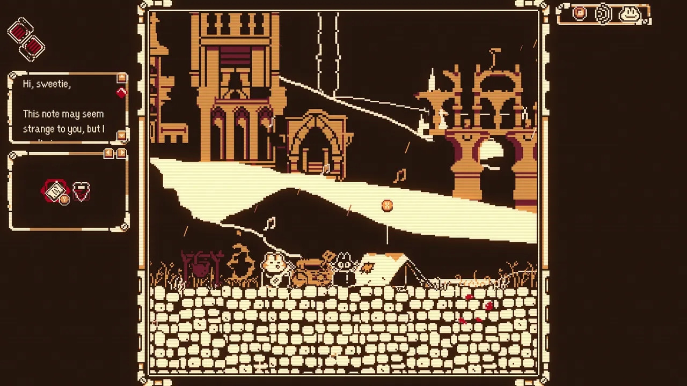
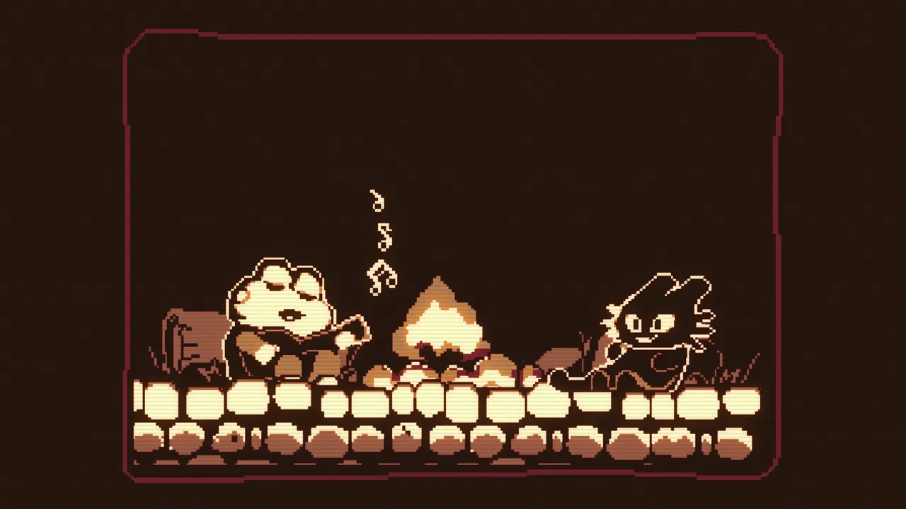
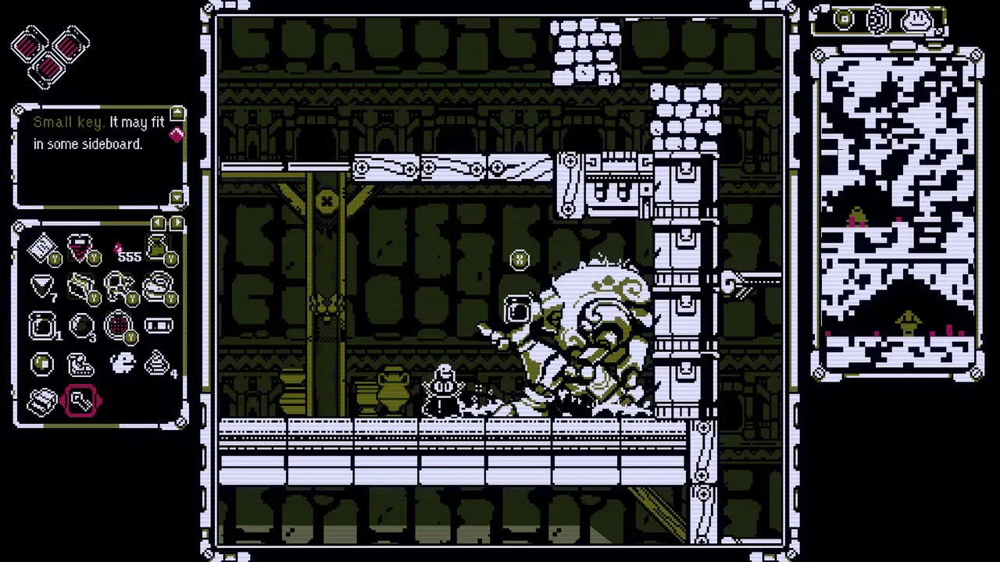
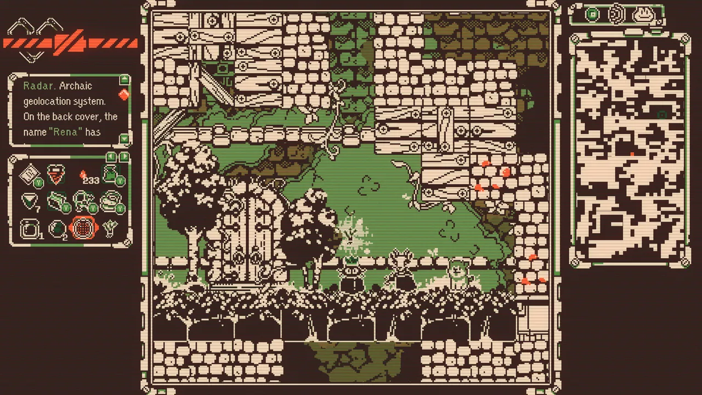

---

[Everdeep Aurora](https://store.steampowered.com/app/2251400/Everdeep_Aurora/)
is initially fun to dig around and explore in this digging-centric highly
vertical exploration story game. I heard it was a Metroidvania, but honestly
it's so linear and there's almost no meaningful upgrades... and the map is
actually just "radar" and the underground earthquakes mean things slightly
change location on you all the time.

It felt Souls-like in the evocative dialogue and implications about a larger,
dying world... which was an interesting contrast to the large variety of cute
animal characters.

I wanted to talk to everyone and help them out, but tons of backtracking and
mediocre platforming made the game drag on a bit.

I almost certainly wouldn't have gotten the true ending to this game without a
guide. It's not especially hard, but I had run out of patience for the slow
exploration in this game. The endings were all fine, but leave most details open
to interpretation. I don't want a Lord of the Rings ass ending, but I was hoping
to get a little bit more from this game in the writing department. The vibes,
however, are great.

I want to stress that this game is super cute and interesting... but I wanted a
bit more game and a bit less tedium.

<figure>
  
  <figcaption>The areas with larger guys and different color palettes were interesting</figcaption>
</figure>

<figure>
  
  <figcaption>The frog is your little buddy</figcaption>
</figure>

<figure>
  
  <figcaption>I love the full sized illustrations in this game</figcaption>
</figure>

<figure>
  
  <figcaption>Nice Chozo statue reference, but upgrades are not very interesting in this game</figcaption>
</figure>

<figure>
  
  <figcaption>I reunited this deer with her dog</figcaption>
</figure>
