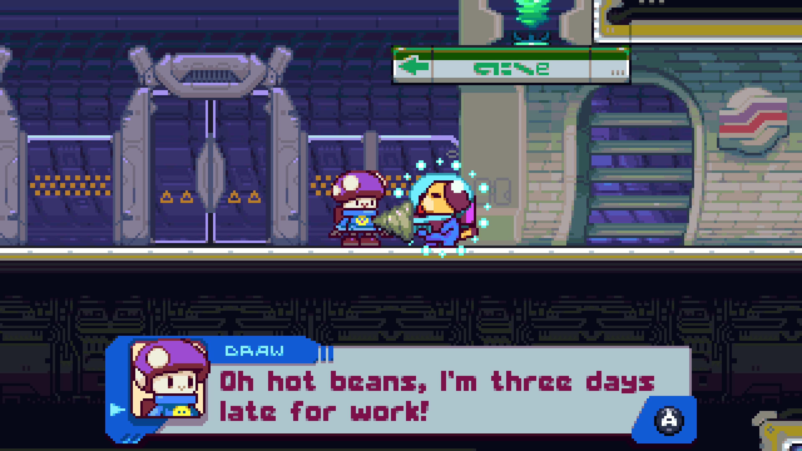
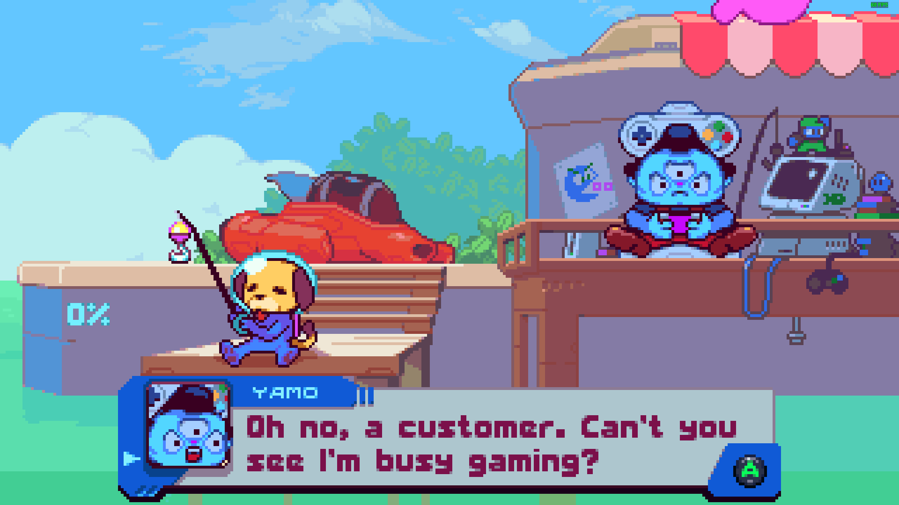
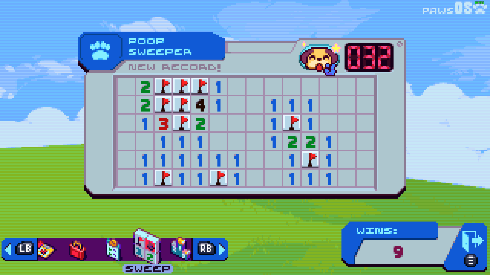
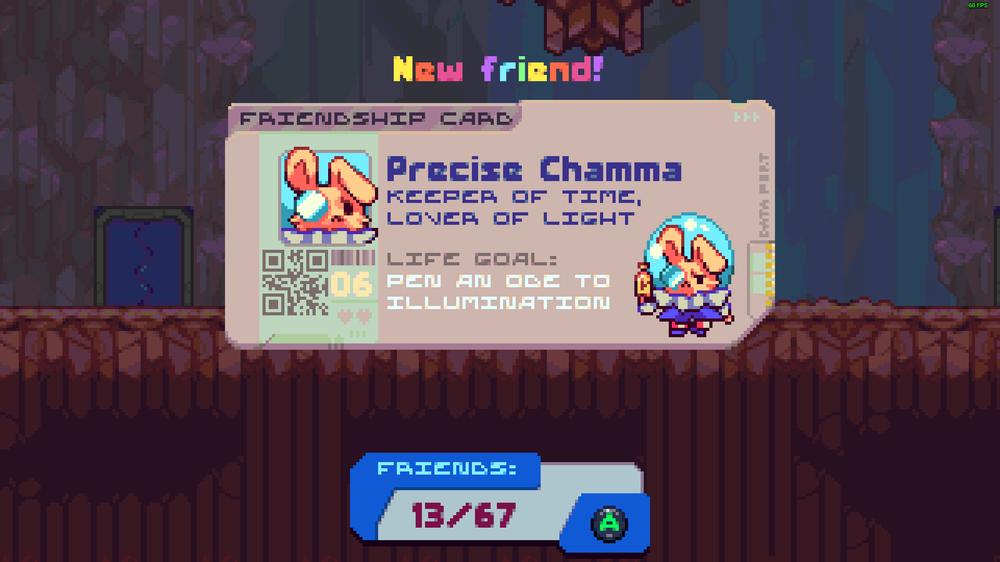
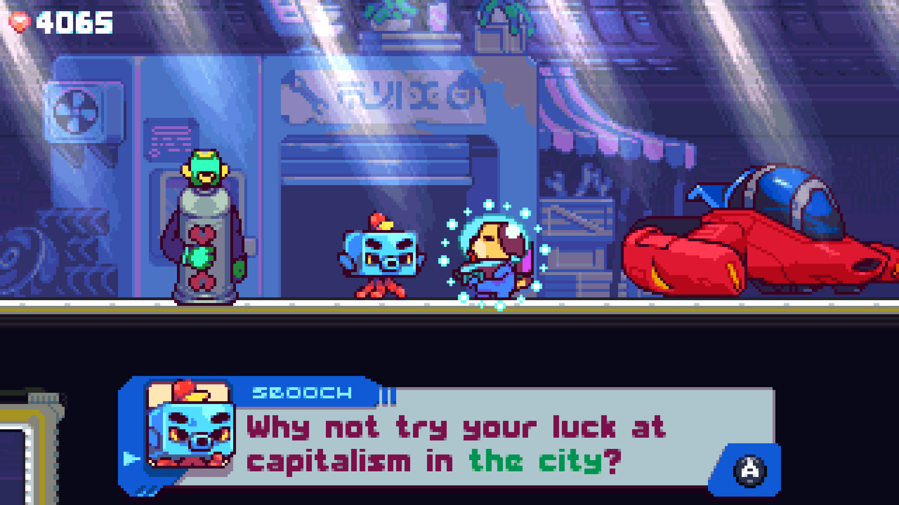
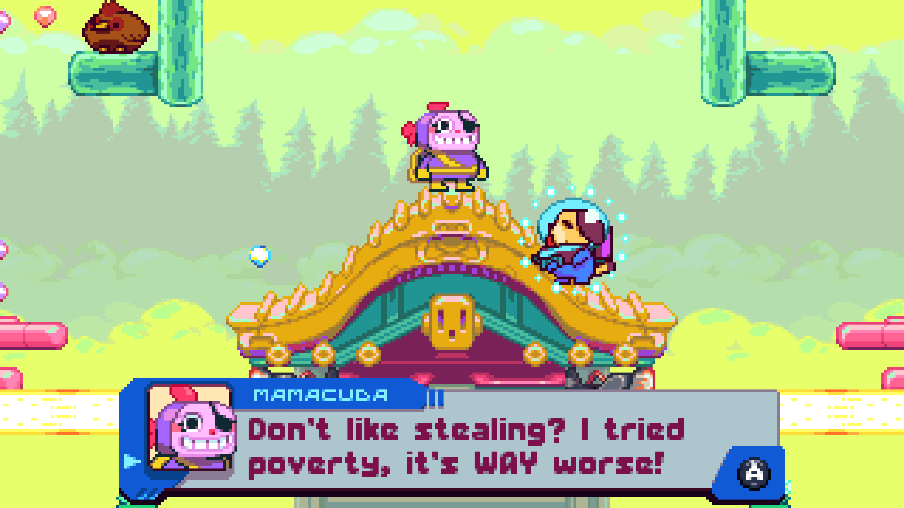

## Visuals

Absolutely gorgeous. The characters are so expressive and well drawn. The style
is perfect. The animations are disgustingly smooth and good looking. This has to
be one of the nicest looking games on the GBA.

My only complaint is that because everything is so large, the game feels very
"zoomed in", which can make gameplay a bit tough.

## Audio

It's great! A bunch of different tunes to set the mood, and all the sound
effects are nice too. No complaints here.

## Gameplay

I really liked it at first, but it grew a bit frustrating near the end. There's
not a lot of checkpoints in this game, and there's a ton of backtracking. The
core concept of the game is that the maps wrap around vertically and
horizontally, and you have to go through each one three different times upon
your first visit. Each time you have one of your three core powers removed
(jetpack, shield, gun). It's a cute idea to get more mileage out of each area,
but the wrapping levels combined with the built-in replaying meant I felt like I
was always walking over the same areas.

The boss fights were not my thing. I've certainly fought many harder video game
bosses, but these just felt claustrophobic and weirdly fast paced, for what is
otherwise an exploration platforming game in the vein of Wario Land 3 (SUCH a
good game omg). The game offers 3 difficulty levels, but not a lot changes
between them. In the later levels and bosses, I died a lot, and the game isn't
terribly generous with checkpoints. Despite having a regenerating shield, this
game has a lot of instant or near-instant deaths, which put a damper on my
experience.

Also, there's a point where you have to have 10,000 gold in order to continue,
which was a total slog. And a different point where you need to have 50 (well,
actually 48 is enough) friends to continue. Both of these are kinda arbitrary
barriers, though I'll let the friends one slide since it's really a core game
mechanic you'd have to be skipping.

## Writing

Everyone has the cutest dang lines, and I enjoyed the storyline completely. A
plot point is befriending 50 of the 60-some inhabitants of the solar system, and
I adored getting to meet every single one of them.

## Other

The game's speed is framerate dependent, and it doesn't provide a framerate
limiter. When I first started playing the game, I was using my 360 Hz monitor,
so the game was running at 6 times the expected speed. It's not too hard to find
the NVIDIA Control Panel settings to fix that, but it's also not something I'd
prefer to have to do. I ended up playing most of the game on a different 60 Hz
monitor anyway.

<video src="turbo.hd.mp4" controls preload></video>

**A clip of the game running at 6x speed because of the bug with high refresh
rate monitors.**

## Overall

This is a really cool game, and it's even more impressive when you realize it
was made for the GBA and came out in 2023! The PC version only has a few minor
enhancements to the GBA version.

I think if you can go into this game with enough patience, you'll be fine. Don't
forget to scour every inch of everything, and use the "look" command (L) to move
the camera around to help find what's next.

I wish I had a bit more patience for its shenanigans later on, but I had to look
up a few things that were stumping me.
