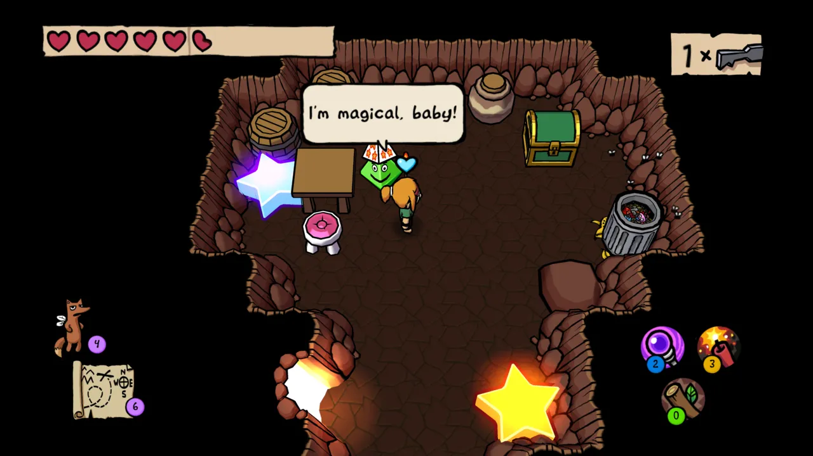
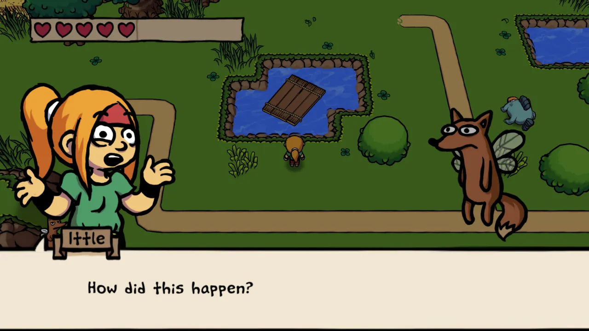
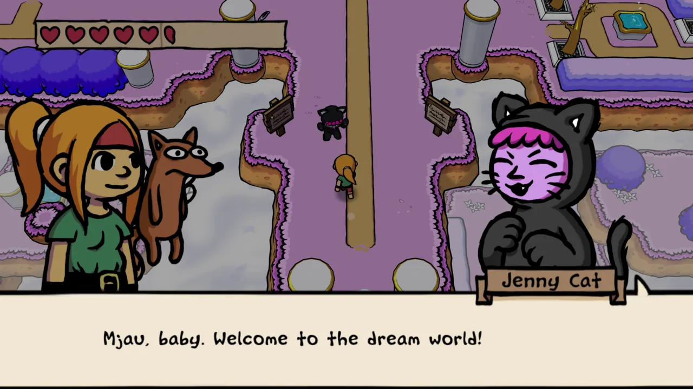
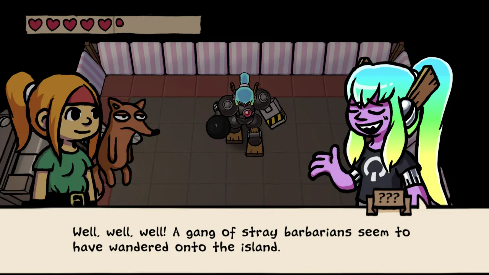

## Puzzles

Most of the puzzles were fun and felt fair. A few puzzles felt like they
required you to discover techniques that were completely not obvious, or
technically hard to pull off. I think accidentally performed a glitch to solve
one of the puzzles (pushing a triangular block straight instead of diagonally).

<figure>
  
</figure>

I'm pretty sure I had to solve a puzzle using an advanced magic wand technique
that wasn't demonstrated to me in the game and I only discoverd by accident
while mashing buttons.

Theoretically you can do the first seven dungeons in any order, but I was happy
to take the game's suggestion on which dungeon order to use. I also skipped all
5 optional dungeons, because they immediately felt extremely obtuse and
timing-heavy in each of their first rooms, and I had already soured on the game
a bit by the time I unlocked them.

<figure>
  
</figure>

## Combat

About halfway through the game I noticed there was a menu option to reduce
combat difficulty. I still found the game pretty challenging even after enabling
that. While the game doesn't punish you especially badly for combat failure
(respawn at the dungeon entrance, but dungeons are pretty small), you do still
have to redo the entire fight you lost.

<figure>
  
</figure>

Also, it's possible and quite easy to accidentally walk out a door mid-combat
and reset an entire fight when it's not a boss. This was really frustrating.

The combat centers around two main things: your extremely weak stick/sword and a
dodge roll with invincibility frames ("iframes"). Enemies have a lot of health.
Some required more sword hits than I could bother counting. Many enemies in the
later half of the game spew large quantities of projectiles, and can crowd the
screen in such large numbers that I had no hope of dodging or even understanding
what was going on.

Technically the magic rod lets you reflect projectiles, but I found the aiming
to be quite difficult in the game and routinely missed, taking more damage than
if I had tried to dodge.

## Writing

The game is almost painfully self-aware. Mostly it made me chuckle rather than
groan. It definitely feels like a game from 2016 with this writing style, to me.

<figure>
  
</figure>

## Overall

I seem to remember liking the
[first game (2013)](https://store.steampowered.com/app/241320/Ittle_Dew/) more
than this one. I preferred the hand drawn 2D art style to the cel-shaded 3D
(though I think it's quite good for what it is).

It's a fairly effective 2D Zelda-like, held back by frustrating combat. Perhaps
someone with a better knack for its combat could really like it. It also seems
well suited to speed running, including an in-game timer and many different
possible dungeon orders.
