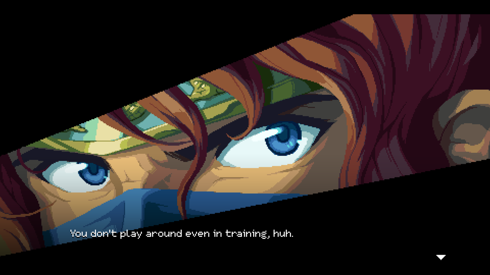
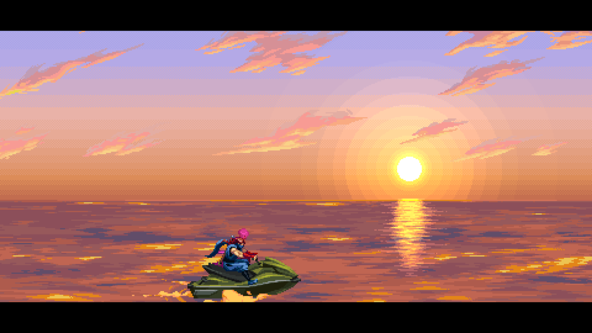
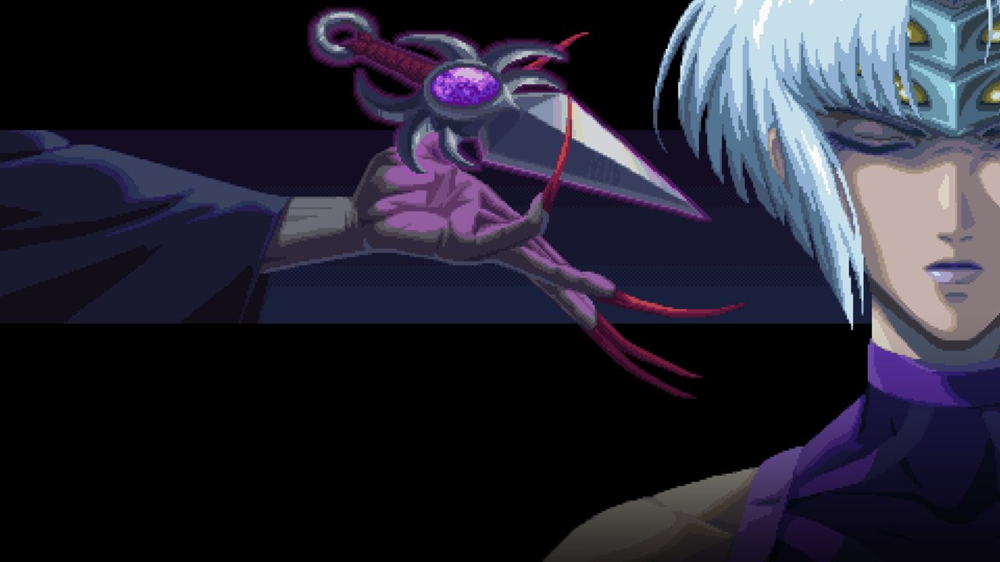
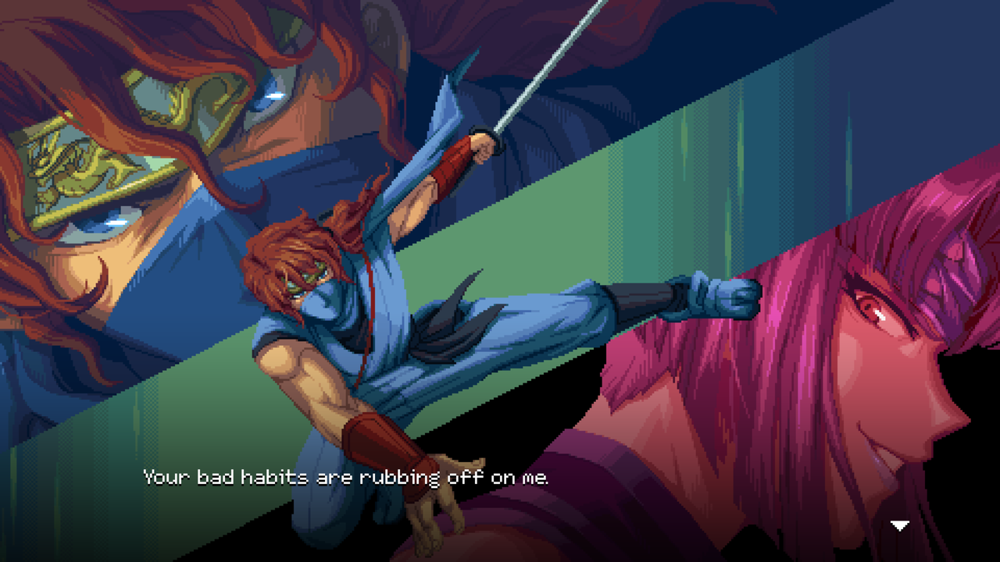
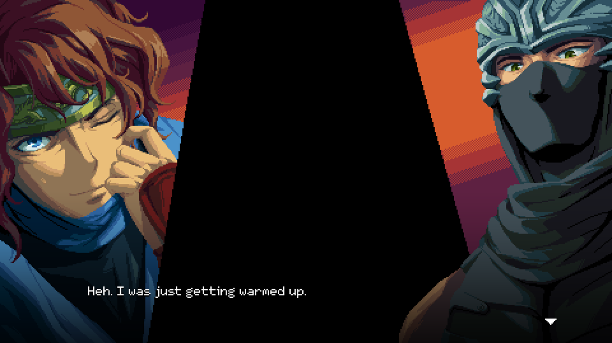
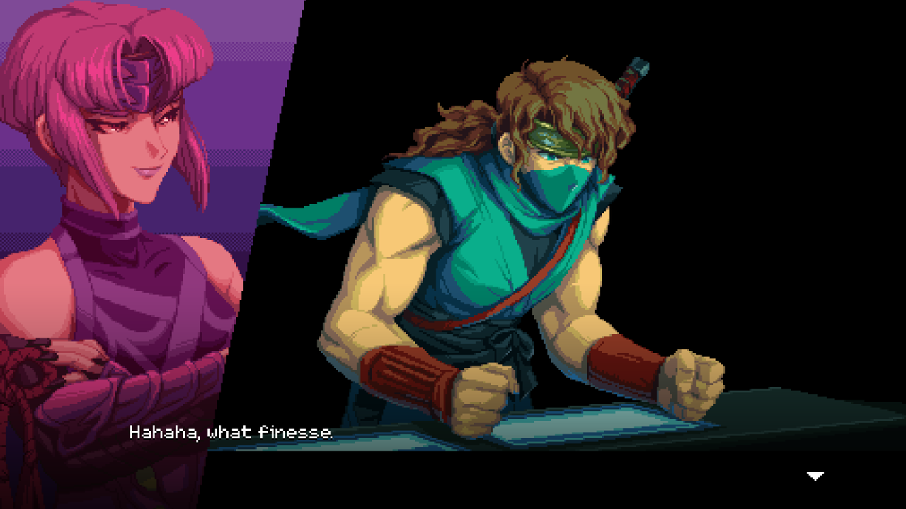

---

The new
[Ninja Gaiden: Ragebound](https://store.steampowered.com/app/2542120/NINJA_GAIDEN_Ragebound/)
is perfection. At $25 and 12 hours, there's no chance for it to overstay its
welcome. It's affordable and fantastic. I'd happily pay more, though. I
seriously have no complaints.

(I beat all the main and secret levels, replaying a few to get better scores or
find secrets. I did not try Hard Mode, though.)

The artwork is so stunning, I had to include several screenshots for y'all to
feast your eyes on.
[The soundtrack](https://kidkatanarecords.bandcamp.com/album/ninja-gaiden-ragebound-original-game-soundtrack)
is great too, and available on Bandcamp. The gameplay is tight, and so is the
platforming. The standard difficulty was a perfect and exciting level of
challenge for me, but you can adjust several parameters to make it easier. You
can unlock a harder difficulty, if the base isn't enough for you.

The levels all had something fresh and fun going on. There's even a jet-ski
level and a motorcycle level! There's auto-scrolling levels, platforming heavy
sections, combat rooms, and a bunch of challenging bosses.

While the story isn't anything amazing, it strikes a good balance between
serious and silly without laughing at itself or feeling insincere.

Check out a gameplay video and see if it's for you. This is a new bar for action
platformers for me.

<figure>
  
  <figcaption>An early illustration of our pretty boy hero: Kenji.</figcaption>
</figure>

<figure>
  
  <figcaption>There's a jet-ski level and a motorcycle level!</figcaption>
</figure>

<figure>
  
  <figcaption>Another stunning fullscreen illustration.</figcaption>
</figure>

<figure>
  
  <figcaption>The story isn't deep, but I like Kumori and Kenji's relationship.</figcaption>
</figure>

<figure>
  
  <figcaption>The famous Ryu Hayabusa is your mentor.</figcaption>
</figure>

<figure>
  
  <figcaption>Kenji isn't good with computers, but Kumori has his back.</figcaption>
</figure>

None of these screenshots are in the "action" parts of the levels because...
it's just too high octane for there to be a good moment to screenshot! It's not
blisteringly paced, but there's little downtime.
