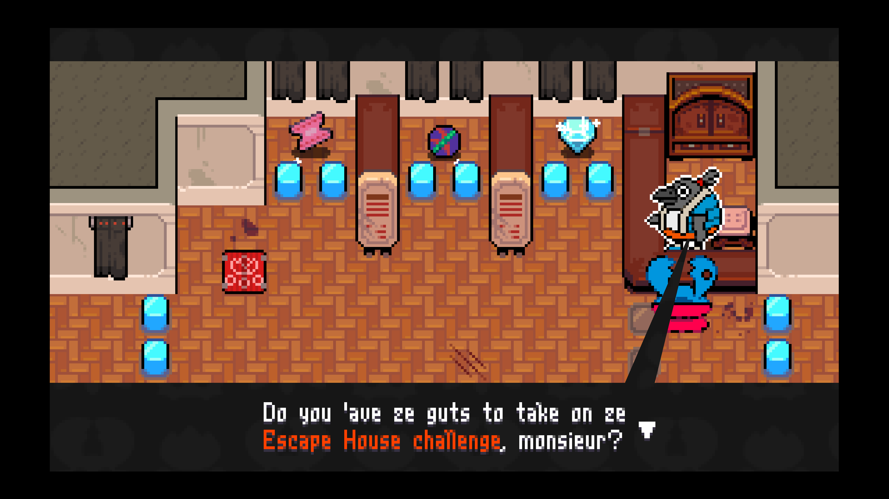
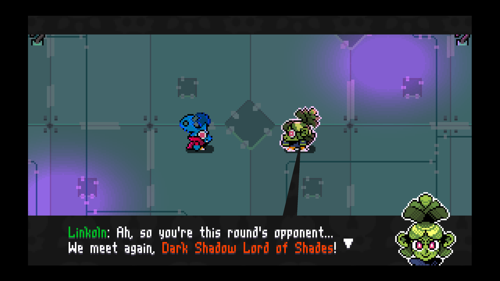
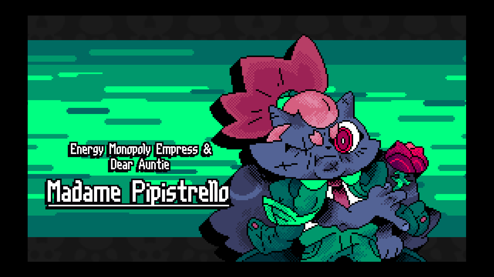
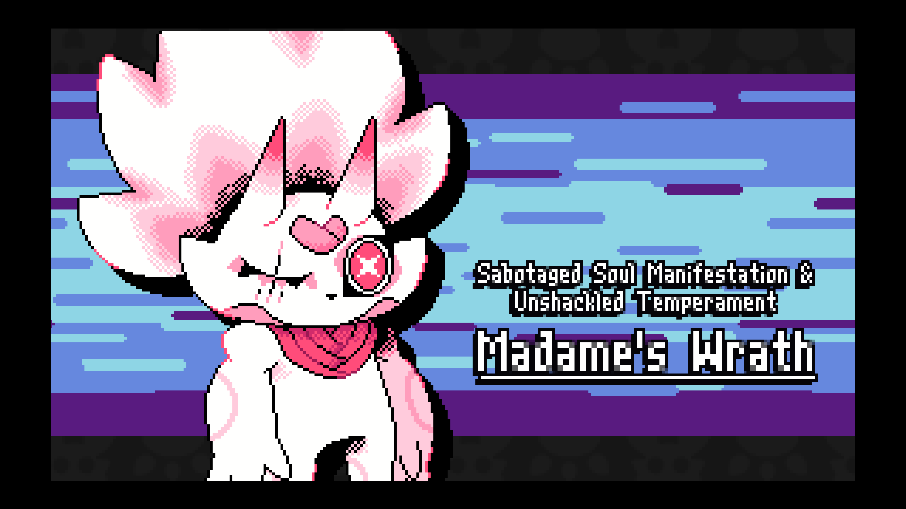
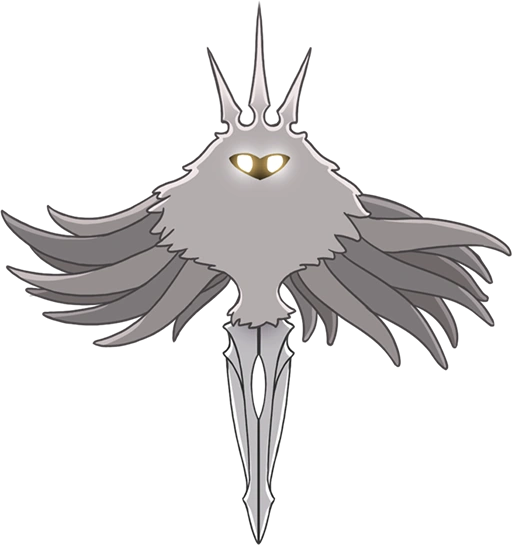
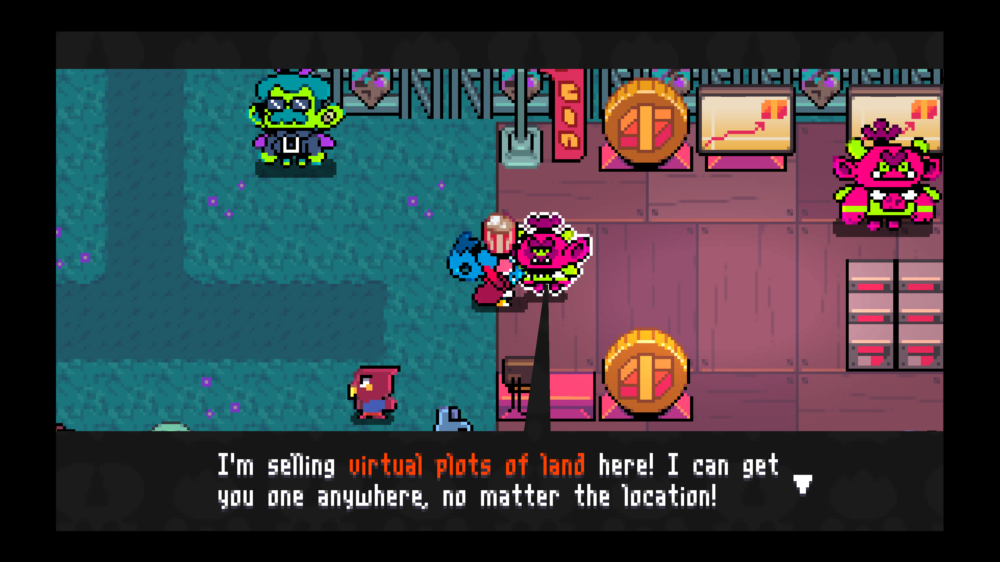
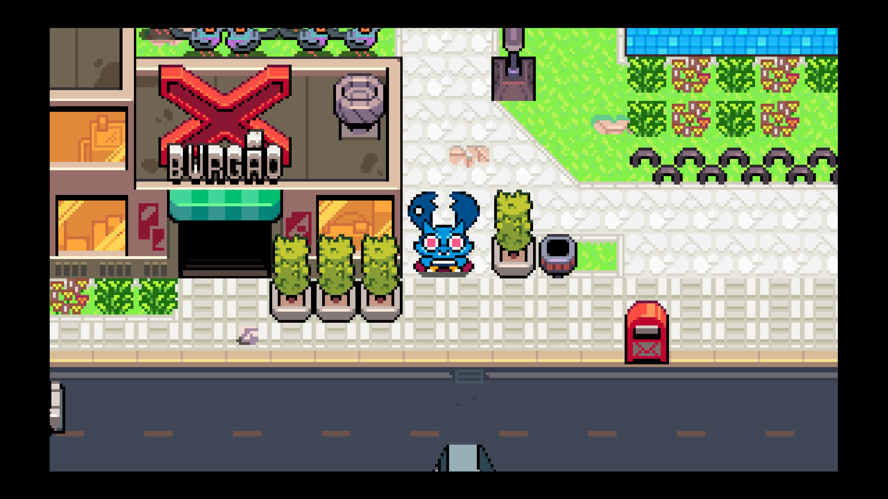

---

I really wanted to like
[Pipistrello and the Cursed Yoyo](https://store.steampowered.com/app/2870350/Pipistrello_and_the_Cursed_Yoyo/)
more than I did. I _love_ the old 2D Zelda games, but indie devs don't seem to
make much in the same vein. Hell, that's not even a tag on Steam. Zelda-likes
are frequently tagged with Metroidvania, but I think the relation isn't as
strong as people make it out to be.

A good Zelda-like is mostly exploration and puzzles. A good Metroidvania is
mostly exploration and combat. Also, Zelda-likes typically have almost no
platforming, since the top down camera angle is not conducive to that.

If this game wasn't both immensely charming and full to the gills with
accessibility options, I definitely wouldn't have finished it.

Hollow Knight seems to have captivated the brains of indie game designers out
there. Perhaps not as badly as Dark Souls, but you could argue that Hollow
Knight is sort of the Dark Souls of Metroidvanias. And I like both games to
differing degrees, but continuously feel like indie game designers are taking
the wrong inspirations from these games (mostly focusing on difficulty).

## Pros

- Gorgeous pixel art

- Goofy and fun writing

- Modern day setting with modern problems

- The yoyo is creative

- Some of the platforming feels really good to execute

- The intertwined city and sewer maps are really fun

- Copying the mini puzzle shrines from _Breath of the Wild_ was a great idea

## Cons

- Way too much platforming for a top down video game

  - I actually like platforming games, like Celeste and N+, for what it's worth

  - And fall damage??? C'mon!

- Many puzzles are time sensitive and require quick execution

- Encounter design feels awful

  - Enemies are all damage sponges, taking 2-3 times as many hits as I'd expect

  - Combat mostly occurs in locked rooms (a la Devil May Cry or Guacamelee), and
    the enemy density is too high to effectively fight without getting hit
    constantly

- The game is extremely punishing by default

  - You start with _three_ hearts, but you can't talk half or quarter heart
    damage like in Zelda... that's three _hits_, period

  - Beating a boss doesn't give you another heart container

  - And it takes **_8_** heart container pieces to get another heart in this
    game (unlike 4 in Zelda---where there's also full sized heart containers
    available)

- Some of the best upgrades in the game require you to go into _debt_, severely
  penalizing your stats until you can accumulate enough money

- By default you lose money when you die

- Holy fucking shit cars drive super fast, rarely stop, and hit you so much that
  I died walking around the city at least once

## Screenshots

<figure>
  
  <figcaption>I hated this platforming section</figcaption>
</figure>

<figure>
  
  <figcaption>Linkoln is definitely not Link</figcaption>
</figure>

<figure>
  
  <figcaption>Madame Pipistrello, your aunt</figcaption>
</figure>

<figure>
  
    <figcaption>A not so subtle homage to Hollow Knight</figcaption>
</figure>

<figure>
  
  <figcaption>I didn't bother getting the true ending of Hollow Knight, but I certainly heard about The Radiance</figcaption>
</figure>

<figure>
  
  <figcaption>The NFT joke area made me laugh a bit</ficaption>
</figure>

<figure>
  
  <figcaption>X-Burgão! In case you missed this game being developed in Brazil</figcaption>
</figure>
