<link rel="stylesheet" href="./style.css" />

---

<label>
  <input id="gbc-filter" type="checkbox" autocomplete="off" checked />
  

    
Game Boy Color screenshot filter

    
<small>You can hover the images to temporarily turn off the effect.</small>

  

</label>

---

<figure>
  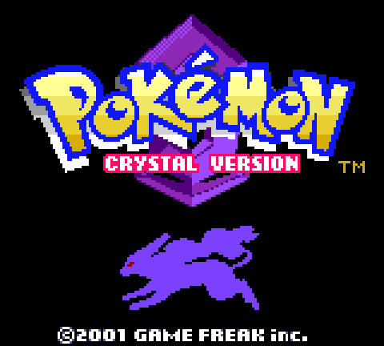
  <figcaption>Pokémon™ Crystal Version © 2001 GAME FREAK inc.</figcaption>
</figure>

## Allow me to gush for a moment about the Game Boy Color

I think the Game Boy Color is the peak of video game graphics. I was a very
impressionable age when this device was in its prime, but hear me out. The
relatively large color palette (15-bit color) combined with intense restrictions
(3 colors for foreground objects, 4 colors for background objects, a base sprite
size of 16x16, and an unlit screen), led to some really creative graphics.

The simplified color palettes and sprite sizes are so much more evocative than
modern game art, and certainly easier to produce (I'm not saying pixel art is
easy, though, mind you).

Compared to a modern high definition game like Pokémon Scarlet/Violet, the dense
low resolution environments create this sense of so much more detail than is
actually present. I feel like there has to be some relation here to why film
looks best 24 fps, even though that's barely enough fidelity for our brains to
register something as movement.

## Starting my adventure

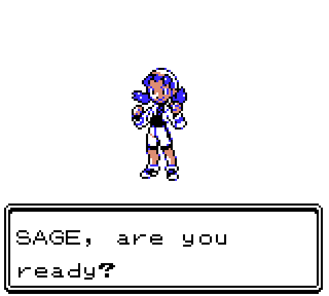

**My body is ready.**

Crystal was the first game where you could play as a girl! How cool. The game
got off to a good enough start for me, though it does make you wait a while
before you earn the right to use Pokéballs.

I thought long and hard before picking Cyndaquil as my starter, because there
are usually so few good Fire type Pokémon available. I don't care for the
starters in Johto as much as in Kanto, but it's hard to account for nostalgia in
the comparison.

What really struck me early on with this game was how few decent Pokémon
appeared in the wild. Pretty early on I snagged a Geodude who I used for like
half the game. I probably should've hung onto Hopplip or Bellsprout, because
after passing them up I didn't stumble upon many Grass types for a while.

## Density and scale

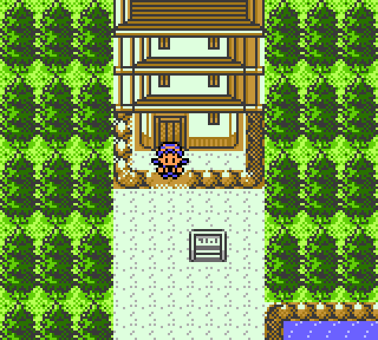

**This tower is absolutely gorgeous.**

We often take for granted how modern games are able to represent massive scale.
Older games like this are not spacious in the least bit. These areas are tiny
and dense. The art is filled with questionable proportions, particularly with
respect to the size of humans and buildings. And there's nothing wrong with
that. That does not pull me out of the experience. The stylized graphics invite
me to think _about a house_ rather than seeing a highly literal full 3D house on
display. The imperfect colors around tile edges? A gorgeous compromise, in my
mind, between memory usage and perfection.

## Grinding, balance, and party diversity

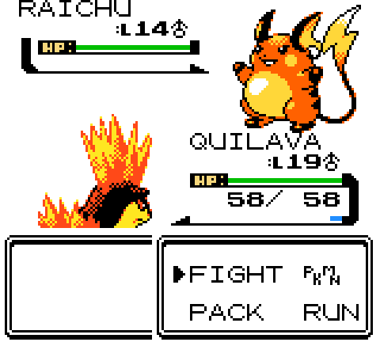

**The game taunted me with trainers using Raichu (my favorite Pokémon), but you
can't get your own until you've nearly finished the game.**

The wild Pokémon were generally 10+ levels below my party, and I didn't enjoy
banging my head against the slow and uninteresting random battles in order to
fix that problem. I do have a tendency to skip battles too much in RPGs, but
even when I fought every trainer here I felt like I just had enough XP to scrape
by, nowhere near enough to level up a new monster for the next gym.

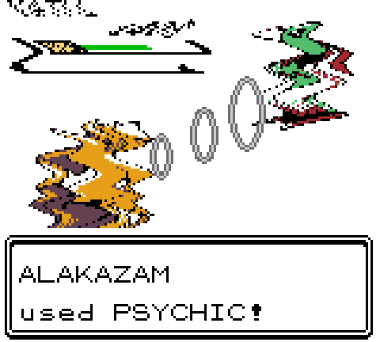

**Alakazam is so broken in this game, I used him more than every other Pokémon.
Also, this attack animation was extremely impressive in action.**

Psychic type was absurdly powerful in Generation I, and despite their efforts,
feels nearly as broken in Generation II. It's not that I _wanted_ to use
Alakazam as my main Pokémon, it just felt like I had to unless I wanted to grind
a lot.

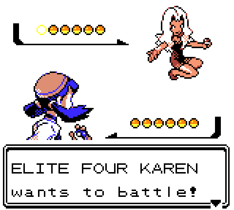

**Karen stood no chance against Alakazam.**

Sadly, most Gym Leaders and Elite Four members can be easily swept by one or two
Pokémon. The 1v1 format of Pokémon battles doesn't lend itself to a lot of depth
here. And yes, I could make it harder by using Set mode instead of Switch (to
disallow me from counter-picking against the enemy's next Pokémon), but I didn't
really see the point. I would've just ended up chugging some potions or grinding
to be able to tank a hit when counter picking.

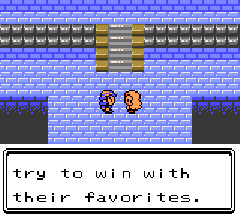

**Karen thinks I should win with my favorite Pokémon, but that would take far
too much grinding...**

Does she have any idea how hard it is to keep a balanced team up to level?
Grinding against wild Pokémon is a terrible way to get XP, but Trainer battles
are finite... At this point in the game the best way to grind\* is actually to
just fight the Elite Four repeatedly, but it's a bit mind-numbing. Also, what if
you run out of money in this game? You wouldn't be able to catch any more
Pokémon. That seems really weird to me. I guess you could always grind your
starter Pokémon to level 100 and beat the game that way.

\* I never did the battle tower, so maybe that's useful? But I really don't
know.

## Breeding

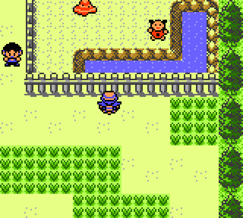

**Love was not in the air for Ditto and Kadabra.**

Breeding is new with Generation II and is utterly bizarre. It combines the worst
parts of grinding by forcing you to walk around endlessly. I tried in vain to
get my Ditto to breed with my Kadabra, but there was simply no chemistry between
them. It appears that in Generation II, there was a fixed chance that Pokémon
simply wouldn't breed with each other, and the chance-per-step was already
extremely low. I gave up.

Dragon Quest Monsters (2000), had a far better system called synthesis\*. With
synthesis, the resulting monster was almost guaranteed to be substantially
stronger than the two "parents". It was also a great way to create monsters you
hadn't caught or even encountered yet.

\* A historical note: Dragon Quest Monsters released in 1998 in Japan, a year
ahead of Pokémon Gold/Silver, and is much more enjoyable to play. Too bad that
Pokémon is just so much damn cuter and destroyed the competition in the "monster
collection" genre so badly that they became synonymous with the term.

Compared with Shin Megami Tensei V (2021), though, both of these systems require
you to level up your newly created monster. In SMTV, your new monsters directly
inherit most skills from both parents and are already higher level and stronger
than the parents.

## Battling

Look, I made the [Pokémon Type Calculator](https://pkmn.help/) specifically
because I was tired of Pokémon battles. This probably shocks some people to
hear, but haven't found them interesting since I was a kid. The 1v1
rock-paper-scissors system is just not that engaging. You'll have to excuse me
for bringing up mechanically superior monster collection games again, but both
Dragon Quest Monsters and Shin Megami Tensei are fully based around 3-4 monster
parties, which makes the tactical space much more interesting.

## Catching Pokémon

<figure>
  

    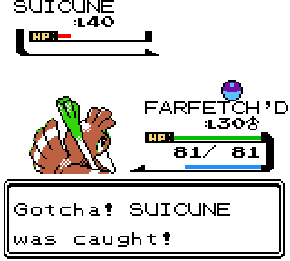
  

  

    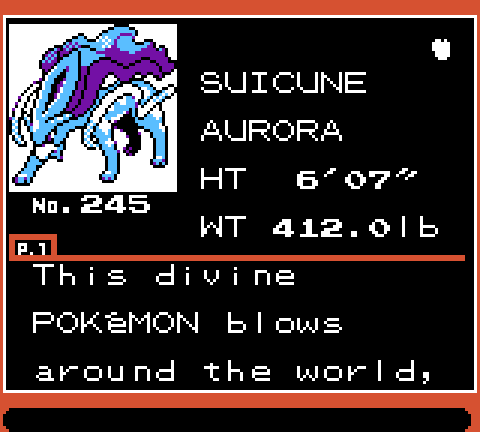
  

  <figcaption>
    I threw Pokéballs until I lost count,
    but my very first ball the next day caught Suicune.
  </figcaption>
</figure>

Catching Pokémon has got to be the system most in need of a complete overhaul.
Unlike Pokémon stats, natures, EVs, IVs, moves, types... all the systems that
are huge, complex, and hard to change... The Pokémon Company could change
catching in any game without breaking existing stuff.

They did exactly that in Pokémon Legends: Arceus, where it became more of an
action/stealth minigame most of the time. I genuinely had fun hunting down
monsters in that game, and would catch repeats of the same guy just for fun. And
you got XP for catching Pokémon there!

## Two regions in one game?

<figure>
  

    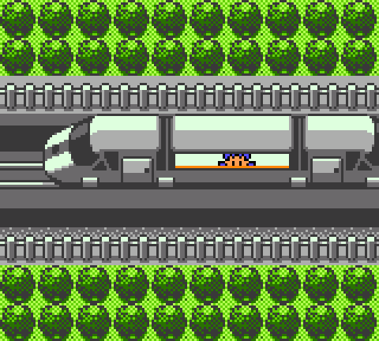
  

  <figcaption>Riding the train from Kanto to Johto</figcaption>
</figure>

While I appreciate the reveal of "OMG you can go back to Kanto", that part of
the game wasn't very fun. You're wildly overleveled for most random encounters,
and the gym leaders are total pushovers despite being redesigned. The fight
against Blue was definitely more engaging, though. I really wanted to do the
fight against Red as the capstone of my Crystal experience, but he's simply too
overleveled. His Pokémon are in the 70-80 range, and my highest monster was
like... 51 I think? a 20+ level gap is too challenging for a noob like me, even
with me counter-picking every Pokémon specifically to take him down. And I
wasn't about to grind to make it happen.

## Did I enjoy myself?

<figure>
  

    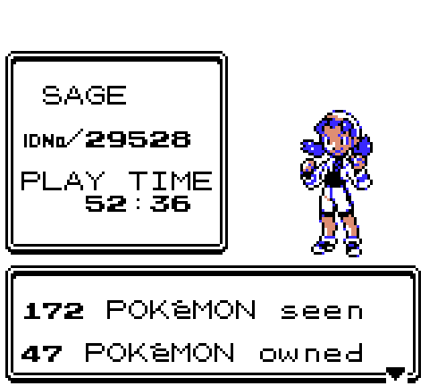
  

  <figcaption>I beat the Elite Four after about 50 hours of gameplay. I wrapped up Kanto
(besides Red) after 66 hours.</figcaption>
</figure>

This run was partially for fun and partially for research, I guess. If I hadn't
felt like I was missing something by never having played Generation II, I'm not
sure if I would've finished the game. Pokémon is a franchise that gets away with
a lot of mediocrity due to nostalgia, good character/monster designs, and
fantastic music. And you can't forget that kids aren't jaded and tired the same
way adults are. I soaked this stuff up like a sponge when I was a kid. And don't
kid yourself, Pokémon is still very much made for kids, even if The Pokémon
Company wants money wherever they can get it.

I didn't hate my time with Crystal, but it's also annoying in all the ways I
expected it to be. It doesn't feel lifeless or dull like Scarlet/Violet so often
feel, but the mechanics are sorely in need of some work.

I'll say this was a huge nostalgia rush and a cute experience, but not a great
game by modern standards.

## There are other monster collection games?

If you like Pokémon and haven't played _Dragon Quest Monsters_ for the Game Boy
Color (known as Dragon Warrior Monsters originally), I think you should give it
a shot! Assuming you're in the mood for a Game Boy Color game.

If you're looking for something more modern, you can't go wrong with _Shin
Megami Tensei V: Vengeance_, which is available on most modern gaming systems.
Don't listen to the haters about its lackluster story: the writing is more
interesting than any Pokémon game I've played, barring maybe Scarlet/Violet.

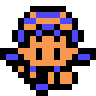
