## Thoughts

This game has that _Breath of the Wild_ juice: there's always _another little
thing to do_ right around the corner from your current location. A big laundry
list of tasks to keep you occupied. But while it might keep you busy, it lacks
the spirit of adventure that keeps Pokémon games engaging. Exploration is
largely dead, in favor of grinding and side quests.

I'm a huge fan of both _Pokémon Legends: Arceus_ and _Shin Megami Tensei
V_---games that bring open worlds to more traditional RPG series---but this game
misses the mark. It's not even that I have a problem with a small setting:
_Dragon Age II_ is my favorite in the series, and it famously takes place in a
single town.

I don't want Pokémon to feel chained to its past incarnations, but this game is
just so lacking in execution of its ideas. You'd really hope that
[the world's biggest media franchise](https://en.wikipedia.org/wiki/List_of_highest-grossing_media_franchises)
could afford to more quality into their video games. But I guess the profit
numbers don't match my dissatisfaction, so who knows when things will improve.

Maybe I should pick up
[Digimon Story Time Stranger](https://store.steampowered.com/app/1984270/Digimon_Story_Time_Stranger/)...
I'm still not sure why they saw fit to release the same month as a new Pokémon
game. But before I get to that, I think _Shin Megami Tensei IV_ is next on my
menu. And I also have _Dragon Warrior Monsters 2_ lying around, in case I want
to play the sequel to the Game Boy Color game I enjoyed back in 2019.

## Summary

### The good

- Catching Pokémon is still largely fun, like in Legends: Arceus

- Many of the new Mega Evolutions are fun and interesting

- Boss theme music is fantastic

- Jacinthe and Lebanne were an entertaining duo

- Canari, Corbeau, and Mable were all fun

- Rooftop traversal is an interesting puzzle mechanic

- The fluidity of fighting/catching in wild zones is remarkable

- Alpha Pokémon and Pokémon swarms made me yelp with fear

- Switching out PP and Accuracy for cooldowns and animation frame advantages is
  really interesting---I've barely scratched the surface of the strategic
  potential here

### The bad

- Lack of voice acting feels like an odd choice given the level of detail put
  into the scene writing---at least give us "beep beep beeps" when they talk!

- Fast paced trainer battles feel like they lose any strategic interest

- Brutally long "on rails" tutorial segment for the first few hours

- Urbaine/Taunie continues the tradition of annoying and braindead ally "rivals"

- Lumiose City is flat,
  [unconvincing](https://en.wikipedia.org/wiki/Potemkin_village), and
  uninteresting

- You can enter almost zero of the buildings

- The city day/night songs are repetitive and grating

- No bicycle or surfing!

- Real time combat is awkward, especially in small areas with uneven terrain

- Moves don't lock to their targets or use AoE circles like in MMOs, and
  hitboxes have a lot of issues

- Holding ZL and ZR so much made my hands hurt

- $30 DLC sold on day 1, with the update slated for February 28, 2026

- NPC draw distance is abysmal and distracting

- Wild Zones are claustrophobic and frustrating compared to Sword/Shield,
  Legends: Arceus, and Scarlet/Violet---like hunting at a petting zoo instead of
  a forest

- Final post-credits boss is a bit annoying due to trainer death mechanics

- You literally never leave Lumiose City, and the game even teases you about it
  if you try

## Images

<figure>
  
  <figcaption>
    Me climbing the ladder from Z to A!
  </figcaption>
</figure>

<figure>
  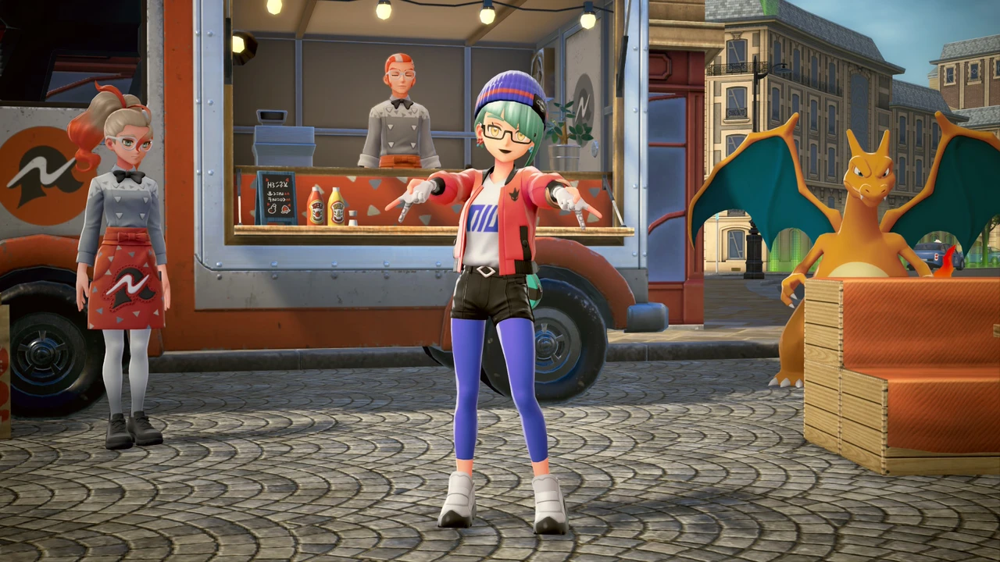
  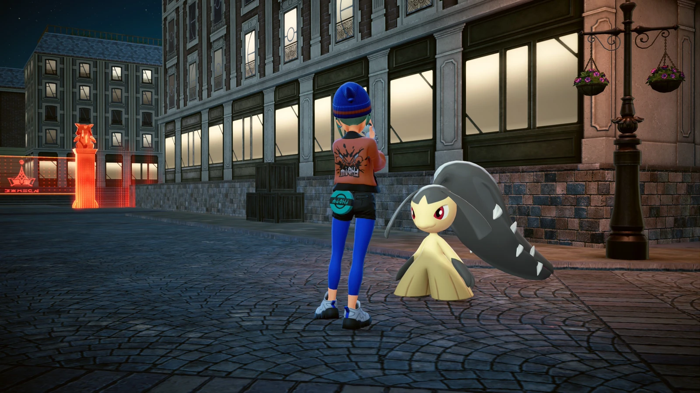
  <figcaption>
    Posing for a photo shoot (night & day).
  </figcaption>
</figure>

<figure>
  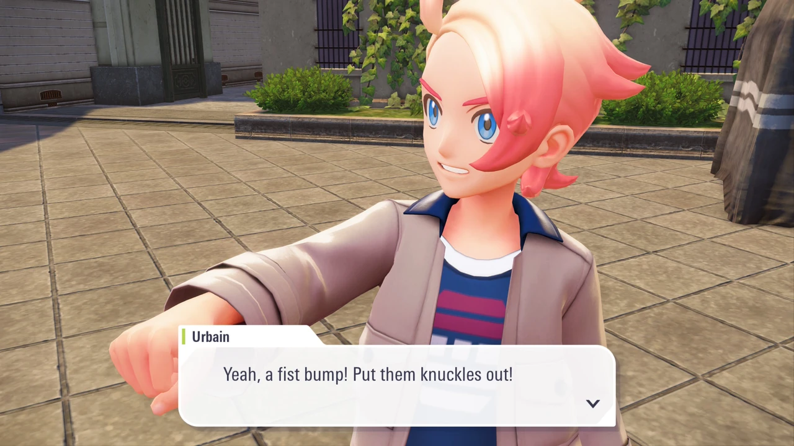
  <figcaption>
    I can't stand Urbain at all&mdash;and for some reason everyone wants to fist bump you in this game.
  </figcaption>
</figure>

<figure>
  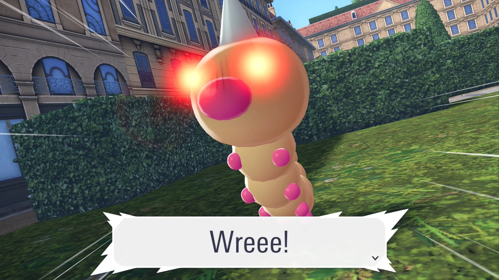
  <figcaption>
    An Alpha Weedle from a side quest.
  </figcaption>
</figure>

<figure>
  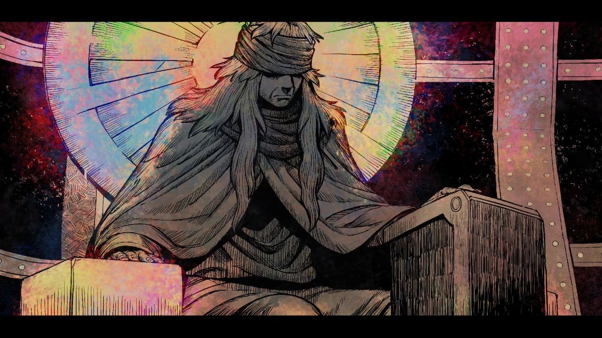
  <figcaption>
    Still from a gorgeous hand drawn cutscene about AZ.
  </figcaption>
</figure>

<figure>
  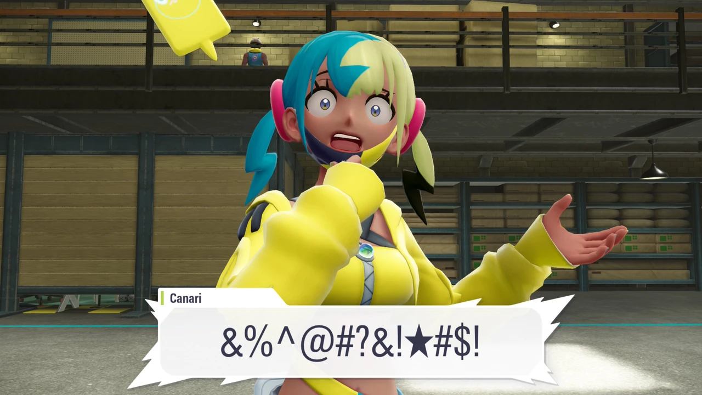
  <figcaption>
    Canari, the Electric streamer... not to be confused with Iono.
  </figcaption>
</figure>

<figure>
  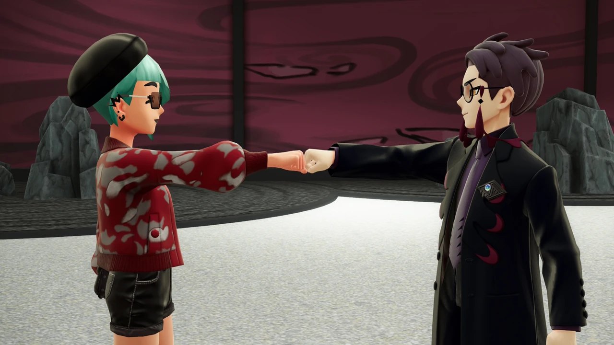
  <figcaption>
    Corbeau really grew on me, with his <q>thief with a heart of gold</q> vibe.
  </figcaption>
</figure>

<figure>
  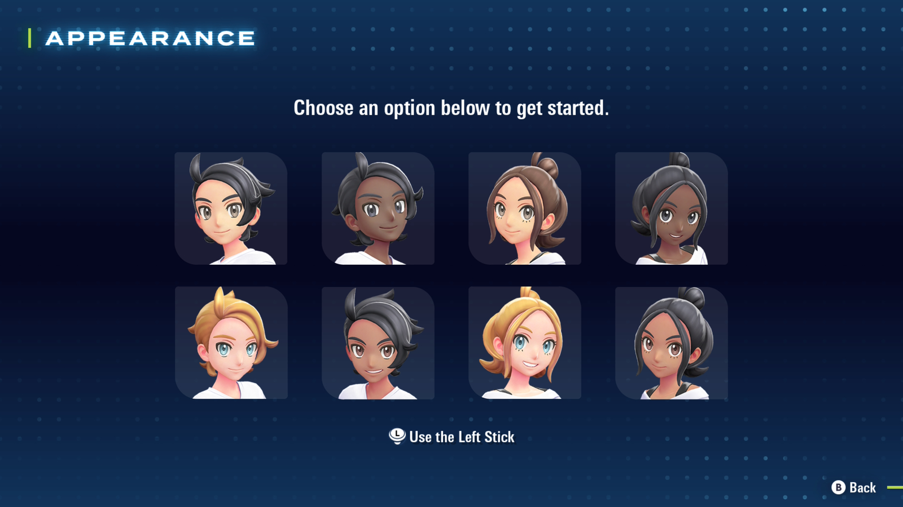
  <figcaption>
    Gender/pronouns are still determined based on the hair length/side of the character picker...
  </figcaption>
</figure>

<figure>
  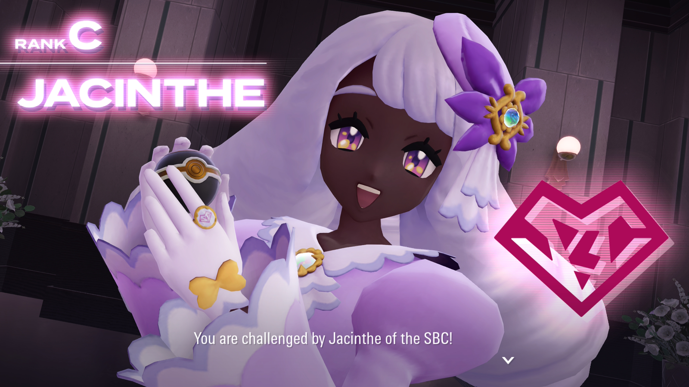
  <figcaption>
    Jacinthe perfectly embodies the Fairy type&mdash;cute, magical, passionate, and unpredictable.
  </figcaption>
</figure>

<figure>
  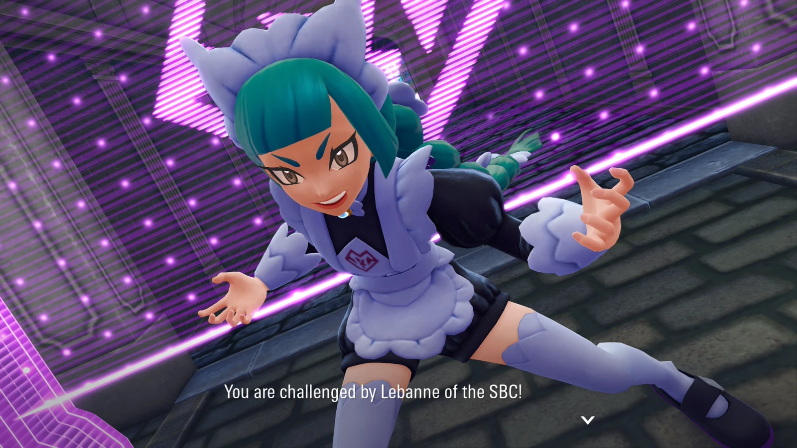
  <figcaption>
    Lebanne's true nature on display&mdash;vicious and rowdy.
  </figcaption>
</figure>

<figure>
  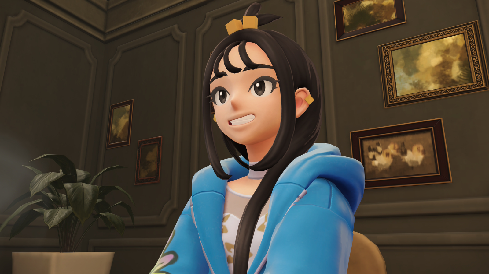
  <figcaption>
    Lida was my favorite Team MZ member&mdash;she has actual leadership skills and a contagious smile.
  </figcaption>
</figure>

<figure>
  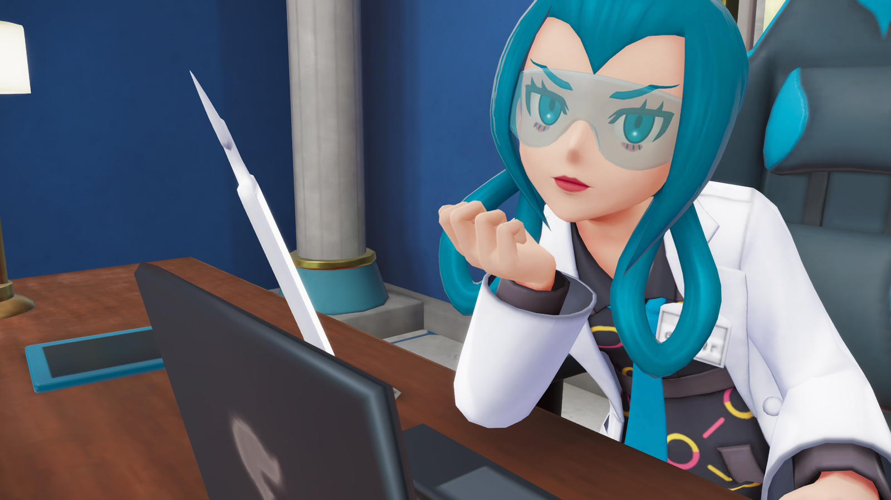
  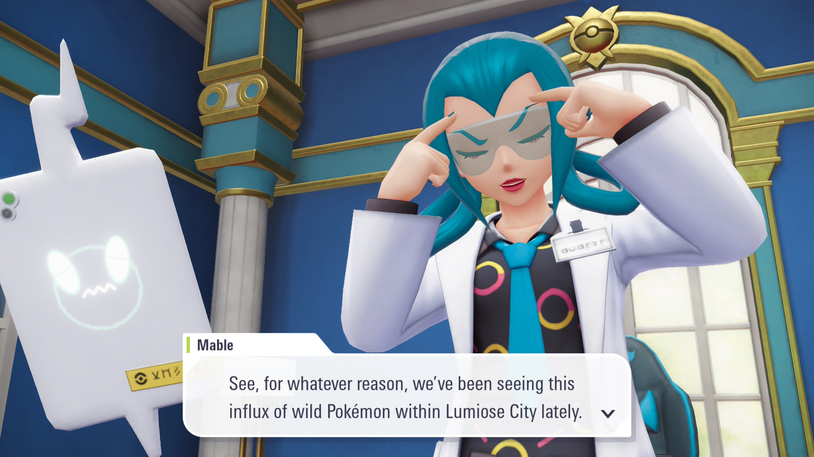
  <figcaption>
    Mable flips the script on the typical Pokémon Professor&mdash;I love her rowdy attitude and secret past.
  </figcaption>
</figure>

<figure>
  
  <figcaption>
    Barbacle is probably my least favorite Pokémon, but the <q>biblically accurate angel</q> vibes of its new Mega Evolution really worked for me!
  </figcaption>
</figure>

<figure>
  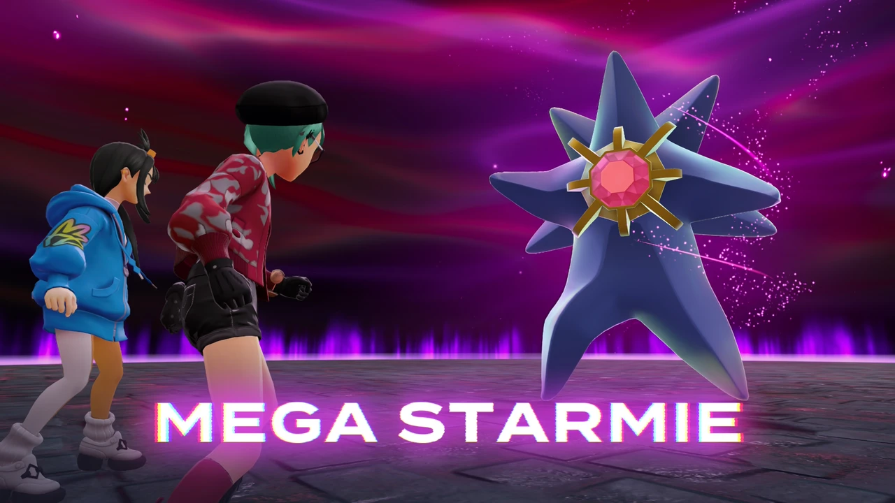
  <figcaption>
    The Internet loves Mega Starmie&mdash;and so do I!
  </figcaption>
</figure>

<figure>
  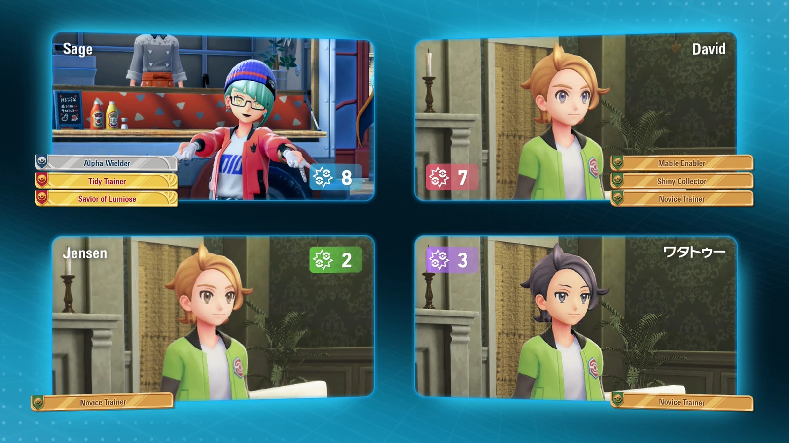
  <figcaption>
    The multiplayer experience of <q>carefully taken photo</q> vs 3 guys with default avatars.
  </figcaption>
</figure>

<figure>
  
  <figcaption>
    Somebody needs to get this guy to the <a href="https://pkmn.help">Pokémon Type Calculator</a> immediately.
  </figcaption>
</figure>

<figure>
  
  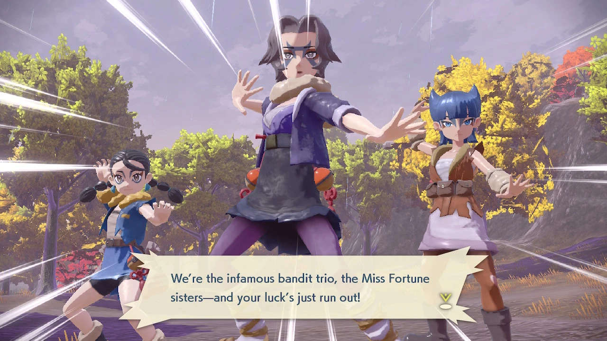
  <figcaption>
    I miss the graphical style from Pokémon Legends: Arceus.
  </figcaption>
</figure>
