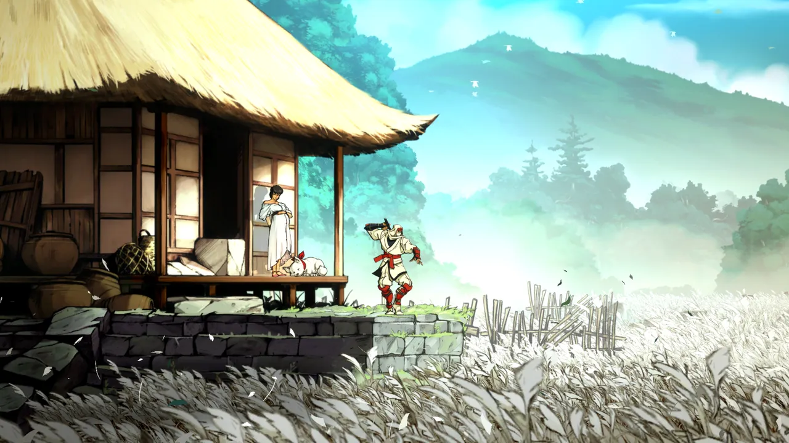
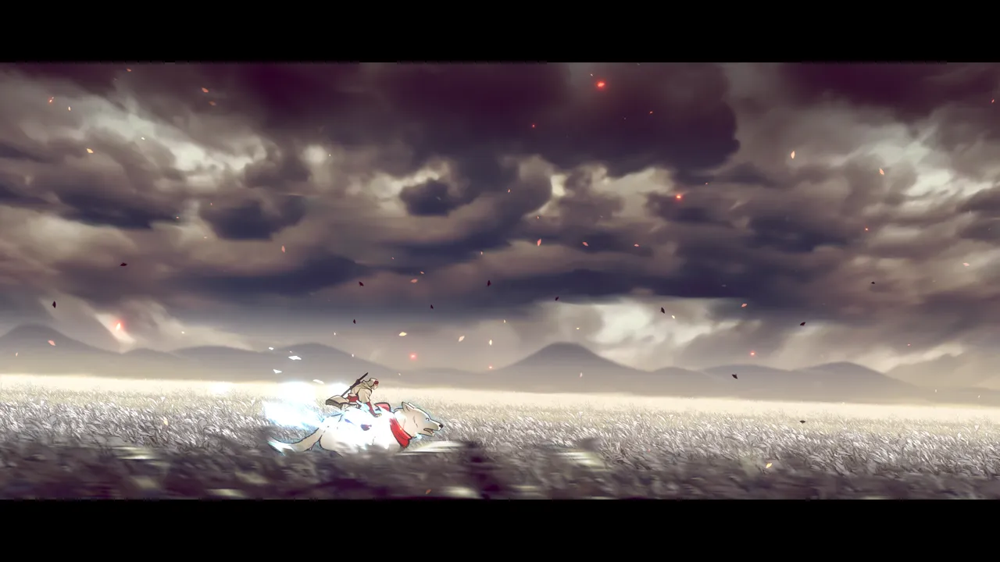
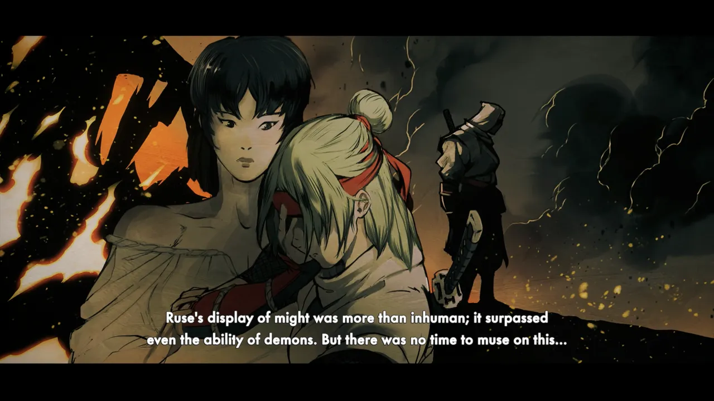
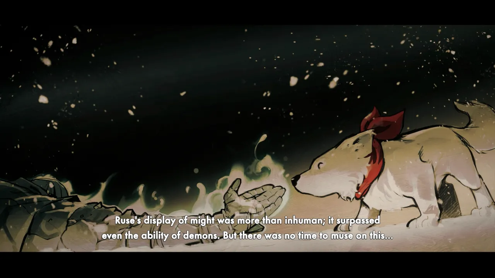
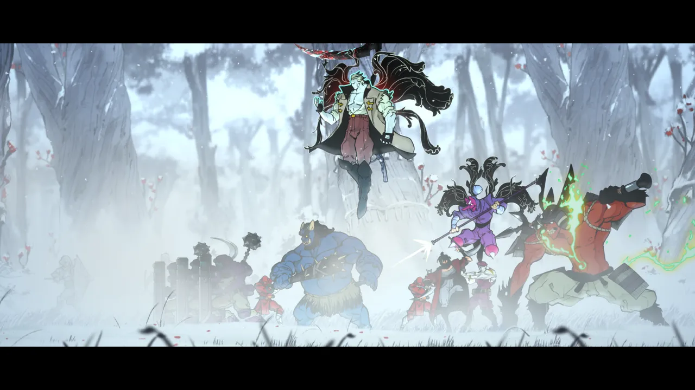
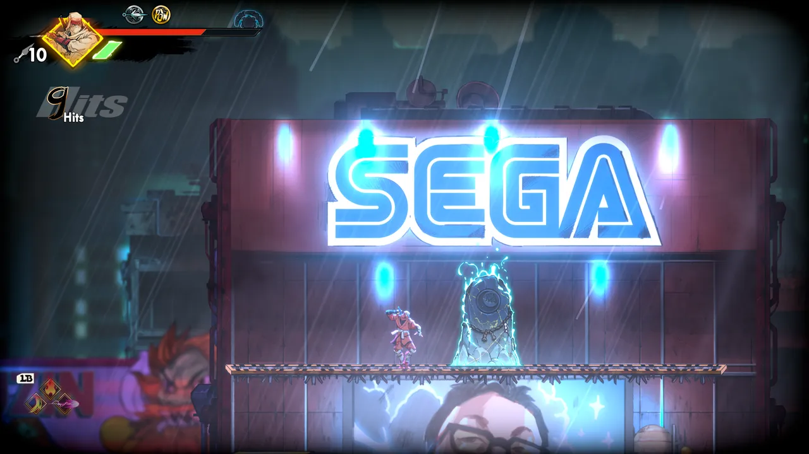
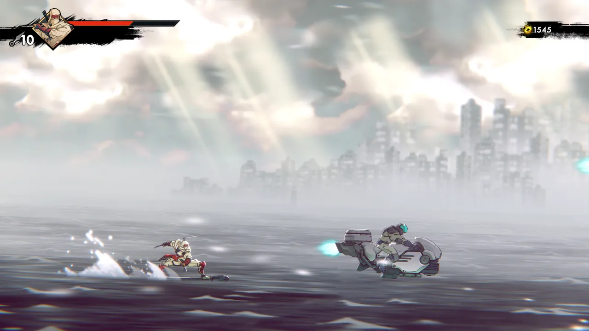
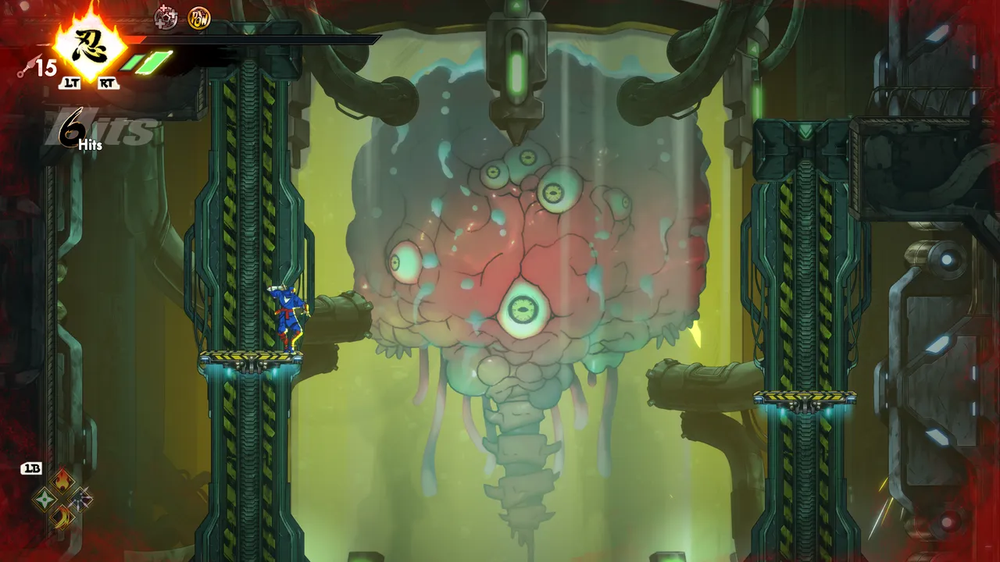
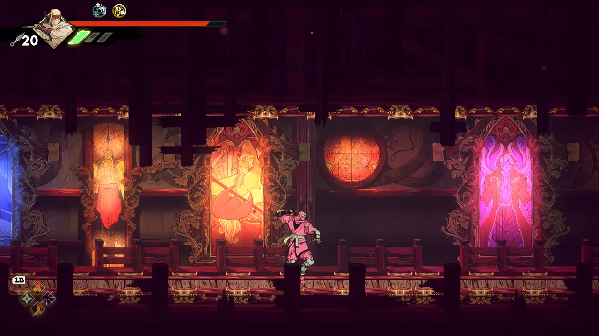

---

The new
[SHINOBI: Art of Vengeance](https://store.steampowered.com/app/2361770/SHINOBI_Art_of_Vengeance/)
is fun, but nowhere near as
[exciting to me](/blog/2025/review-ninja-gaiden-ragebound/) as NINJA GAIDEN:
Ragebound.

I'd say it feels like an
[Xbox Live Arcade](https://en.wikipedia.org/wiki/Xbox_Live_Arcade) game. It's
fun, but it feels overcomplicated and punishing in all the wrong ways to me.

The combat is actually pretty satisfying to pilot. The combos flow smoothly, and
there's lots of nice attacks you can unlock. But there's simply far too many
game mechanics for my taste.

1. A combo system featuring light & heavy attacks
2. Dodge roll
3. Charge attack
4. Double jump
5. A diagonal dive attack
6. A ground pound attack
7. An unlockable parry mechanic
8. Air dash
9. Wall run, jump, and slide
10. Grappling hook
11. Glider
12. Execution move
13. Special moves (4 slots)
14. Super moves (4 slots)
15. Equipment (2 slots)

And there are so many other moves and combos you can buy in the store in-game.
Learning to juggle all of these things is something I never quite got the hang
of.

However, the encounter design frequently left me irritated. The game starts to
litter the screen with extremely tanky enemies that overwhelm the screen with
projectiles and unavoidable attacks. And "armor" becomes a huge part of the
game: a regenerating type of health that resists most attacks. If you play the
game right, you can get all the enemies prepped for a multi-assassination attack
that clears the screen of enemies.

The platforming sections were my least favorite, and in my stubbornness, I
actually finished the most
[Super Meat Boy ass part of the game](https://www.youtube.com/watch?v=xdcbNZLJIzs).
I can't say that was a wise use of my time, but I did it anyway. I'm no stranger
to challenging platforming (I love Celeste and N+, for example), but the
mechanics felt unrefined and the checkpointing felt unusually obnoxious.

I played through the whole game on normal difficulty (the hardest difficulty).
Perhaps I would've liked it more if I had lowered it, but again, I was feeling
stubborn.

I don't think the game is bad... but it's not for me. I could even imagine
someone liking this better than Ninja Gaiden: Ragebound, given how it's harder
by default and absolutely stuffed to the gills with game mechanics. But for me
it felt like an unfocused and disappointing second course after gorging myself
on a full plate of perfect ninja game immediately before playing this one.

<figure>
  
  <figcaption>Joe Musashi and his pregnant wife.</figcaption>
</figure>

<figure>
  
  <figcaption>Gorgeous 2D graphics and extensive parallax scrolling make this level a visual treat.</figcaption>
</figure>

<figure>
  
  <figcaption>And then comes the vengeance.</figcaption>
</figure>

<figure>
  
  <figcaption>Sorry, the dog dies!</figcaption>
</figure>

<figure>
  
  <figcaption>Lord Ruse and his gang of evildoers.</figcaption>
</figure>

<figure>
  
  <figcaption>Neo City was full of neon signs and billboards.</figcaption>
</figure>

<figure>
  
  <figcaption>The surfing level was annoying but optional.</figcaption>
</figure>

<figure>
  
  <figcaption>Nice Metroid reference.</figcaption>
</figure>

<figure>
  
  <figcaption>The final level has some beautiful zones.</figcaption>
</figure>
