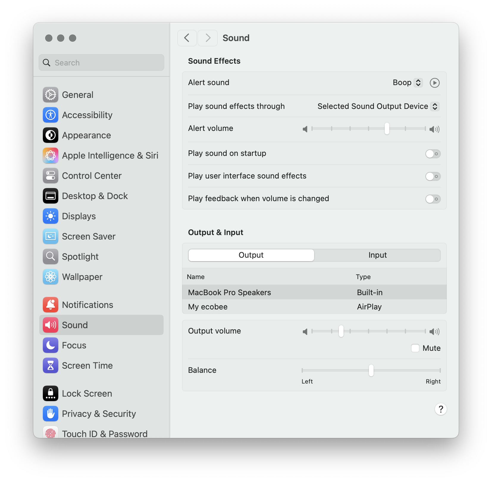
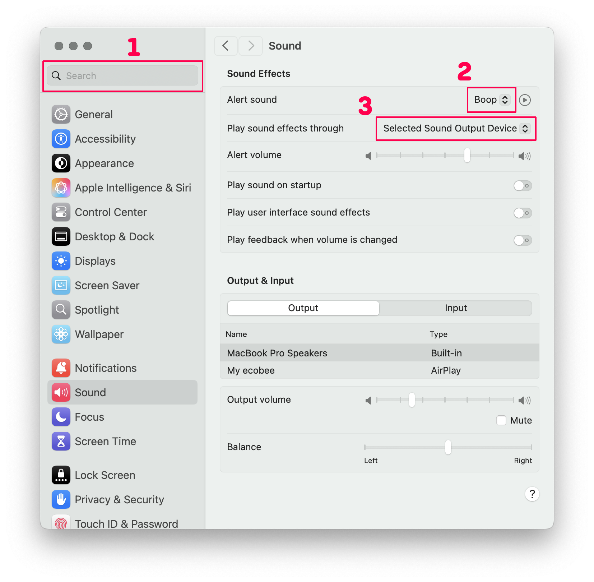
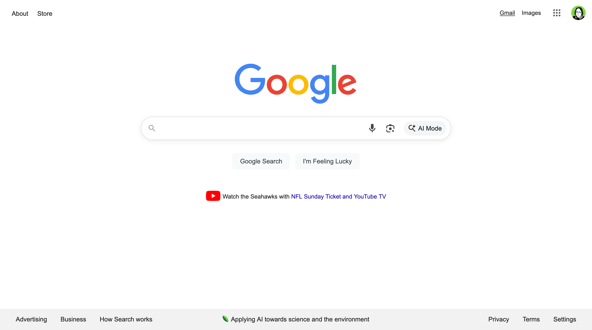
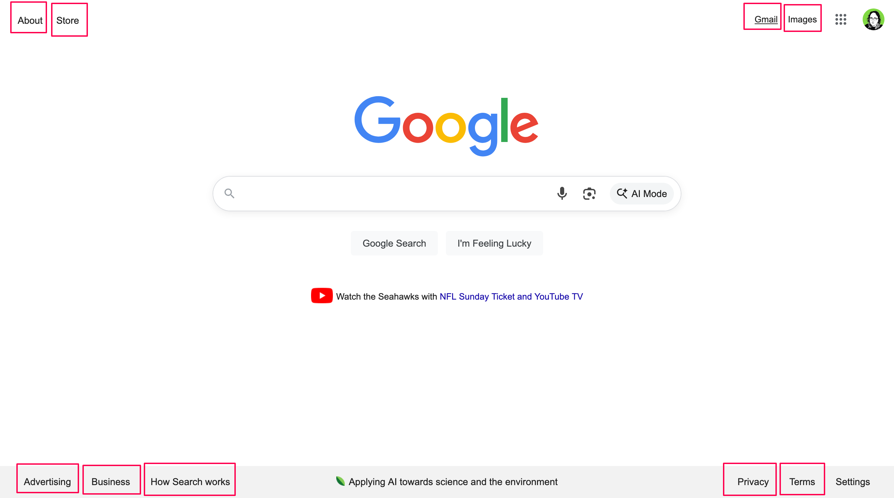
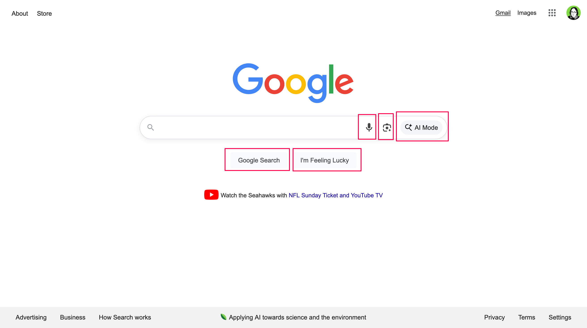
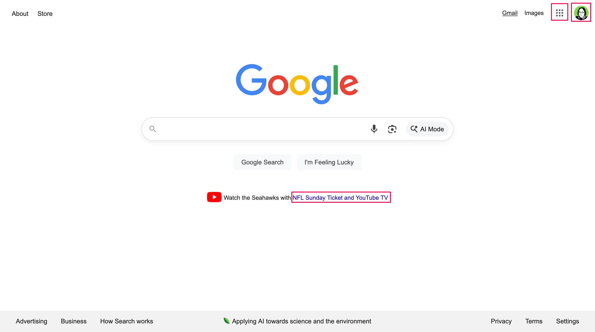

<script type="module" src="./assets/element.mjs"></script>

## What's the Problem?

Changing the CSS
[cursor](https://developer.mozilla.org/en-US/docs/Web/CSS/cursor) property is
ugly, distracting, and causes issues determining which page elements are links.

Instead of using overly subtle colors and inappropriate animations, try making
buttons respond instantly to hover with a subtle color change, and ditch the
animation---they actually make it harder to tell when the button is changing
states.

Remember: on mobile, users will never see your hover effects (e.g. color and
cursor changes). You should be inspiring confidence in the clickability of your
button from first glance.

**Interactive demo:** _Try clicking these buttons, hovering them, and focusing
them with Tab._

<figure>
  <div class="frame max-content">
    <wavebeem-blog-finger>Loading...</wavebeem-blog-finger>
  </div>
  <figcaption>Bad examples (left) vs. good examples (right)</figcaption>
</figure>

The differences are subtle, but the right column of buttons inspires a lot more
confidence to me than the top, despite no pointer cursor (👆).

## When Should I Use the Pointer Cursor?

I think that the CSS
[cursor](https://developer.mozilla.org/en-US/docs/Web/CSS/cursor) property
should almost never be set. If something is a link, it should use the
[anchor element](https://developer.mozilla.org/en-US/docs/Web/HTML/Reference/Elements/a)
(`<a>`), which gets this cursor automatically when `href` is set as well.

### Links

Links should generally take you to a new page (using HTTP GET) automatically by
virtue of their markup (`<a href="...">`). Links cause the browser's URL to
change, and can be safely opened in a new tab (regardless of SPA vs MPA
architecture).

### Buttons

Buttons may either modify the existing page (e.g. open a modal dialog) or submit
a form. The form may result in a new page loading (typically by issuing an HTTP
POST request).

While a button could be used to call `location.href = "..."` or
`history.pushState(...)` to navigate the page... this isn't an ideal use of a
button, since links already do this job better. It's ok to call this at the end
of a button's handler if there's also some kind of side effect that happens
before the navigation.

### Cards

Did you know that you can put images and paragraphs inside of anchor tags? The
easiest way to make a card clickable is to make the whole thing one giant anchor
tag.

If your designer wants you to have nested click areas, however, you're out of
luck. Nesting anchor tags is invalid, so you'll have to use a hack like nesting
a relatively positioned "hitbox" inside the main link of your card.

```html
<div class="card">
  
  <a href="..." class="card-link-main">main link goes here</a>
  <footer>
    <a href="..." class="card-link-footer">author link goes here</a>
  </footer>
</div>
```

```css
/* Root for absolutely positioned element */
.card {
  position: relative;
}

/* Expand the main link to fit the entire card size */
.card-link-main::after {
  content: "";
  position: absolute;
  inset: 0;
  width: 100%;
  height: 100%;
}

/* Raise the footer link above the main card link */
.card-link-footer {
  position: relative;
}
```

### Progressive Enhancement

For progressively enhanced web pages, it can be desirable to have a link to a
different page upgrade to a button that performs an on-page action.

In this case, the initial HTML should be `<a href="fallback-page">`, and the JS
would ideally replace this with a `<button>` tag. If it's challenging to replace
the link with a button, you could _remove_ the `href` and attach the click
listener... but you run the risk of confusing people with the slightly different
keyboard behavior of links and buttons (buttons activate on Space OR Enter, but
links only activate on Enter).

### What About Links That Look Like Buttons?

They're still links. If it's an `<a href="...">`, just leave the default pointer
cursor on it. This communicates that it can still be opened in a new tab, or
copied as a link. The only issue here is that a keyboard user might try to
activate the link with Space, which only works on buttons. You could add a
[keydown](https://developer.mozilla.org/en-US/docs/Web/API/Element/keydown_event)
listener, but I'm not sure if that's a best practice.

### What About Buttons That Look Like Links?

Definitely don't put the cursor pointer on these! I think these sorts of
elements should make their functionality obvious by placement or text content.
Making this text blue or underlined can confuse people into treating it like a
link.

## Apple Doesn't Need Hover States

macOS barely has any hover states at all, and the cursor rarely changes to
anything besides the text I-beam cursor within apps. Let's look at the macOS
System Preferences app for a concrete example.

<figure>
  
  <figcaption>macOS System Preferences (Sequoia 15.6.1)</figcaption>
</figure>

<figure>
  
  <figcaption>(1) text cursor; (2, 3) regular select background on hover</figcaption>
</figure>

macOS barely uses any hover effects, including alternate cursors. In the System
Preferences app, only text fields (1) and "ghost" selects (2, 3) have any visual
change on hover.

## Even Google Search Doesn't Do It Right

<figure>
  
  <figcaption>google.com</figcaption>
</figure>

Much to my chagrin, every single clickable element on this page (except the text
input) uses the pointer cursor (👆).

### True Links

<figure>
  
  <figcaption>google.com: links</figcaption>
</figure>

These elements are truly links. You click them, and your browser navigates to a
new page. All of the various ways of opening links works here: left click, right
click + open in new tab, control-click, command-click, and long-press.

### Buttons

<figure>
  
  <figcaption>google.com: buttons</figcaption>
</figure>

These elements are buttons... mostly. Clicking them performs an action, such as
submitting your search query... well, except for the microphone icon (voice
search) and the camera icon (image search)... those just take you to new pages
in a way that could be done with a link. Oops!

### Confusing Link-Buttons

<figure>
  
  <figcaption>google.com: failed links that act like buttons</figcaption>
</figure>

These two strange links in the top right seem like failed instances of
[progressive enhancement](https://en.wikipedia.org/wiki/Progressive_enhancement):
if JavaScript weren't present, they would link you to... somewhat related pages
to accomplish your task. However, upon closer inspection... they are poor
substitutes. The "apps" menu takes you to a
[Google promotional page](https://about.google/products/) that doesn't take into
account your user settings. And the account menu is even worse: if you follow
the link... you just get an account switcher page! When JavaScript is present,
you get a settings menu, and links to other related pages.

Both of these links have the `pointer` cursor, but they shouldn't really be
links. You can right click and open these links in a new tab, but
command-clicking uses the JavaScript menu functionality added to them instead.

The NFL link in the center of the page? It's inexplicably an `<a>` tag
completely missing an `href`, despite that it seems to merely navigate the page
on click.

## Help Restore the Pointer Cursor to its Former Glory

Perhaps web design is too far gone for the pointer cursor to have a strong "this
is a link" association, but I like to think we can still fix it. Join me in
using it for its intended purpose only!
