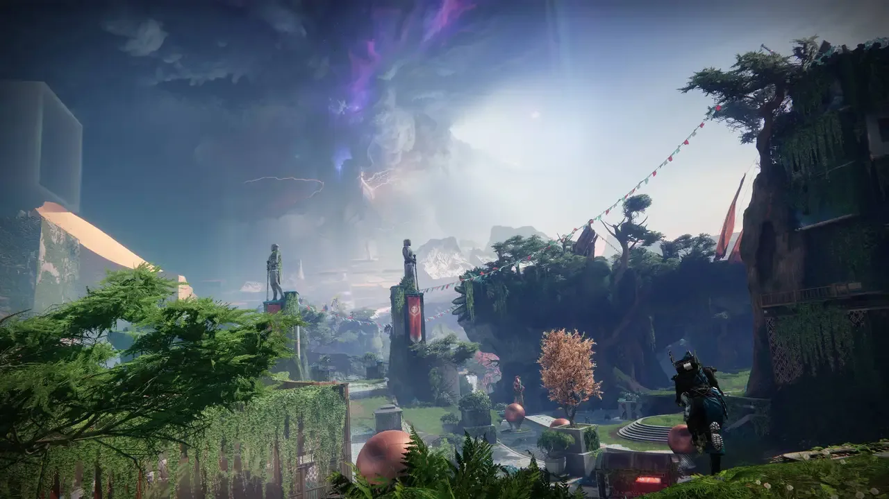
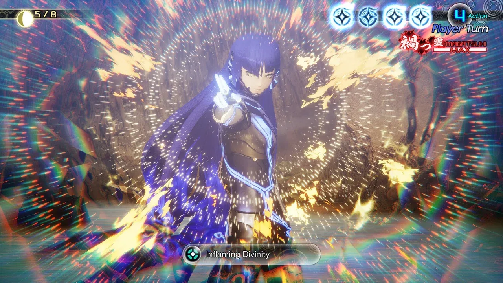
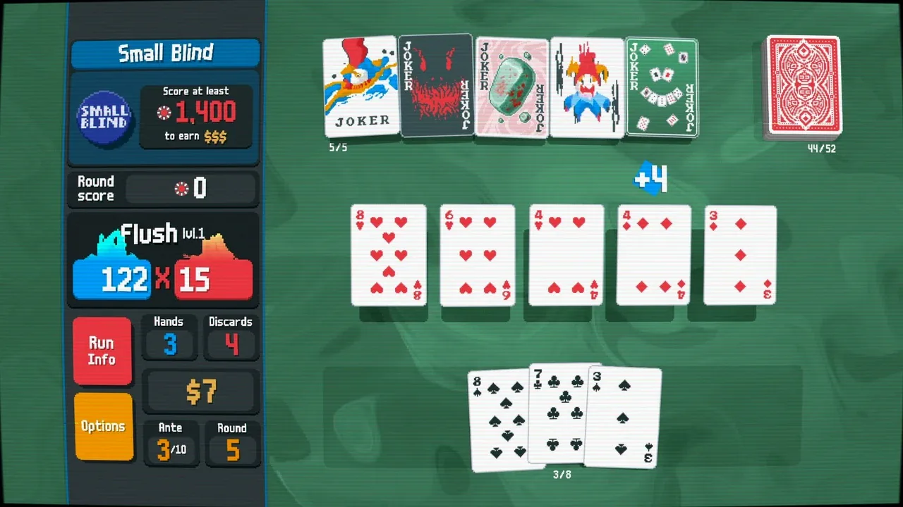
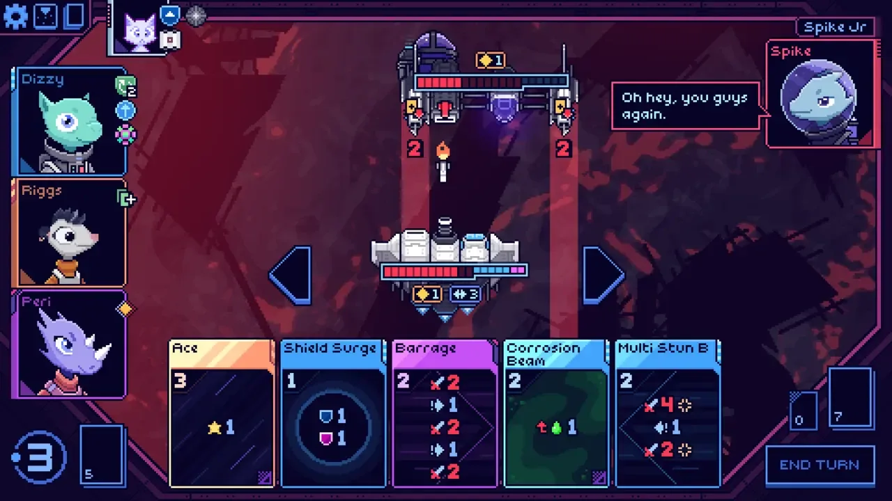

## Favorite

### Destiny 2: The Final Shape (2024)

Goodness gracious, _Destiny 2_. The previous expansion, _Lightfall_, was a
letdown in a lot of ways. Though I wasn't upset for the same reason as the
community (seriously, I only ran the _Root of Nightmares_ raid once, and I've
retired from raiding).

In contrast, _The Final Shape_ just absolutely crushes it. I think it's the best
story campaign they've ever done, and the new _Prismatic_ subclass is extremely
fun. I loved the writing, especially Cayde-6. I can't believe I'm saying that.
I've pretty much hated Cayde for being an unfunny jokester since the beginning
of Destiny 2, and was originally happy to see him killed off. His return shocked
and upset me, but I think the circumstances were fantastic, once you get to see
the story unfold. Even better, he has character growth during his absence. His
death and time in the afterlife bestowed upon him a needed wisdom and
perspective that made him a good leader. His dialogue with Crow, and the set up
for Crow's new role, were all great.

> **Crow:** "You almost sound like you're having fun."
>
> **Cadye-6:** \*laughs\* "Aren't you?"

Also, I can't forget to mention that Lance Reddick will be dearly missed. Keith
David did an admiral job as the new Zavala, though. I think some people had a
hard time accepting the combination of his personality shift along with the new
voice, but I think Bungie had been setting us up wonderfully for it.

The new Pale Heart area was super fun, and I loved uncovering its secrets.

Sadly, since the expansion, we've hit the second round of Bungie layoffs, and
the game seems to be in a tailspin. The expansion didn't sell well (probably
because of players dropping off after the last expansion), and the seasonal
story model revamp as "Episodes" has failed to hit the mark. The game also seems
buggier than ever before, and it just feels like they're understaffed to keep
this decade old beast healthy and engaging.

I have deeply loved this game, to the tune of thousands of hours, but I have
decided to enter a soft hiatus. I still play on occasion when other friends are
looking for a Grandmaster Nightfall buddy or something like that, but I wouldn't
be surprised if by this time next year I've uninstalled it.

I salute everyone who ever worked on making Destiny the weird and wonderful
experience that it's been.

### Shin Megami Tensei V: Vengeance (2024)

I really liked the original _Shin Megami Tensei V_, perhaps more than most. I
saw a lot of negative things about it, particularly around the story.
_Vengeance_ added a new story route called "Canon of Vengeance" (the old one is
now named "Canon of Creation"). I only played the new "Canon of Vengeance" since
it's only been a couple years since I played SMTV, and didn't need the refresher
(it's a long game, too!).

The new music absolutely whips, just like the old stuff. The new enemy faction,
the [Qadištu](https://megamitensei.fandom.com/wiki/Qadi%C5%A1tu), are really
cool. I lovingly call them the
[Goth IHOP](https://knowyourmeme.com/memes/goth-ihop) sisters, and have a few
commissioned pieces of
[Eisheth Zenunim](https://megamitensei.fandom.com/wiki/Eisheth_Zenunim) art.
Both routes suffer from the open world game design problem of "if you play all
the side quests you'll probably get tired of the game before it's over", but I
still really like them.

Even as a dungeon crawling RPG fan (_Etrian Odyssey_, my beloved), I think the
way these games approach open world exploration coupled with the incredible
music... just absorbs me into these worlds. And more than anything I'm a sucker
for demon fusion and press turns. These games are just super fun mechanically
for me.

The previous game had a "regular attacks only" auto battle feature, but this one
also offers an intelligent auto battle that uses spells and targets weaknesses.
Coupled with the increased animation speed and the pacing can feel so good in
this game!

I think the Canon of Vengeance breaks down in the 2nd half storywise just like
the Canon of Creation, but I'm fine to overlook their weaknesses.

I was disappointed that the final boss of the game was the same, but the new
fights I took part in were all interesting! It certainly is more than just a
DLC, but it's also not a fully new game. I happily gobbled it up, though. I just
can't get into _Persona_ like I can the _SMT_ games I've played ("SMT4
Apocalypse", "SMTV", and "SMTV: Vengeance").

### Balatro (2024)

Wow, this game is really fun. Incredible soundtrack. Simple concept. Base
difficulties are easy enough that you can get your bearings and learn how to
play while still feeling successful. Good art too. Also, it's made using
[LÖVE](https://www.love2d.org/), the 2D game engine for Lua (I've used it and
thought it was great!).

### Cobalt Core (2023)

This game is super fun! I'm loving the pixel art, the music, the writing, the
gameplay. I've been playing it "co-op" with Ash on the couch, and we discuss
strategies out loud. I'm about halfway through with the game, and only started
it in December.

## Finished

### Castlevania: Aria of Sorrow Alter (2020)

I love Castlevania. My good friend Anna recommended this ROM hack to me for one
of my favorite games of all time. She was right: I love it! Hard to say if it's
better than the base game, but it changed everything up enough that it felt
really fresh despite me knowing my way around the base game pretty well.

### The Expanse: A Telltale Series (2023)

Despite the weirdly yassified rendering of Camina Drummer, this game is pretty
cool. The feel of moving around in space is unique, if a bit slow and strange.
It feels like a well made Telltale game, but I didn't like the gameplay concept
of searching for hidden items constantly in order to get more story moments.

### Titanfall 2 (2016)

Everyone talks about the time level, but I think the prefab home factory level
was way cooler. Also, the level on the moving ships. Wow. These are some
extremely memorable levels, and the robot buddy is great.

### Momodora: Moonlit Farewell (2024)

What a lovely game. I adore the previous game _Momodora: Reverie Under the
Moonlight_. The character Pardoner Fennel from that game is one reason I chose
Fennel as my middle name. This game is gorgeous and super fun. Glad to see rdein
and friends make one final Momodora, and it's the most Momodora of all in so
many ways.

### Fallen Leaf (2024)

Really weird but pretty cool. Tries do a lot of stuff. Not all of it works out
well. In a lot of ways it's like classic Mega Man, but you also need to collect
tons of characters and find lots of hidden secrets. I felt the balance was kinda
off for some of the bosses. I liked the art and music a lot. The characters
mostly felt worse than the main character, Leaf, though.

### Dragon Quest III HD-2D Remake (2024)

Really cute! I don't prefer "HD-2D" to just giving me the SNES or GBC sprite
work directly, but it does have many nice QoL features added to the game. And it
doesn't look tacky and awful like the Android ports. I think I actually
preferred the simplicity of Dragon Quest I and II (which I played on GBC). The
multi-classing system must've been really cool at the time, and honestly is
still pretty good fun. I don't recommend bothering with catching all the
monsters or taking a Monster Tamer when you play, though, unless you want to
double or triple your playtime for very little reward.

### Castlevania: Portrait of Ruin (2006)

Still a great Castlevania game. Bummer about losing Ayami Kojima's art, though.
I wish Charlotte was more useful, it's basically a solo game as Jonathan.

### Castlevania: Order of Ecclesia (2008)

Holds up worse than I expected. I found the game more frustrating due to needing
to use precisely timed two button combos to deal maximum damage against the
game's complete health sponge cast of enemies. But hey, Castlevania where you
get to play as a cool girl! It could be worse.

### Castlevania: Dawn of Sorrow (2005)

Aria of Sorrow's loser brother. Despite all the similarities, this just feels so
much worse on every axis _except_ pixel art. Whew, the sprite work is incredible
here. In love.

### Fable Anniversary (2014)

This game originally came out for Fable's 10 year anniversary... and here I was
playing it again for Fable Anniversary's 10 year anniversary lol. I played it on
stream and had a lot of fun. Though at this point I'm more laughing _at_ the
game than with it. My goal was to make a twink (0 STR, MAX DEX) build, and
eventually I got gay married to the tattooist in Knothole Glade. We decided on
stream that my new gay husband was going to feed me soup until I got strong (MAX
STR) because playing that game without melee gets really boring. Oh, and we
named the main character Crispin. It was a silly time.

## Unfinished

### UFO 50 (2024)

I don't see this game as "shelved" because I really like it, it's just too much
for me to consider "beating" in any meaningful sense. So far my favorite games
are _Devilition_, because I love a puzzle/strategy game, and _Rail Heist_, which
feels like a strategy game where you have to perfectly execute your silly ideas.
There's some other fun games in there too, but most are a bit too old & janky
feeling for me to want to work through. I realize this is intentional, but I
don't have any nostalgia for 1980s video games, and I haven't really gotten into
them later in life either.

### Path of Exile 2 (2024)

This is really fun so far. It's just in early access, but I can see myself
continuing to play it. I love the co-op and just blasting and looting with
friends. The addition of the new twin stick control scheme feels extremely
overpowered for magic users, though. I wonder what they'll do with that. If it's
anything like the first Path of Exile, it'll still be going strong 10 years
later, so there's no rush for me to gorge myself before the game even has its
true release date.

### WEBFISHING (2024)

This game is so cute and good. I haven't finished everything, but this is a game
that's about the journey and hanging out with your friends.

## Shelved

### Penny's Big Breakaway (2024)

This game is super cute, but I just found it frustrating to play.

### Helldivers 2 (2024)

A fun and silly co-op game. I always had fun playing, but never really got
hooked. I would consider playing it again with friends, but won't be seeking it
out.

### Dokimon: Quest (2024)

This game has some nice quality of life features I wish Pokémon had, but
otherwise it's just not super fun to me.

### Judgment (2018)

I was really digging the story in this for a while, but the actual gameplay got
stale to me. I think I'm done with _Ryu ga Gotoku Studios_ games for... a while.
I really didn't like the sidequest writing. The voice acting was great. I looked
up every cutscene for the end of the game, and I think the twists maybe got a
bit out of hand.

### Final Fantasy X/X-2 HD Remaster (2013)

I simply could not have fun playing this game. Supposedly it gets more
interested shortly after I stopped playing, but I couldn't summon the willpower
to keep going. I can tell there's some cool fucky story stuff going on with the
multiple worlds, but I'm just keeping this on the shelf. I'd rather just hear a
friend explain it to me some time.

### RKGK (2024)

I just didn't have fun playing this. I only logged a few hours.

### Chico and the Magic Orchards (2022)

Incredibly cute, but I didn't really like the mental math of the positioning and
angles necessary to beat the puzzles.

### Isles of Sea and Sky (2024)

I heard "Zelda without combat" but what I actually got was "open world sokoban".
I found it incredibly overwhelming the way the game was massively
interconnected, making it unclear which rooms I should even spend my time in.

### Star Ocean: The Second Story R (2023)

Killer music. Subpar English voice acting. Cliche story. Combat felt like a bad
version of _Tales of Symphonia_. I stopped playing after the difficulty spiked
in the mid-late game, leading to me being frustrated.

### Momodora III (2014)

I liked _Momodora: Reverie Under the Moonlight_, _Momodora: Moonlit Farewell_,
and even _Momodora II_, but I didn't really like _Momodora III_. It's super
cute, but the levels felt a bit mean (lots of one hit kill surprises), and the
tiny sprites + fast button mashing attacks + tough bosses was a frustrating
combination to me.

### Alpha Protocol (2010)

Well, I actually beat this game a few times before. I decided to stream it for
another playthrough this year, but I gave up without finishing it, mostly
because my stream attendance was really low. It's a worse game than I remember,
but I still think it did some interesting stuff. I'd love to see a reboot of
this franchise.
