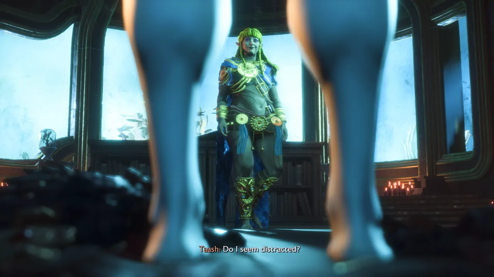

## It's Been a Minute

Wow, look at all the things I want to write about. This is going to be a bit of
a longer post since I haven't been blogging as much recently. Buckle up!

## Grand Archive TCG

I'm gonna keep this section short and promise to write more about
[Grand Archive](https://www.gatcg.com/) soon, since this has been my recent
obsession.

I'm still not very good at the game, but it's a lot of fun to play and collect!
The new expansion
[Distorted Reflections](https://index.gatcg.com/cards?prefix=DTR) just came out,
which is inspired by Alice in Wonderland.

<figure>
  

    
    
    
    
    
    
  

  <figcaption>A few cards that look cool :^)</figcaption>
</figure>

## Hunter × Hunter

I've been watching
[Hunter × Hunter](https://en.wikipedia.org/wiki/Hunter_%C3%97_Hunter) with Ash
recently. We're in the _Chimera Ant_ arc, which is exactly what it sounds like
so far. Apparently this is the most epic arc of the show, so I'm hoping to have
my mind blown soon.

So far the first season was was surprisingly my favorite. Gon and Killua are a
charming pair, and well written as absurdly talented pre-teen warriors.

<figure>
  
  <figcaption>(Left to right) Kurapika, Gon, Killua, Leorio</figcaption>
</figure>

## Dragon Age: The Veilguard

Should I write a full review for this? I've logged about 90 hours in this game
according to Steam, but I'm notorious for letting games idle. I'm pretty sure
50+ of those hours were while I had shingles (which was fucking terrible) and
took like two weeks off work. I just sat on the couch wincing in pain from
shingles and occasionally rolling my eyes at
[Dragon Age](https://store.steampowered.com/app/1845910/Dragon_Age_The_Veilguard/).

<figure>
  
  <figcaption>Gomez Addams lookalike Emmerich died offscreen because I didn't grind enough faction rank to keep him alive in the final mission</figcaption>
</figure>

<figure>
  
  <figcaption>Taash has the emotional maturity of a grapefruit, but their story was still fun.</figcaption>
</figure>

<figure>
  
  <figcaption>Even the Darkspawn have been yassified.</figcaption>
</figure>

- **It's too long.**

  I'm no stranger to 100+ hour games, but they have to be realy good to keep my
  attention that long. This game really didn't deserve to be as long as it was.
  It felt really stretched out, and I didn't even finish all the side quests.

- **Combat is mid.**

  Learning that this game was originally supposed to be an online multiplayer
  live service game a la Anthem made this part make so much more sense. I'm not
  a tactics gameplay nerd like I used to be, but that'd probably be better than
  wave after wave of mediocre real time combat filled to the brim with big boom
  wow explosions that make my eyes hurt and the screen shake and glitter
  nonstop.

- **The characters are just fine.**

  I just didn't get into any of the characters the same way I did in other
  Bioware games. Solas is still one of the most compelling characters, though he
  spends nearly the entire game locked in time prison, while you're forced to
  slog through endless side quests in hopes of chasing down the two "mustache
  twirling supervillains", as my friend Lilah calls them.

- **The tone is awful.**

  Apparently the original writing direction was insufferably smug and smarmy,
  but the backlash against [Forspoken](https://en.wikipedia.org/wiki/Forspoken)
  led them to pivot. Unfortunately, the damage had already been done, and no
  script edit could save this game. I was shocked to find out this was the _less
  smug and smarmy_ version of a previous script. It must've truly been terrible
  before.

- **So much backtracking.**

  The weirdly labyrinthine levels beg you to traverse them again and again in
  hopes of finishing some stupid little side quest or picking up useless ores
  and gems (shnuck nuck nuck) to feed to your allied factions in order to raise
  their fucking rep rank. You can see the bones of the Anthem-like grindfest
  they were building here.

- **Did I even like this game?**

  Well, it's a bastardized version of the "Bioware formula", so I'm fairly
  forgiving. And I wanted to see how this stuff ends. And it's not all bad! It's
  just that at the end I see a mountain of complaints overshadowing the fun I
  had.

- **A nonbinary party member appears!**

  I'll give them credit for writing a decent nonbinary awakening story for
  Taash, though the whole thing felt like it was a stuggle between the actually
  nonbinary author trying to tell a good story and the obviously we need to do
  Trans Rep 101 so all the cis dudes playing this game understand what's going
  on, or whatever.

## New Theme

Yeah, here I go again. This isn't the first time I've redesigned my website to
be more warm and orange colored in Summer. This time it's a lot more restrained
on the orange and I kept a bunch of the green I love.

As usual, I consider this a starting point, and I'm sure I'll evolve it a bit
before I eventually get sick of it. I was particularly inspired by my friend
[Anh's lovely site redesign](https://anhvn.com/posts/2025/weeknotes-34/). Based
around the color pink, I nicknamed this her Kirby theme. My favorite detail is
her diamond-shaped footer nav.

<figure>
  

    
    
    
    
  

  <figcaption>Anh's new redesign</figcaption>
</figure>

Given my recent card-oriented obsession, I was inspired to make a more clean and
paper-inspired theme again. As much fun as I had with wild gradients, I began
craving something simpler that let the content shine. Inspired by my favorite
[HTML named color](https://frills.dev/experiments/html-named-colors/),
`PeachPuff`, I paired a pale orange with a rich green. While pink might be the
[most obvious choice](https://en.wikipedia.org/wiki/Color_wheel) to pair with
green, I prefer the look of orange.

I spent a _long_ time exploring the
[Liquid Glass](https://developer.apple.com/documentation/technologyoverviews/liquid-glass)
layout space for this site. Unfortunately, floating UI is just pretty annoying
unless it's really small, and
[I don't want to compromise by using a hamburger menu](https://www.nngroup.com/articles/hamburger-menu-icon-recognizability/).
I spent an absurd amount of time trying to get an auto-hiding nav bar working
well, but ultimately canned it. Between Firefox bugs in the
[scroll](https://developer.mozilla.org/en-US/docs/Web/API/Document/scroll_event)
event and Safari not supporting
[scrollend](https://developer.mozilla.org/en-US/docs/Web/API/Document/scrollend_event),
I couldn't achieve parity with a proper native auto-hiding toolbar, like in
Chrome. It was a fun experiment, but I decided to ditch it rather than ship
something janky.

<figure>
  
  <figcaption>Floating UI can look great with low contrast backgrounds...</figcaption>
</figure>

<figure>
  
  <figcaption>...And utterly terrible with high contrast</figcaption>
</figure>

## Playdate Season Two

<figure>
  
  <figcaption>Clown pee is definitely the funniest screenshot I've taken</figcaption>
</figure>

I haven't sunk my teeth into every
[Playdate Season Two](https://play.date/games/seasons/two/) game yet, but I'm
having fun so far! The device still isn't everything I hoped it would be, but I
love the unique experiences I get on it.

[Chance's Lucky Escape](https://play.date/games/chances-lucky-escape/) is a
hilarious old school adventure game... with a modern difficulty level. Honestly
it's pretty dang easy, but it's very amusing! I chuckled a lot at the absurd
situations and outcomes.

[Long Puppy](https://play.date/games/long-puppy/) nearly feels like it could be
a new [Keita Takahashi](https://en.wikipedia.org/wiki/Keita_Takahashi) game. I
didn't care for the time limits, but you can turn those off and have fun
exploring.

## Health Stuff

I'm getting a colonoscopy and endoscopy tomorrow! Not my first rodeo, but it's
gonna be a barrel of fun again I'm sure. My primary care doctor thinks I
probably have migraines. I've been trying a new to drug to help with that... but
it hasn't been helping so far. More to come on this front. My acid reflux has
improved since I started taking Prilosec. I'm also getting asthma tested soon,
and need to go to the eye doctor again pretty soon.

## Links

- [HTML named colors](https://frills.dev/experiments/html-named-colors/) by
  Frills

- [Anh's site redesign](https://anhvn.com/posts/2025/weeknotes-34/) by Anh
