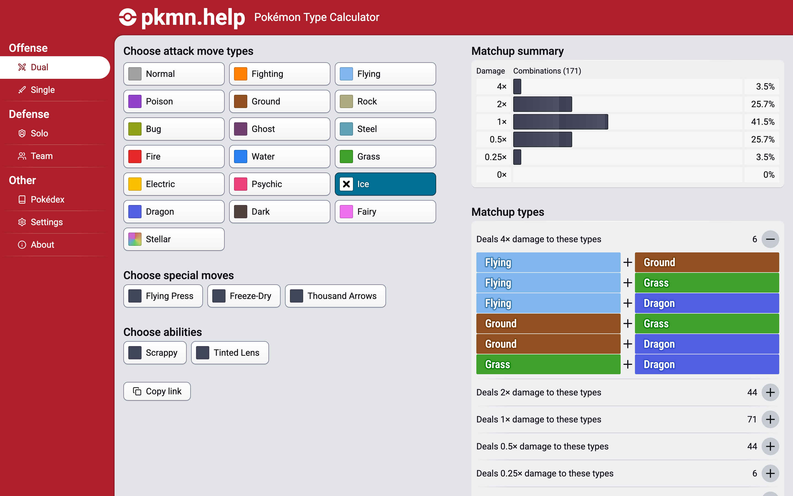
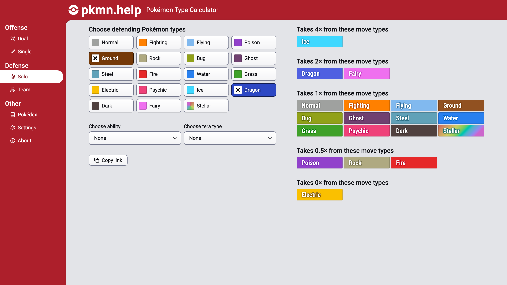
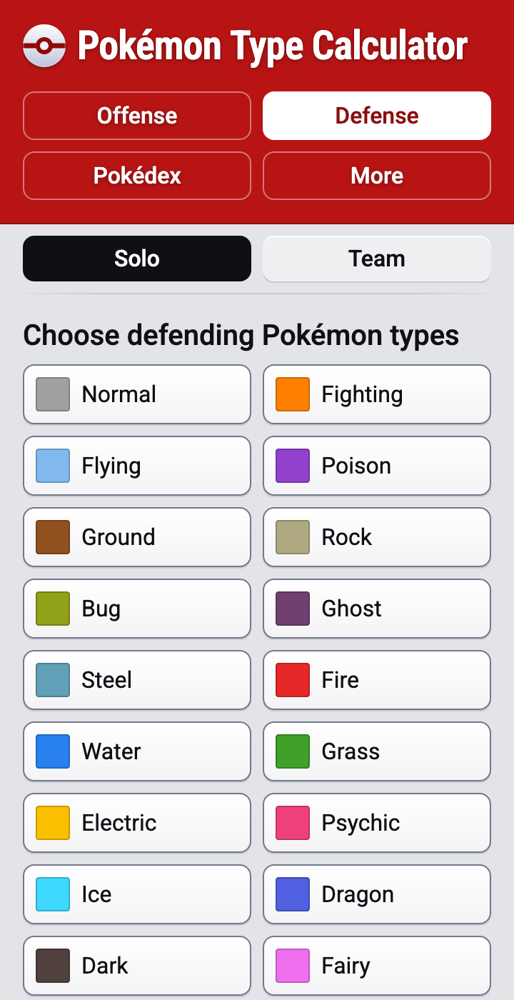
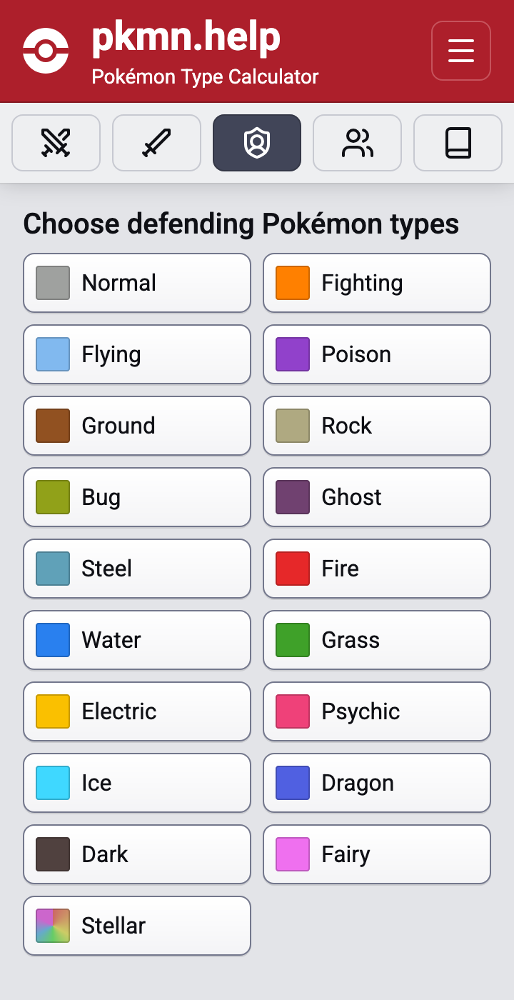
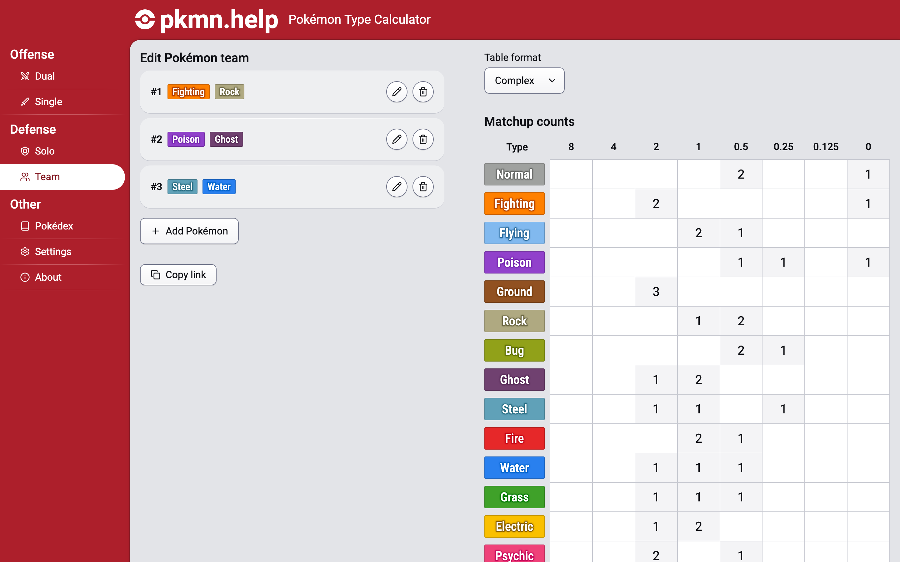
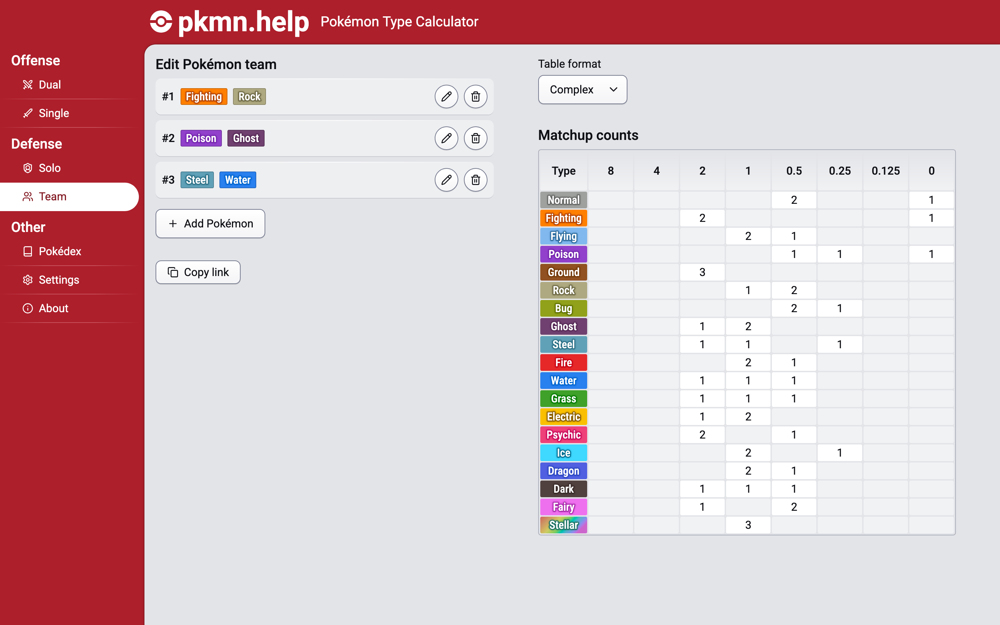

## pkmn.help

I guess I spent...
[a lot of time working](https://github.com/wavebeem/pkmn.help/commits?author=wavebeem&since=2025-11-01&until=2025-12-01)
on pkmn.help this month. I got some feedback emails that reminded me to be
careful when making large scale site changes. Most people were nice enough about
it, though.

### Dual-type offense calculator

<figure>
  
  <figcaption>Find offense calculations results for dual type combinations</figcaption>
</figure>

A fan suggested this one to me. The existing single-type offense calculator may
look nice and simple, but it's not very realistic.

### New layout

<figure>
  
  <figcaption>New desktop layout with navigation sidebar for direct access to every page</figcaption>
</figure>

<figure>
  

    
    
  

  <figcaption>The new mobile layout is less confusing and saves a lot of space</figcaption>
</figure>

Nobody asked me for this, but I'd personally been very tired of the haphazard
site organization. I caused some panic by replacing the one-tap navigation with
a hamburger menu, though. And, honestly, fair. Nobody likes when their workflows
take more steps. So I designed a tab bar for the top 5 pages and released that.
In order to get this done, I added the amazing
[Lucide icon pack](https://lucide.dev) to my site. It's open source and very
developer friendly. The stroked style looks pretty good, too. The 24x24 size
with 2px stroke feels a little big for some of my use cases, but scaling them
down to a 16x16 icon with 1.5px stroke matched my old icons pretty well.

I'm not generally a fan of "icon only navigation", but I think the users of
pkmn.help spend so much time here that they will get the hang of it quickly.
Plus, the hamburger menu icons reinforce the meaning of the tab bar icons.

Oh, I also switched from the site being named "Pokémon Type Calculator" to being
named "pkmn.help". That's the domain name, and it's short and sweet! "Pokémon
Type Calculator" was always a description, not a title. And it doesn't make a
lot of sense to translate the title into every language too. So now there's a
clear distinction between the site name and its description.

Maybe eventually I'll get around to making a real home page for the site...
haha.

### Team defense results table

<figure>
  
  
  <figcaption>Before and after: The new team defense results table is compact, easy to read, and looks nicer!</figcaption>
</figure>

I've been unhappy with the visual appearance of the team defense results table
for a long time. It was space inefficient, hard to focus on the right details,
and just kind of ugly.

I changed the large square table cells with thin borders to small rectangular
table cells with slightly rounded borders and a 2px gap between them. Along with
the new small ghost badge, everything lines up perfectly now. And most
importantly, the information I want to stand out, actually stands out more now!
The eye is drawn to brighter colors, after all.

## A new links page

My [links](/links/) page now has a ton of curated links on it! It's organized
and includes descriptions. Hopefully you can have fun checking out the things I
wanted to share :)

I also tried to make a lightbox image viewer, but it's kind of a huge pain. I
ended up going with something that opens the image in the browser directly when
you click them.

## Other stuff

We went furniture shopping! We'll get our new chairs this week. I'm super
excited about
[them](https://daniafurniture.com/products/diego-armless-chair?variant=39423423184999).

We spent the day before Thanksgiving with family, and Thanksgiving day hosting a
Friendsgiving :)

Oh, and our power went out _twice_. Super annoying!

## This month has been a blur

I honestly can barely remember what I did this month. I mentioned last month
that my "next" games would be NINJA GAIDEN 4 and Shin Megami Tensei IV... but I
somehow haven't even started those.

I did buy Kirby Air Riders, but I don't like it as much as I hoped I would.
Maybe I'll write a review for it after I've spent more time with it.

Maybe I've spent too much time working on pkmn.help recently. I'm proud of the
changes, but it's been a bit exhausting. I have a tendency to stay up till
midnight or later working on it.

Hopefully I'll actually get back to reading and gaming in full force in
December. I think my body needs it.
