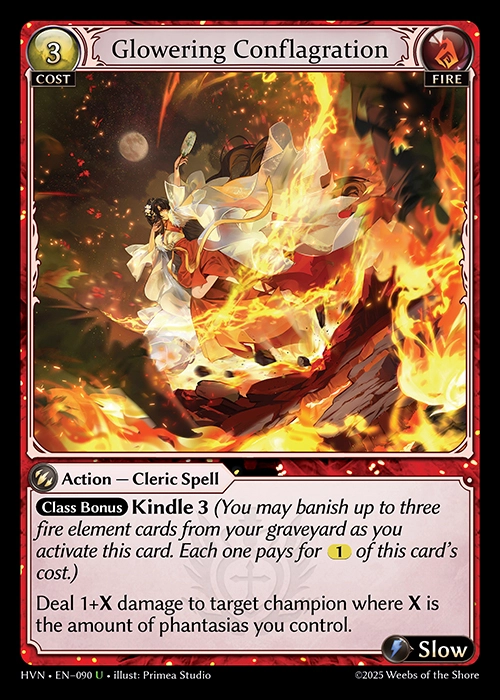
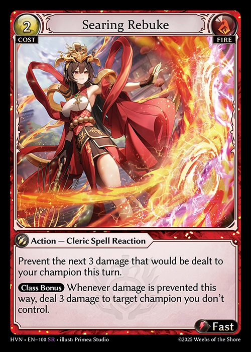
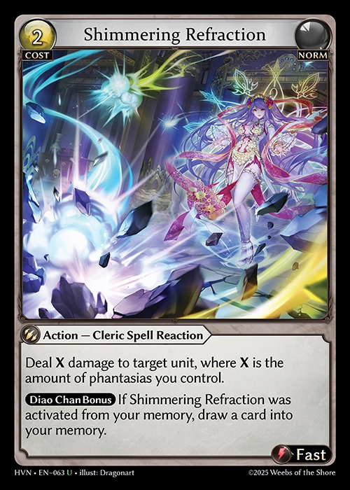
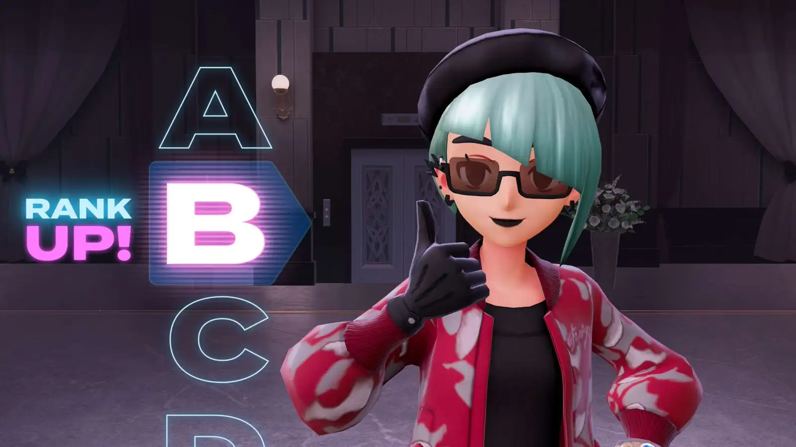
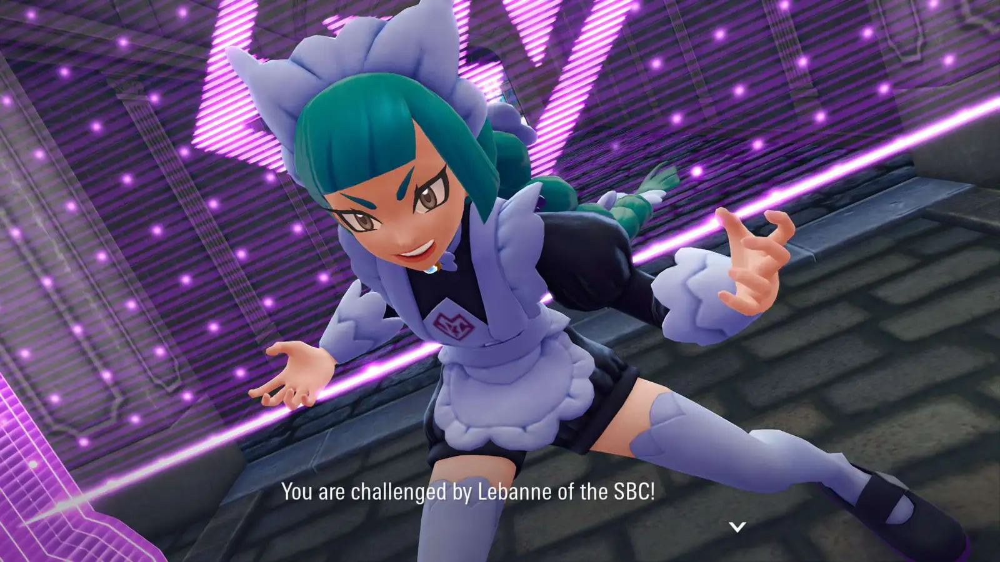
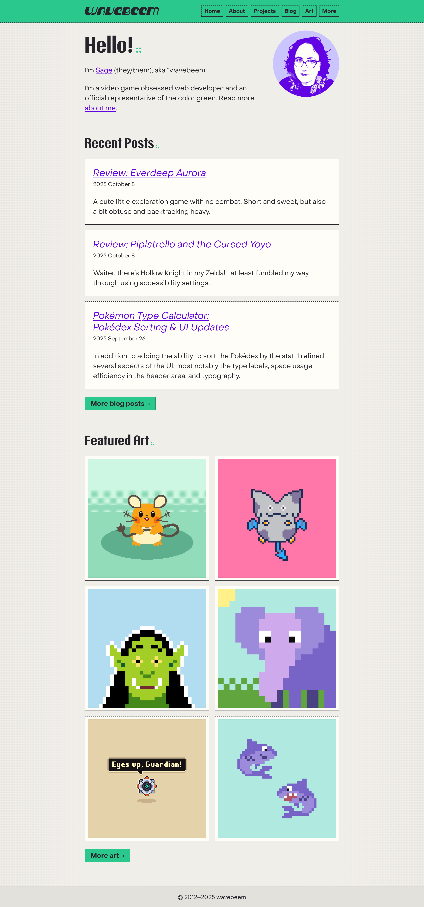
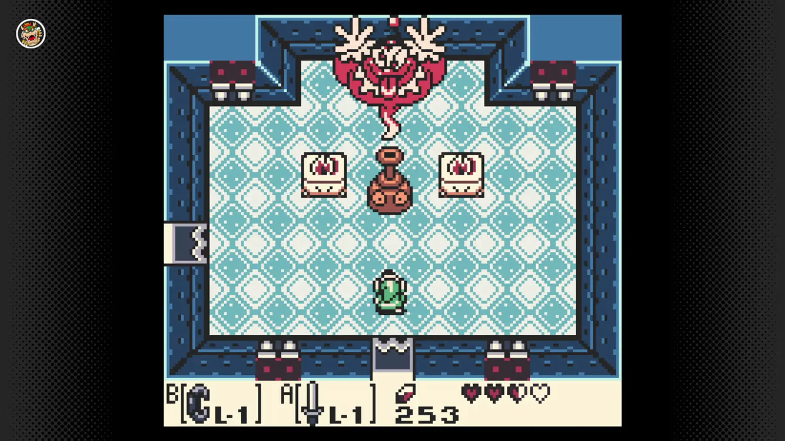
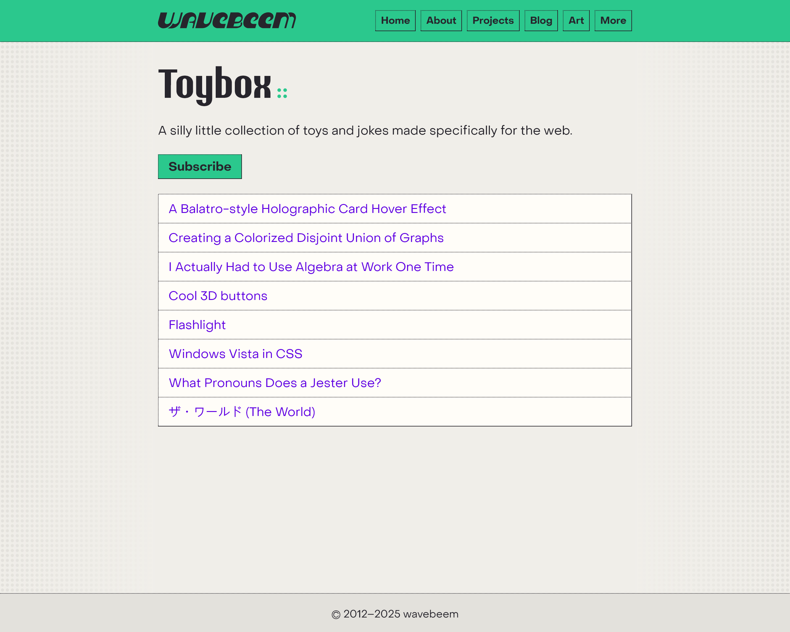
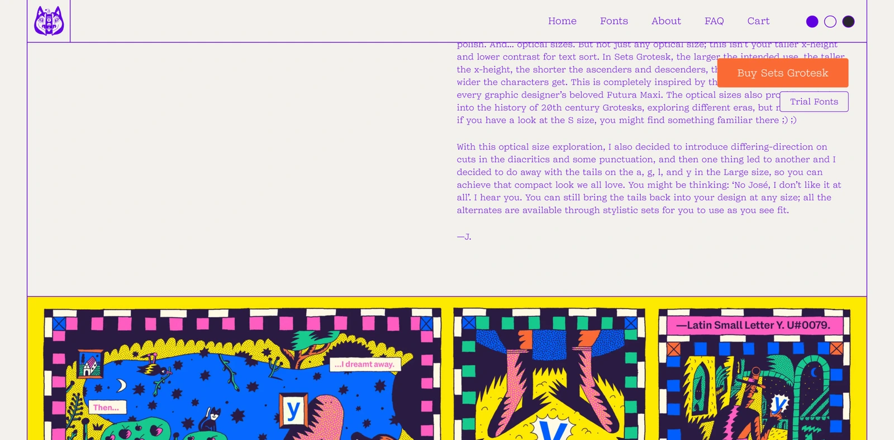

## Grand Archive

After sinking a pretty penny into my Tristan deck... and losing _more_ than
before I upgraded... I decided it was time for a change of pace. I've heard far
too many people say that Tristan requires a high level of skill to use
effectively... and that sure ain't me lol.

My friend Marina suggested I go for a fire aggro Diao Chan build. So far, I love
it! I don't have every single card I wanted at the number of copies I originally
planned, but it's quite close to where I want it... and it feels fun! I think
something more aggressive and exciting was exactly what I needed.

<figure>
  

    
    
    
    
  

  <figcaption>Key cards from my new deck</figcaption>
</figure>

Oh, and she also sold me the Christmas Diao Chan playmat, which looks super cute
and gives me an excuse to have green on the table even though I'm playing a fire
deck.

Only one month until
[Phantom Monarchs](https://www.gatcg.com/article/phantom-monarchs-product-information)
drops! Weebs of the Shore have been teasing more cards, and I'm particularly
excited by the new level 2 Alice featuring Umbra and curses.

I'm kinda tired of Dragon Shields shuffle feel and quality. Particularly the
spiky edges they seem to have, especially on their dual mattes. Plus I don't
even like the look of dual mattes. I want to support my local game stores, but
I've ordered a few types of sleeves online to try. I'm especially interested in
some mint green sleeves. I'm thinking about how I can make a pastels setup with
sleeves and maybe a new playmat.

I've also picked up some casino style dice for play sessions... which are just
super fun to look at and touch (besides the sharp corners).

## Pokémon Legends Z-A

I just wanted to mention that I'm 40+ hours into this game, and I've reached
rank B (you start at rank Z, but you skip from W to F in one fight). It is... a
mixed bag! But it's still really fun. I'm a little sad I have to wait until
February for my favorite monster Raichu to get his DLC, but I guess that's ok.
Look forward to a full review after I beat the main story. Hopefully by the end
of this month.

<figure>
  
  <figcaption>I'm now 🅱️ rank</figcaption>
</figure>

<figure>
  
  <figcaption>Lebanne was cooler than I expected</figcaption>
</figure>

## New Site Design & Updates

<figure>
  
  <figcaption>The new home page</figcaption>
</figure>

I went back to using normal weight italic for my level 3 headings, and I
revisited my heading decorations. Third level headings without links now gain a
little "//" adornment to match the level 1 and 2 headings.

My portrait felt too dull in black and white, so I used my purple accent to jazz
it up a bit.

The teal was the hardest part of this theme for me to nail down. I wanted a
deeply saturated color, but I also needed black text to read well against it.
The computerized/cartoony borders don't work in white in this theme, so I needed
to keep black text/borders everywhere. Originally I tried using purple
everywhere as my accent, but I found it tiresome. And it made links harder to
pick out.

<figure>
  
  <figcaption>Nintendo Switch Game Boy emulation tasteful halftone gradient</figcaption>
</figure>

The original plain gray background felt a little boring to me, especially on a
large monitor, so I came up with this dotted fade out. I was inspired by the
subtle halftone gradient used in Nintendo Online retro emulation. Perhaps I'll
go the extra mile and make a proper halftone implementation at some point, but
for now a pure CSS "dots + gradient" approach gets the job done.

<figure>
  
  <figcaption>The new toybox</figcaption>
</figure>

Not much changed here, but I think my new button and card styles are really
popping on this short and sweet page.

<figure>
  
  <figcaption>The new "things I use" page</figcaption>
</figure>

I simplified the organization of the "uses" page and removed some items I don't
care as much about. Now there's two categories: hardware and software.

<figure>
  
  <figcaption>Sets Grotesk font page</figcaption>
</figure>

[Sets Grotesk](https://www.dogray.xyz/fonts/sets-grotesk) features gorgeous
illustrations on a page with a paper white background and searing purple lines.
I love this purple and have used it before. And the paper white was exactly what
I was looking for after my recent time with peach.

Oh, and I found this fabulous website thanks to my friend Anh, who recently
redesigned her [fabulous website](https://anhvn.com/).

I'll admit that "warm whites" are a bit [AI-coded](https://www.anthropic.com/)
right now, but I'm trying not to let the AI folks steal paper white and sparkles
from us.

I also updated many parts of the site in subtle ways. Hopefully I'm improving
spacing and layouts in your eyes as well.

## Other

I've been getting back into manga (Frieren: Beyond Journey's End; Delicious in
Dungeon; and Prison School), though it's hard to remember to read when I'm
surrounded by and endless supply of video games at home.

I'm enjoying watching Ash play
[The Hundred Line -Last Defense Academy-](https://store.steampowered.com/app/3014080/The_Hundred_Line_Last_Defense_Academy/).

The next games on my list are
[NINJA GAIDEN 4](https://store.steampowered.com/app/2627260/NINJA_GAIDEN_4/) and
[Shin Megami Tensei IV](https://en.wikipedia.org/wiki/Shin_Megami_Tensei_IV).
