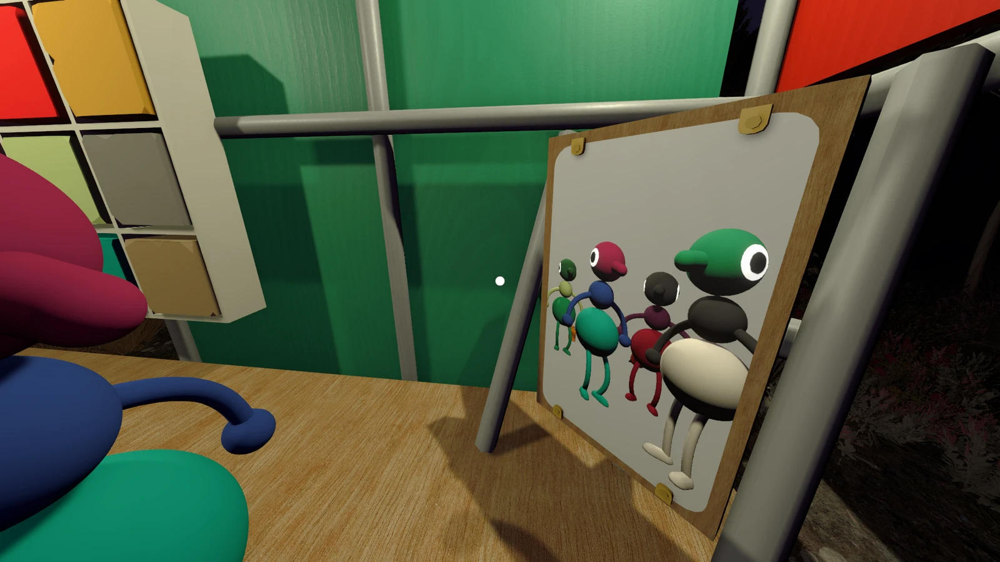
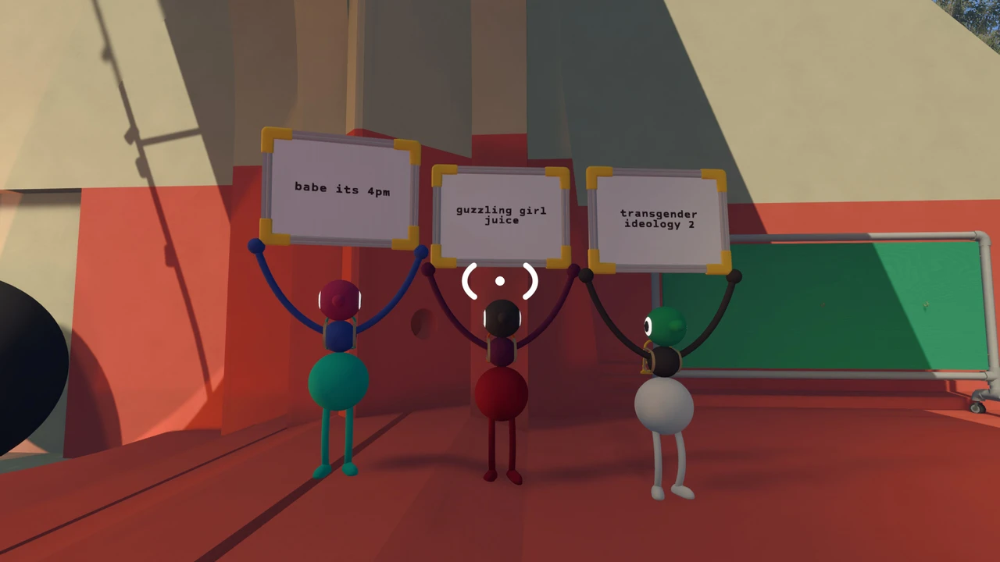
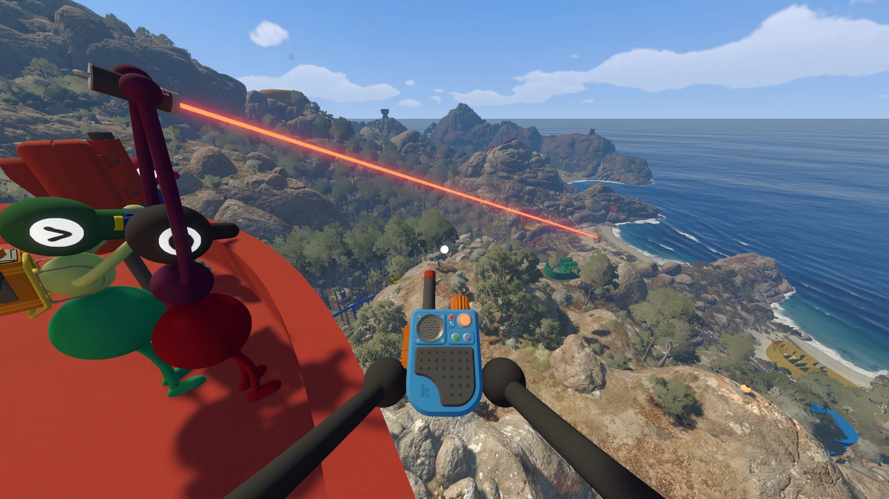
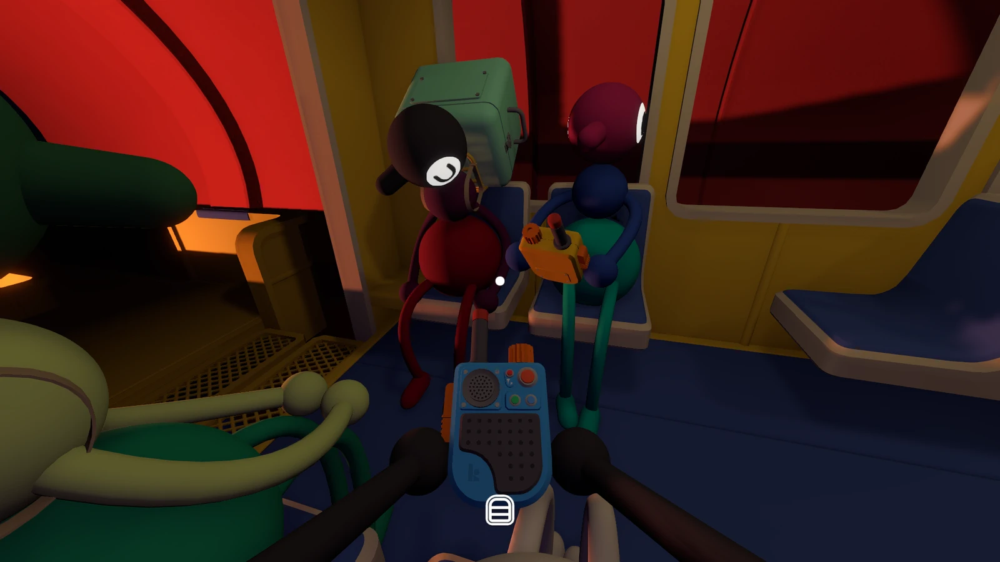

Wow, what a game. I guess I could raise a few complaints if I had to. Some
puzzles in 4 player mode really only required 2 people---which could lead to
feeling left out. But it's not a huge deal to me, and sometimes that just fits
the group dynamic anyways.

Absurdly charming. Really fun to explore. Interesting puzzles with real
cooperation. Silly. A sense of wonder. I haven't felt this level of deep
emotional response playing a game in a long time. What an incredibly special
adventure to take with friends. We spent about 17 hours to hit the credits. I'm
tearing up just writing about it.

The little characters are so cute and I love the minimalist
customization/styling. Acquiring items felt really satisfyingly visceral, too.

It's kind of like playing a bunch of little escape rooms with your friends on a
weird dessert island. The ending is really special in so many ways.

Please find a trusted friend to experience this journey with.

<figure>
  
  <figcaption>We all picked fun color schemes for our little guys</figcaption>
</figure>

<figure>
  
  <figcaption>babe its 4pm, guzzling girl juice, transgender ideology 2</figcaption>
</figure>

<figure>
  
  <figcaption>Puzzles were not this visually overwhelming on average, to be clear</figcaption>
</figure>

<figure>
  
  <figcaption>What a beautiful area to explore...</figcaption>
</figure>

<figure>
  
  <figcaption>Sleeping on the train with friends :)</figcaption>
</figure>
