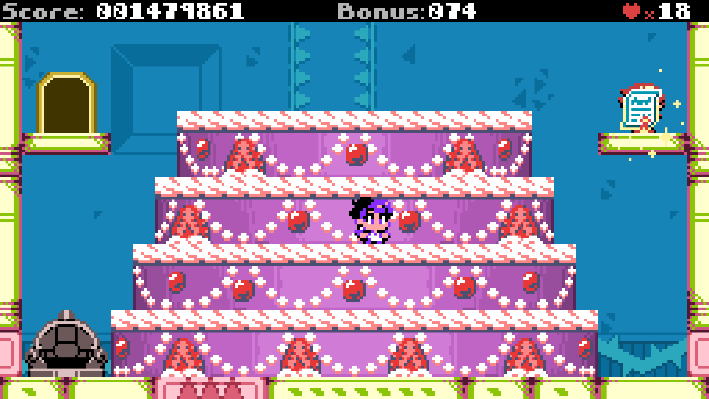
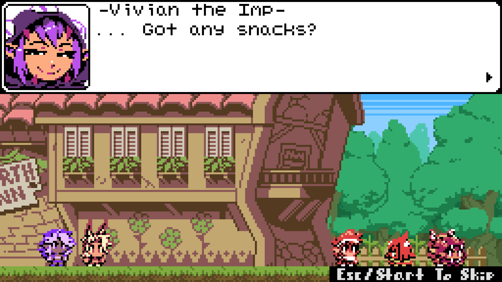

[**Claire a la Mode**](https://store.steampowered.com/app/2292860/Claire_a_la_Mode/),
is a sort of sequel to
[Curse Crackers](https://store.steampowered.com/app/1726760/Curse_Crackers_For_Whom_the_Belle_Toils/),
although it plays quite differently. _Claire_ is somehow even faster, especially
when sprinting (once again, I highly recommend you _don't_ do that, unless
you're a speedrunner type person, or you know you can get away with it in a
particular moment).

The "three HP" system from _Curse Crackers_ I mentioned previously and
complained about... has actualy become worse. Now you only have one HP. Yes, you
get a lot of lives... but bosses can be a bit frustrating since you technically
have to "perfect" all of them now. This means that farming lives is a
requirement if you aren't great at them. There were at least a few bosses were I
had to quit and go farm lives because I was having a tough time, and when you
get a game over, you will just restart the boss with a few lives, and that's
just no fun.

Perhaps I'm just too old and out of touch, but I feel a lot of games these days
are really fast paced and involve a lot of single hit deaths on both sides, and
I just have a hard time keeping up, lol.

What is fun, though, is the three unique stories you get, and that each story
has completely unique levels and characters. With 15+ levels, 15+ characters,
optional co-op on any level, this game certainly has a lot of stuff to do,
especially if you like replaying things. And there's lot of extra secrets to get
in every level. Not every character has the right abilities to access every
secret too, so they incentivize replaying levels with different characters,
which is fun.

You could critize that every level has to be possible to be finished by every
character, and one character has no movement abilities besides jump and
sprint... so the game doesn't ever _require_ that you lean into advanced
movement... but I promise that it has lots of interesting routes that reward you
for learning how to use its interesting mechanics like balloons (one time use
platforms that propel you), or the ability gain upward momentum by throwing
projectiles downward.

The game doesn't have difficulty selection, but each character has wildly
different approaches to platforming, and I think they're intentionally not
balanced, in a way that lets the player choose the experience they find the most
engaging. I think one or two characters may be reskins or near reskins of
another character, but there's still at least ten or so fully unique character
abilities that will have playing levels in interesting ways. Think of them more
like Kirby's copy abilities, but you select them from the menu before entering a
level.

I feel like this game has a broad appeal to from casual gamers to speedrunners,
and the co-op mode sounds promising (though I didn't try it). There's a lot to
love here, and it doesn't overstay its welcome. The price point is quite nice,
as well :)

<figure>
  
  <figcaption>Bee the Queen is comically evil, but nuance can be overrated.</figcaption>
</figure>

<figure>
  
  <figcaption>Decorating a cake: one of several optional minigames that shows up during levels.</figcaption>
</figure>

<figure>
  
  <figcaption>Demon doors from Fable! These doors only open if you meet the conditions they ask of you.</figcaption>
</figure>

<figure>
  
  <figcaption>Blindgaze returns from Curse Crackers, as an Easter egg in the hub area.</figcaption>
</figure>

<figure>
  
  <figcaption>The main menu is cute as heck, though a bit confusing to navigate.</figcaption>
</figure>

<figure>
  
  <figcaption>I really enjoyed the game's sense of humor.</figcaption>
</figure>
