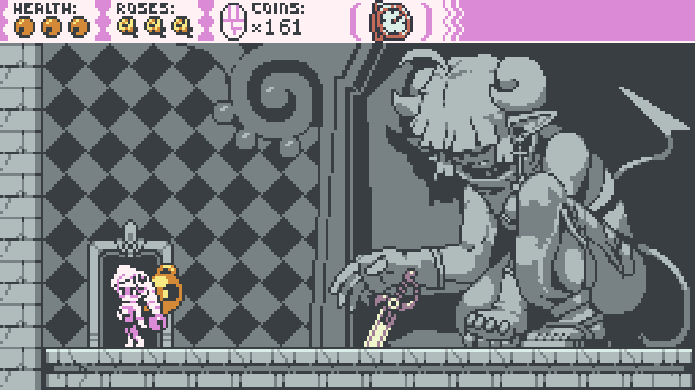
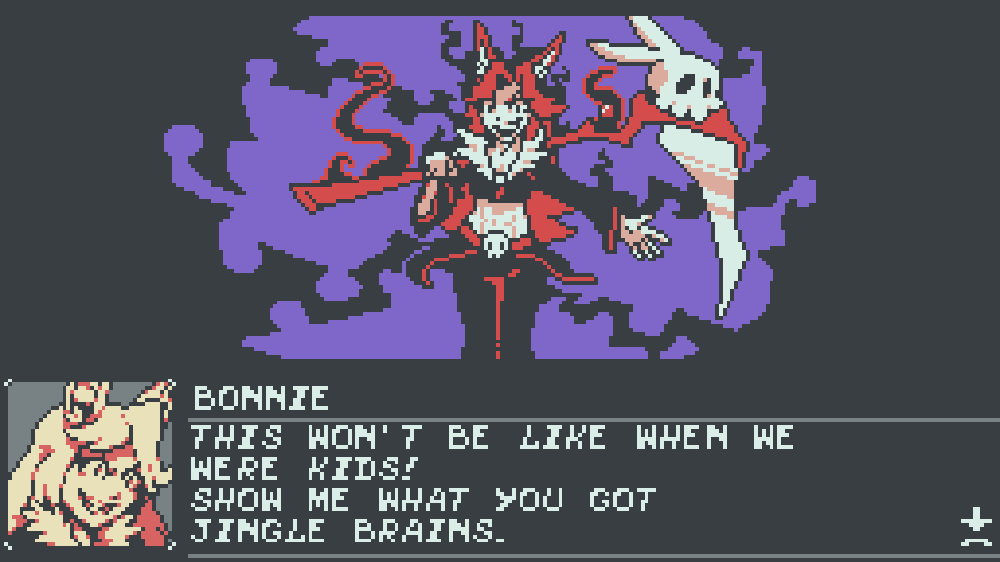
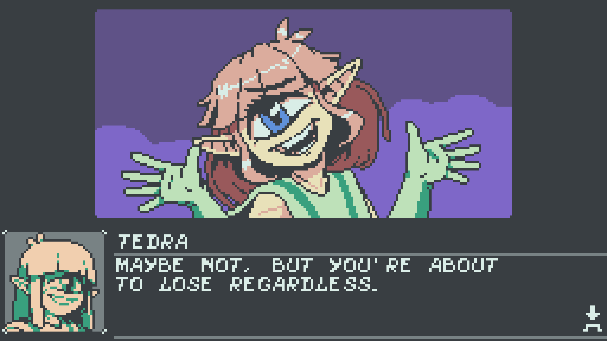

---

Perhaps it's nostalgia and a function of my age, but I feel like the Game Boy
Color was a peak moment in gaming history. Ignoring how hard it was to play
anywhere that wasn't outdoors or next to a lamp, the device finally had _just
enough color_ to be usable, and just enough buttons to be usable. It was the
minimum viable gaming device. So I love seeing indie devs self-impose similar
limitations on their games.

In my recent review of
[Pokémon Legends: Z-A](/blog/2025/review-pokemon-legends-za/), I roasted it for
trying too hard to look good, and ending up looking awful. If you set your sets
on looking "worse" (Game Boy Color), you can be consistent, artistic, and end up
looking amazing.

<figure>
  
  <figcaption>I love the large GBC-style sprites in this game, especially the color choices.</figcaption>
</figure>

This game _does_ have combat, but it's pretty limited. You play as Belle, a girl
with a magical bell companion named Chime, which functions similarly to Mario
Odyssey's Cappy. You can throw Chime to hit enemies, or bounce off of it to
propel yourself.

Also like the 3D Mario games, Belle has a few different jump commands: regular,
high jump, and long jump. Because this is ostenibly a two button game (plus
dash), this can get a little confusing to pull off the long jump reliably
depending on your controller in the heat of the moment.

- 🅰️ **Jump**
- ⬇️🅰️ **High jump**
- ↘️🅰️ **Long jump**

<figure>
  
  <figcaption>One of many, many secrets you'll find in the game... I was too busy to uncover all of them.</figcaption>
</figure>

If you want secrets, this game is absolutely loaded with extras. I got tired
just reading how to unlock the bonus character, lol. Some of the challenge
levels truly tested my patience, and I didn't feel up for trying them.

<figure>
  
  <figcaption>
  I love her imposing aura here.
  </figcaption>
</figure>

I think maybe Colorgrave (the developers) got too good at their own game while
playtesting the Bonnie fight. Or maybe they were expecting everyone to use the
game's not very well explained healing items. For the entire game's runtime, you
have exactly 3 HP... and this boss, if you're not careful, will cover the entire
screen in projectiles.

After tons of practice, and switching to a hyper aggressive playstyle, I was
able to eventually eke out a victory with a single HP left. Despite being
several bosses from the end, this was the hardest fight in the game for me by a
large margin.

<figure>
  
  <figcaption>Tedra is peak character design to me.</figcaption>
</figure>

The game starts off fairly straightforward in terms of platforming, but it
definitely ramps up in difficulty after the first few worlds. You can play most
of the game without using the sprint button (hold RT, which I don't think they
ever mention in game?)... a feature which I actually really didn't like. The
game already has a pretty high movement speed, and holding that down almost
feels like you're using some kind of speedrunner movement exploit, lol.

I wish it was a short burst of momentum you could pull off on the ground, rather
than a button that instantly increases your forward velocity at any moment (even
when already midair).

There's a handful of Zelda-style side quests, and the characters are cute and
fun to talk with. I enjoyed getting to hear more about about the world of
Colorgrave, and I look forward to playing more games in their shared fiction :)

<figure>
  
  <figcaption>You can pet the dog!</figcaption>
</figure>
