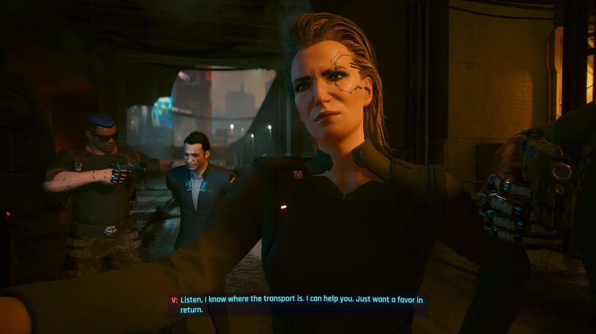
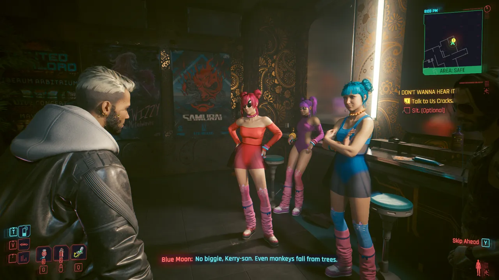
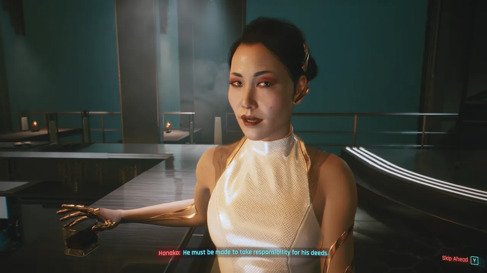
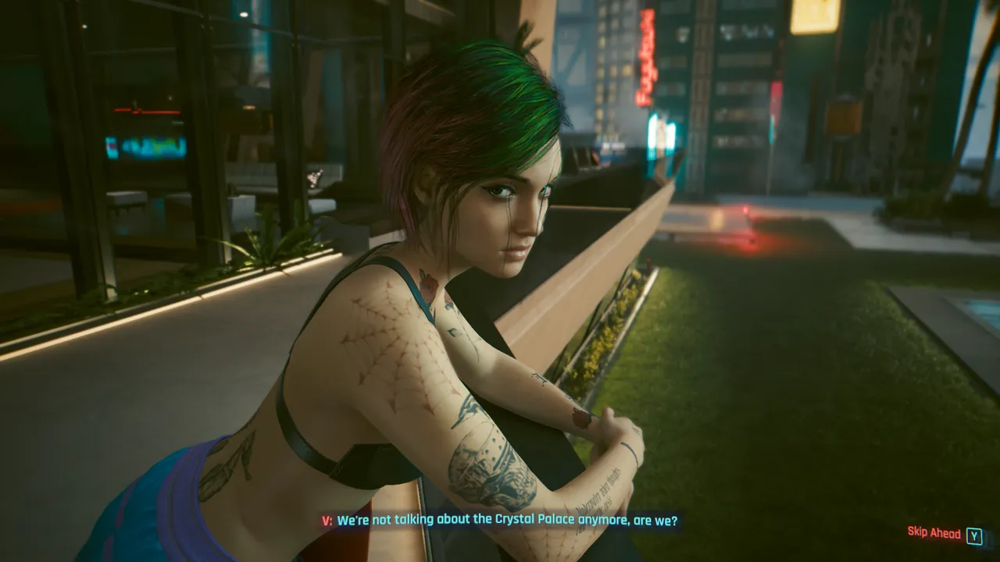
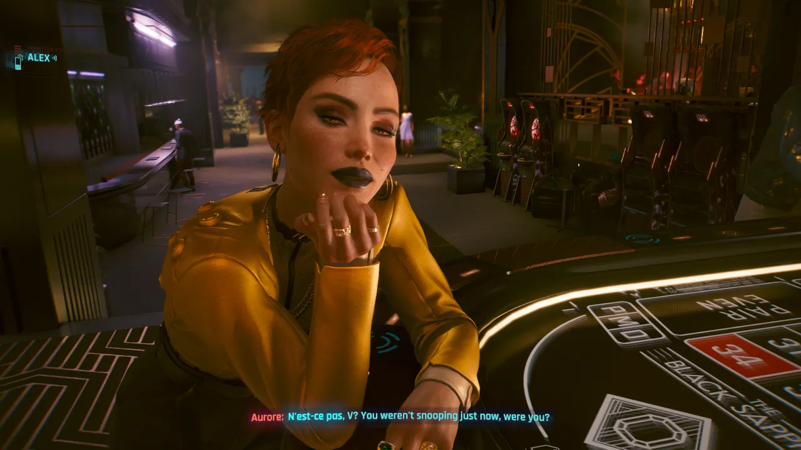
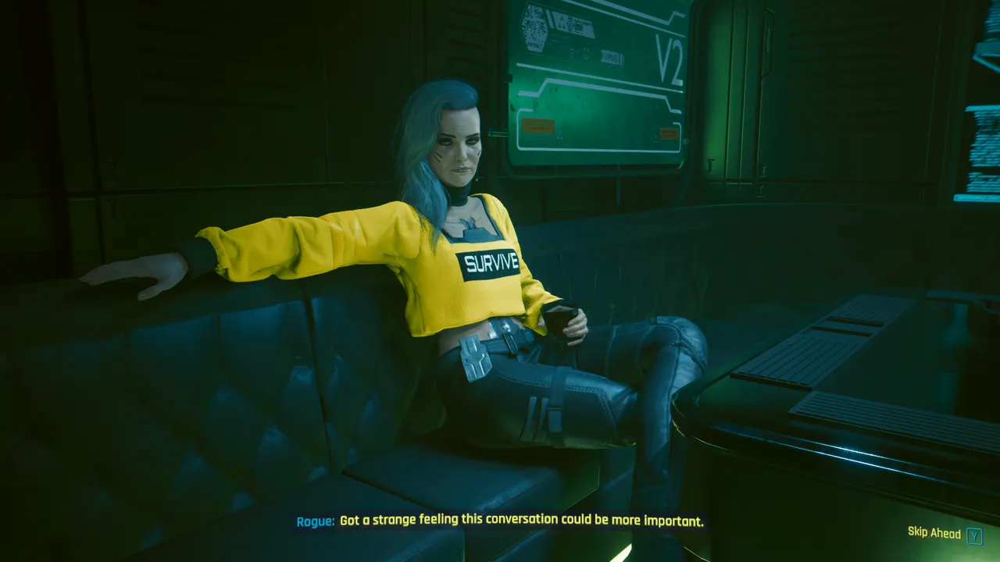
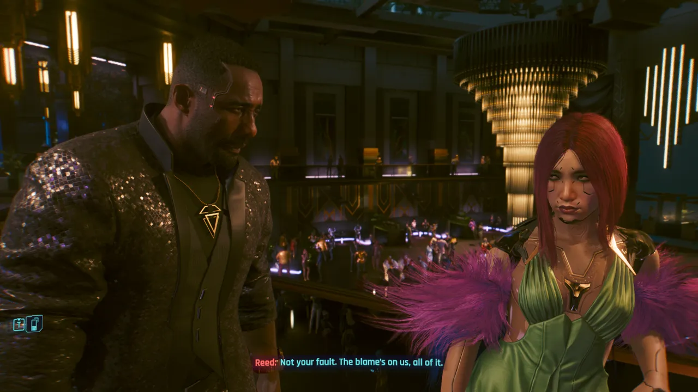
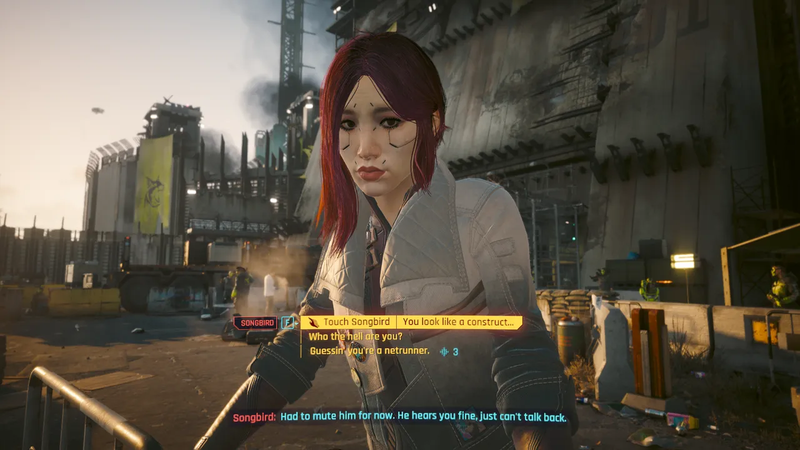

Act 1 (8 missions) of this game had me thinking it was just a GTA gangster
story. And it did a pretty decent job of that, but I really like what this game
grew into better.

Act 2 (17 missions) transitions the game to being about V's "condition", and
introduces your terrorist brain pal Johnny Silverhand. This hoenstly feels like
the "real" game to me, and makes me wish Act 1 was compressed even a little bit.
You _can_ actually choose to skip it, presumably so that you can make a new
character who's instantly ready to take on the amazing Phantom Liberty DLC.

I pretty rapidly acquired the quest to start Act 3 (4 missions in my route). I
guess I was kinda bouncing from main mission to main mission for most of the
game. At that point I had a massive backlog of side quests, so I started doing
some of them, since starting Act 3 locks you in to main missions until you hit
credits.

I'm generally of the opinion that most "open world" games are too big and have
way too many time wasting quests, and this game is no exception. I had a hard
time figuring out which quests would actually be a good use of my time, as
sometimes even the "gig" missions were hilarious and memorable, but then the big
name side missions wouldn't interest me.

The crucifixion BD quest was... truly fucked up. Which is definitely something I
can say about a number of things in this game. It definitely tries to be gross
and push the envelope... but it's generally done in a way that feels like good
tone setting for how fucked up Nighty City is.

---

It's worth mentioning that I didn't quite understand the importance of
cyberware, or how armor worked, until quite a ways into the game. But once I
did, it kind of became trivially easy on Normal... though I didn't mind enough
to increase the difficulty.

I went with a Sandevistan Katana Reflex build, so I was reflecting bullets, air
dashing, and slowing time as I sliced enemies to ribbons. It was... incredibly
effective after I got a little bit of investment into it.

I found the shooting to be decently fun in the game, but I spent most of my time
slicing.

Driving was... not fun. I didn't like how any of the vehicles felt, and dodging
traffic got old fast. It was also a bit irritating that fast travel not only
required you to _end up_ at specific waypoints, but you had to start from those
specific waypoints too. So you'd have to add map markers constantly in order to
fast travel, and summon your car to drive to the nearest one. Getting around the
city was just annoying enough that I didn't bother collecting all of the tarot
cards (which were super cool), or even unlocking all the quests (you have to
drive near where each quest starts to add it to your journal).

---

I don't want to put a ton of spoilers in this review, so I'll speak a bit more
broadly about the story. I'd say the overall tone is sad. It's a story about
grappling with death. While some side quests have happy endings, Night City is a
very bad place where very bad things happen. And V's life story is an extremely
interesting tragedy.

Keanu Reeves's performance as Johnny Silverhand was super fun, though I'm a big
Keanu fan... so take that with a grain of salt.

When it comes to the writing, I actually think Phantom Liberty (the 2023 DLC)
was the best part. Heck, even the side quests are better, and Dogtown is more
dense with interesting things to do.

The Phantom Liberty story is a spy thriller about the NUSA president, sleeper
agents (including Idris Elba as Solomon Reed), and an elite hacker who's dying.
There's a lot of twists and turns, and I really liked the moral gray areas. You
have to choose sides, and I felt conflicted! Ultimately I stand by my choice
100% (it turns out it's the most popular option, but all four had decent
representation).

There's a strong cinematic quality to parts of this game, including a concert by
Lizzy Wizzy (played by Grimes) that plays out during your undercover casino
mission in the enemy's base. The production values feel great in Phantom
Liberty, and it made me remember how much I love spy shit.

Despite me expecting this game to be crude, gross, full of goofy side missions,
centered around too much killing and car driving... When it gets to do its story
bits, I really liked them. I actually shed some tears over both the ending I got
to Phantom Liberty and the main campaign. So they certainly did something right
here.

<figure>
  
  <figcaption>Militech mommy Meredith stepped all over my V in negotations...</figcaption>
</figure>

<figure>
  
  <figcaption>Misty the mystic confiding in V about her new relationship with Mama Welles.</figcaption>
</figure>

<figure>
  
  <figcaption>Kerry Eurodyne's mission with the Us Cracks must've been inspired by Rob Zombie touring with Baby Metal.</figcaption>
</figure>

<figure>
  
  <figcaption>Hanako Arasaka making V a terrible offer.</figcaption>
</figure>

<figure>
  
  <figcaption>Braindance (VR) smut producer and girlfriend Judy Álvarez, having a serious conversation with V.</figcaption>
</figure>

<figure>
  
  <figcaption>Playing roulette with sexy French criminal Aurore was tense and interesting.</figcaption>
</figure>

<figure>
  
  <figcaption>Johnny Silverhand's old friend Rogue&mdash;the hottest octogenarian in town&mdash;is the queen of fixers.</figcaption>
</figure>

<figure>
  
  <figcaption>Solomon Reed (Idris Elba) plays a sleeper agent with a dark past.</figcaption>
</figure>

<figure>
  
  <figcaption>Songbird welcomes you to the Phantom Liberty DLC, and she captured my heart by its conclusion...</figcaption>
</figure>
