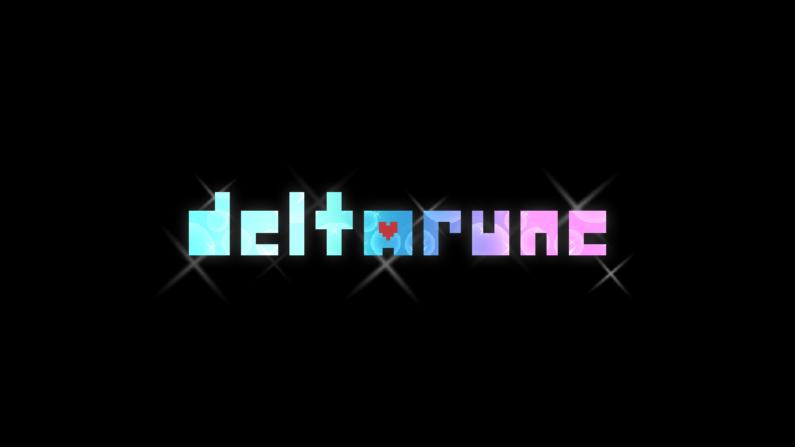

I took 1,825 screenshots of this fucking chapter. It's excellent. And goddamned
heart breaking.

I still don't enjoy the series' bullet dodging and lackluster healing mechanics,
but everything else is peak this chapter.

The new sidescrolling gameplay is shockingly refined. The associated puzzles are
real head scratchers---especially the optional ones. And the chapter end boss
fight against ~~REDACTED~~ goes so fucking hard, oh my god.

Introducing so many new characters in one chapter was a huge risk, but I think
it mostly paid off. Yellow's gag got old pretty fast, but the rest never wore
out their welcome for me. And Flowery was just perfect. I absolutely adored
every moment on top of the castle. No spoilers here. If you're not playing
Deltarune, I don't know why you're reading my fucking review of chapter 5. Go
fucking play it right now. If you are playing Deltarune, send me a DM lol. I'd
love to talk about my Ralsei conspiracy theory.

Now if you'll excuse me, I need to go catch up on the "weird route" stuff
online. I haven't bothered with any of the secret boss route stuff since Jevil
in chapter 1. The world keeps revolving either way lol.

---

OK I lied, one more thing. Toby Fox, please, for the love of god, add some kind
of assist mode or difficulty setting for people who struggle with your bullet
dodging hijinks. I've never been truly stuck on anything in this series, but
it's just not everyone's cup of tea. And I hate to think about anyone missing
out on this game because they got stuck on boss fights.

<figure>
  
  <figcaption>Del-ta-ruuuuuune ♫</figcaption>
</figure>
