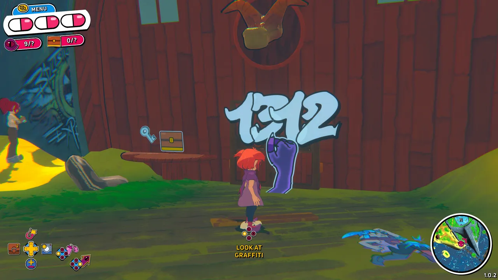
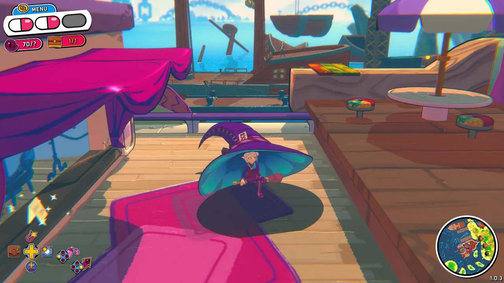
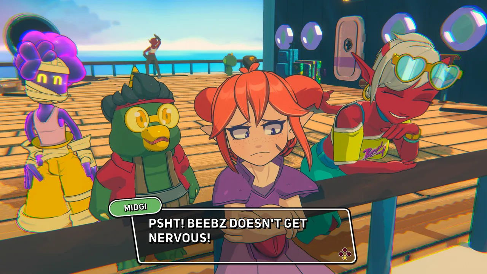
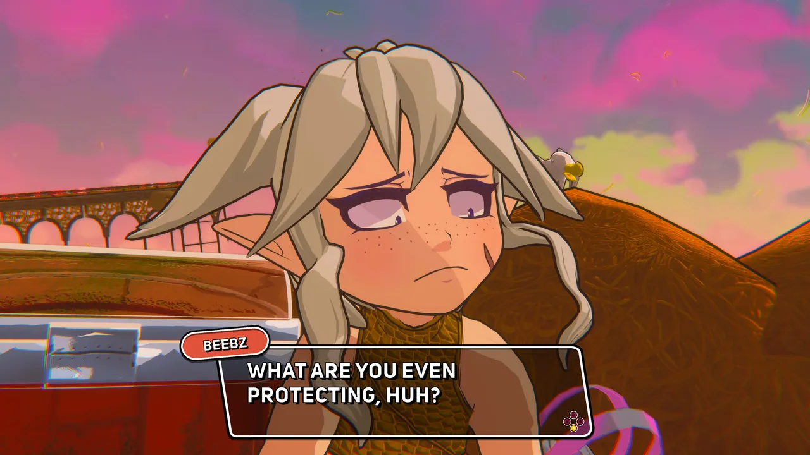
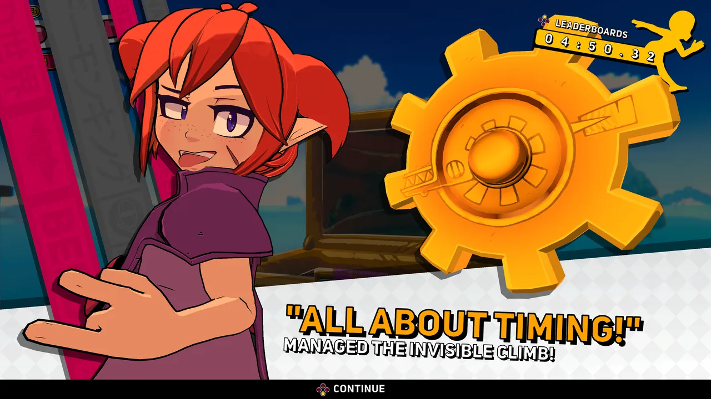
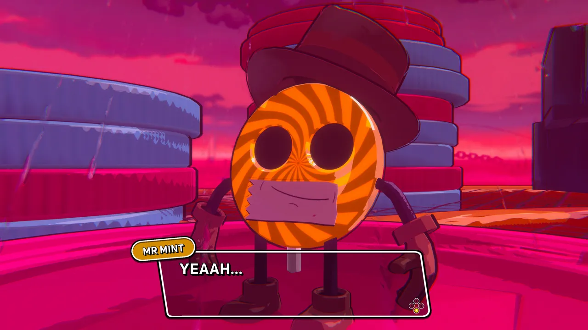
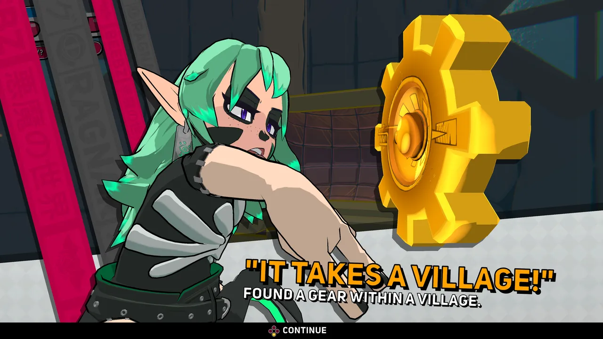
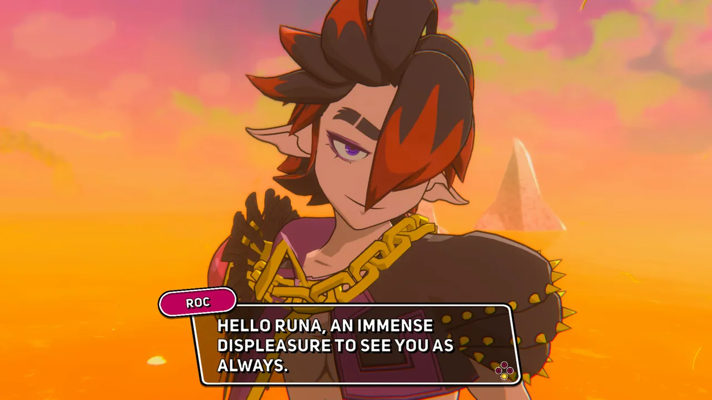
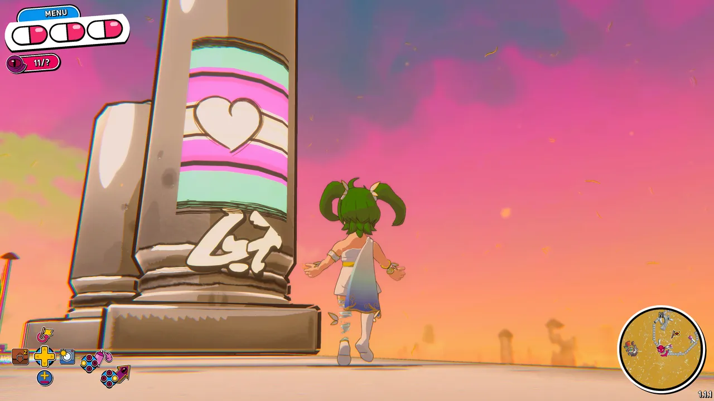

I really wanted to like
[**Demon Tides**](https://store.steampowered.com/app/2585890/Demon_Tides/) more
than I did. It's not poorly made, but it has a number of decisions that I didn't
really vibe with.

The game structure is like
[Bowser's Fury](https://en.wikipedia.org/wiki/Bowser%27s_Fury), which is itself
kind of a simplified
[Wind Waker](https://en.wikipedia.org/wiki/The_Legend_of_Zelda:_The_Wind_Waker)---you
just sail around to where you want to go, and the game is split up into three
chunks of map depending on how many gears you've collected.

Sailing is boring. There's no real sense of exploration, and there's a lot of
"dead water" to get through to find things. Couple that with a mediocre map, and
by the late game I actually unlocked multiple islands on my map, but it was
nearly impossible to tell I hadn't actually visited them.

I get what they were trying to do, but a level select screen would've been much
better. And with a level select screen, they could've pushed the areas a little
bit harder in terms of variety. Since everything is basically an island, they
all broadly have an oval shape around the edge, and then a bunch of random peaks
and buildings so they can actually make interesting platforming.

The movement feels great, but the learning curve is steep. They added even more
maneuvers in this game compared to
[its predecessor](https://store.steampowered.com/app/1747890/Demon_Turf_Neon_Splash/),
and the game could honestly use a flow chart to describe the possible state
transitions.

I _mostly_ got the hang of it by the end of my time with the game (a bit over 30
hours, collecting all 45 gears, and beating the bonus level), but there were
definitely quite a few failures that consisted of me simply pressing a button
sequence in the wrong order, because the game has so many movement options. I
think that boosting in particular probably made this game worse than its
predecessor, because it pushes your platforming distance even further out, which
negatively impacts the level design.

3D platformers always have a fine line to walk, because depth perception is fake
in video games. And this game barely gets a pass through a clever hack---rather
than having any sort of useful automatic camera placement to help you see the
level from a good angle, they just gave you the ability to use RB on the
controller to jump, so you could keep your right thumb on the control stick to
change camera angles at all times. The game would be absurdly frustrating
without this control choice. It was weird at first, but you get used to RB as
the primary button, like you do in Dark Souls.

I'm not really sure why this game has combat or boss fights. Most of them just
didn't feel fun.

---

The music is great, and I particularly enjoyed how 2 Mello's vocal layers would
come in during the hype moments of boss fights.

The graphics generally look gorgeous, and I was really into the facial
expressions and character designs. The world is just extremely charming to me.

Despite my misgivings with learning its complexities, there's plenty of
satisfying platforming to be had. It's just wrapped in a couple layers of stuff
I didn't really enjoy.

The game also features a ton of items you can equip that further alter your
movement abilities... which is really cool, but it also means you can trivialize
many sections of the game with the right combinations of items equipped. I'm
pretty sure it's possible to beat the entire game without using any of these
upgrades, though, so you could simply ignore all but the cosmetic ones if you
wanted to keep maximum platforming challenge.

---

My overall feeling with this game is: competent developer makes overly ambitious
third installment in their platforming series. Despite the gorgeous graphics and
banging tunes, you might be better off buying the incredibly affordable
predecessor game, Demon Turf: Color Splash, to scratch that 3D platforming itch.

<figure>
  
  <figcaption>I wonder what this graffiti could mean...</figcaption>
</figure>

<figure>
  
  <figcaption>Possibly the biggest hat I've seen in a game</figcaption>
</figure>

<figure>
  
  <figcaption>It's Beebz's crew! This game looks gorgeous</figcaption>
</figure>

<figure>
  
  <figcaption>I really enjoyed the facial expressions in this game, especially for Beebz</figcaption>
</figure>

<figure>
  
  <figcaption>Collecting one of the 45 gears in the game</figcaption>
</figure>

<figure>
  
  <figcaption>Mr. Mint's challenge levels have no checkpoints, and really put your platforming skills to the test</figcaption>
</figure>

<figure>
  
  <figcaption>There's a <strong>ton</strong> of outfits to wear in this game</figcaption>
</figure>

<figure>
  
  <figcaption>Secondary antagonist Roc absolutely roasting Beebz</figcaption>
</figure>

<figure>
  
  <figcaption>The graffiti mechanic is like Jet Set Radio meets Dark Souls&mdash;and I loved seeing what people made</figcaption>
</figure>
