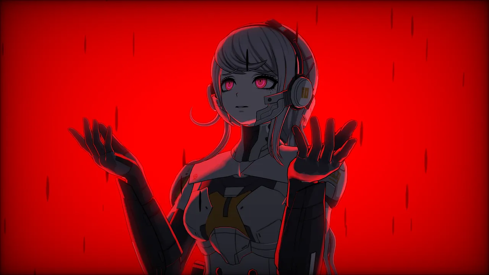
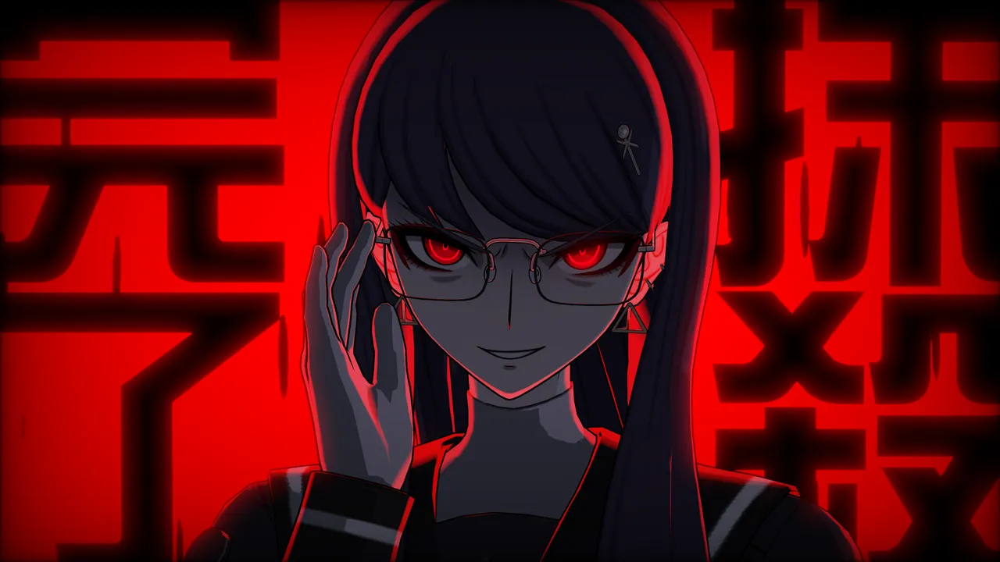
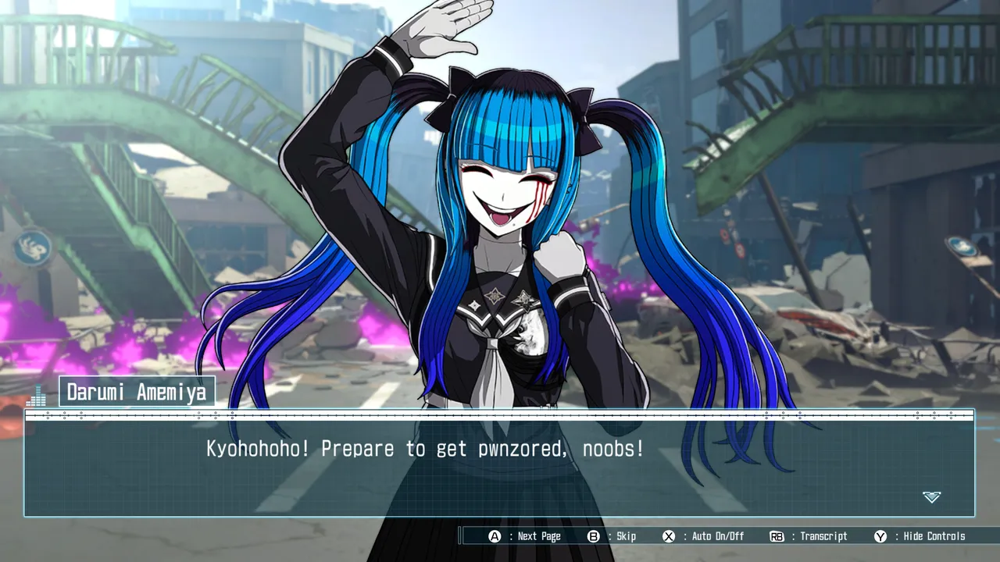
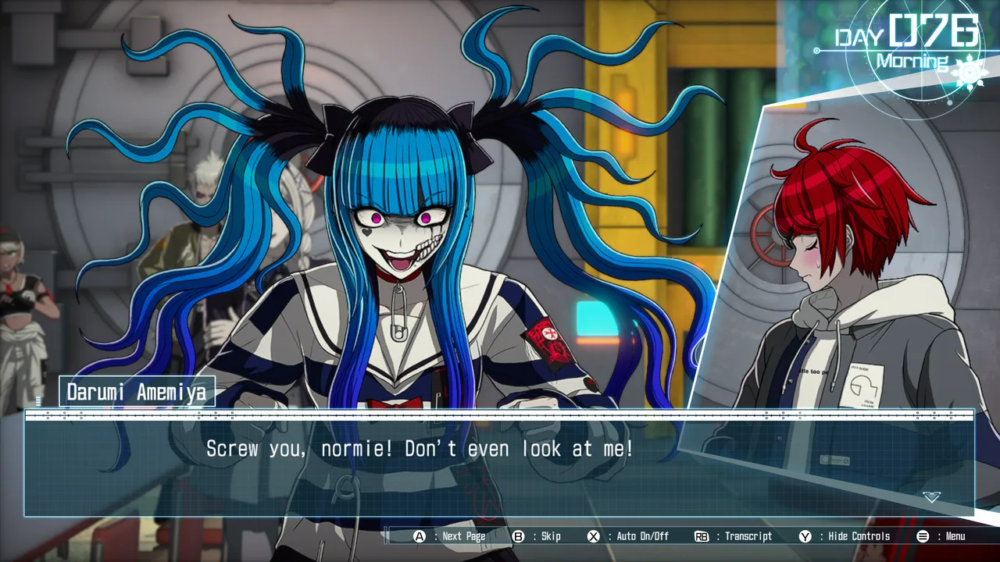
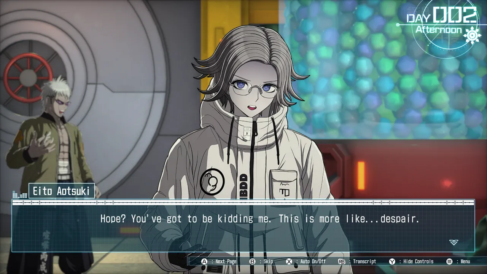
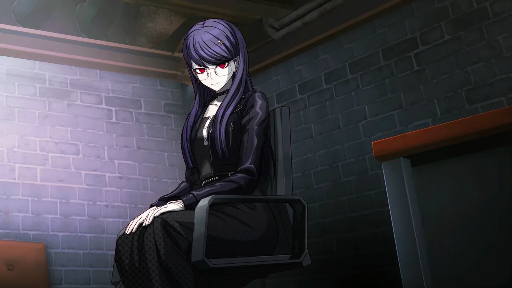

I love Danganronpa, Danganronpa 2, and Danganronpa V3. This game tells a better
story than all three of those, in my opinion. You could make the case that with
"100 endings", it certainly gets more tries. But I feel like Kodaka's madness
was tempered by Uchikoshi and company in this game.

It could also just be that I'm more of an Uchikoshi fan, so adding any of that
Uchikoshi flavor to Kodaka's stuff just makes it way more exciting to me. And
Uchikoshi's influence is definitely all over this game, even if the
moment-to-moment flavor feels strongly Kodaka. I say that this is Kodaka's
magnum opus, by the way, because I think Uchikoshi already had his with
_Virtue's Last Reward_.

I should caveat my thoughts here with: I didn't "play" a single second of this
game. I watched Ash play it the entire time. But it's mostly a visual novel.
Yeah, there's a strategy game component, but like Danganronpa before it... I
consider this aspect more of a minigame to break up the storytelling. Heck, you
can even skip most of the combat by the halfway point.

Eventually you unlock a story flowchart you can hop around, Uchikoshi style, and
that's when things really opens up.

I will say that some of the routes didn't hold my interest. I won't call any of
them trash or terrible, but I think that the goal of "100 endings" was overly
ambitious. This game is absolutely freaking massive, and we unforutnately ran
out of willpower before seeing all it had to offer. I think the game could've
used a little more editing both in terms of cutting less interesting routes, and
then actual copy editing (looooots of extra words, typos, grammatical
mistakes---nothing too bad, and somewhat understandable given the absolutely
massive script size).

I don't want to spoil anything about the story for you, reader, but... I really
grew to love Hiruko, Eito, and even Darumi. All of the characters have at least
something fun going on for me (well, except maybe Gaku lol).

For murderheads and mystery folks missing some classic Danganronpa killing game
nonsense, don't worry, they included routes that have lots of murder and killing
game nonsense too. But the important routes are not about that. And I think
you'll enjoy them a lot more, too, if you get to them.

---

Despite the high profile list of employees at
[Too Kyo Games](https://en.wikipedia.org/wiki/Too_Kyo_Games), I didn't love
[Master Detective Archives: Rain Code](https://en.wikipedia.org/wiki/Master_Detective_Archives:_Rain_Code)
(2023) and didn't finish it, and I didn't even buy
[World's End Club](https://en.wikipedia.org/wiki/World%27s_End_Club)...

I really hope that this game's critical reception has been reflected in
financial success and that Too Kyo Games can survive and continue to experiment
with the stylish visual novel inspired format for video games.

<figure>
  
  <figcaption>I love the full CG art moments in this game.</figcaption>
</figure>

<figure>
  
  
  <figcaption>Executing enemy commanders rewards you with a victory screen tailored to whichever student performed the execution.</figcaption>
</figure>

<figure>
  
  
  
  <figcaption>Darumi is definitely the most <q>winking at the camera</q> character, but I love her lol.</figcaption>
</figure>

<figure>
  
  <figcaption>Hope remains a massive theme in this game&mdash;much like Danganronpa.</figcaption>
</figure>

<figure>
  
  <figcaption>Kodaka's penchant for horny jokes hasn't changed a bit.</figcaption>
</figure>

<figure>
  
  <figcaption>Hiruko becomes your strongest bond throughout the game, and I get teary thinking about her ;-;</figcaption>
</figure>
