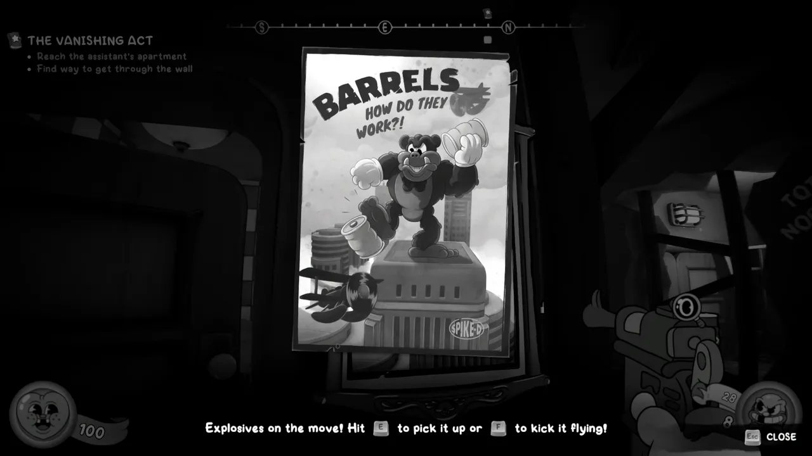
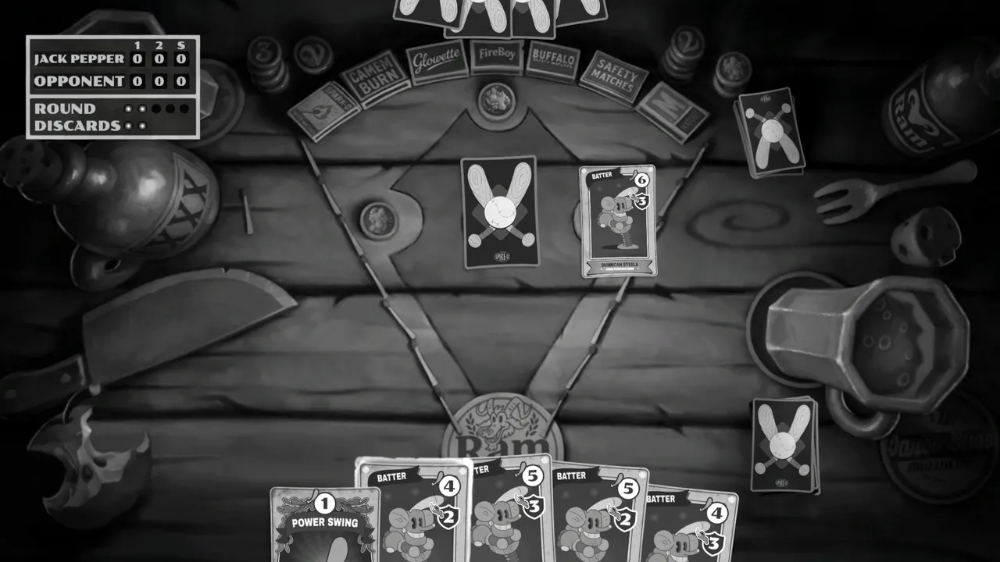
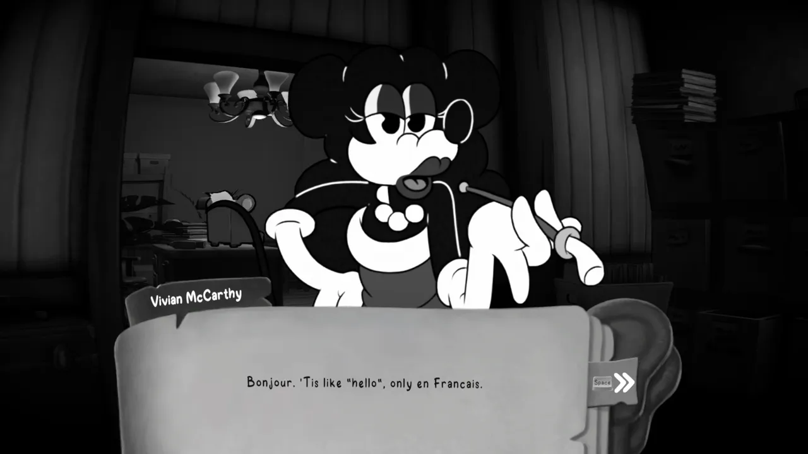
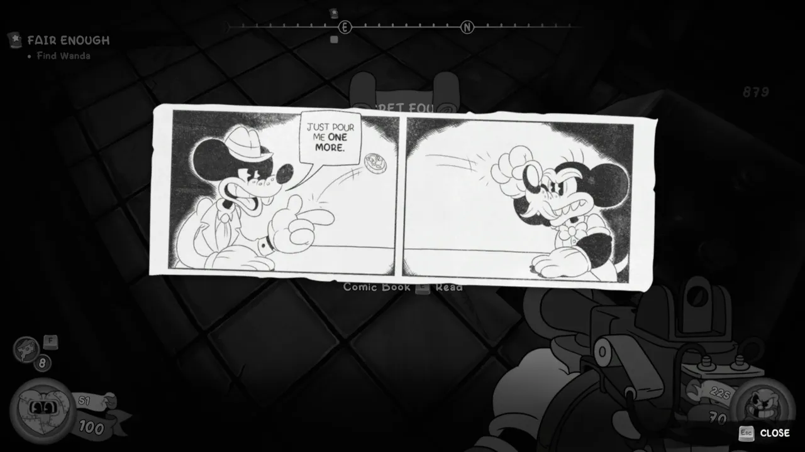
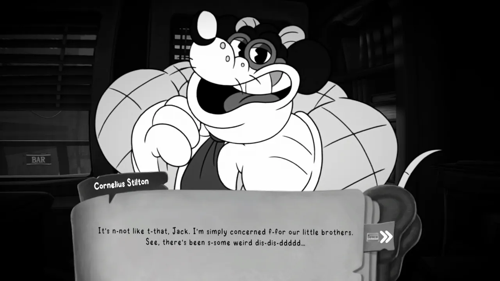
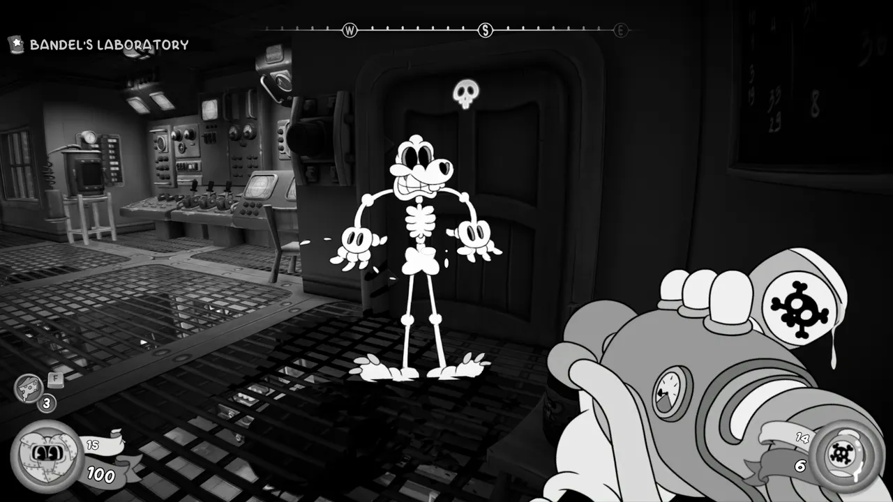
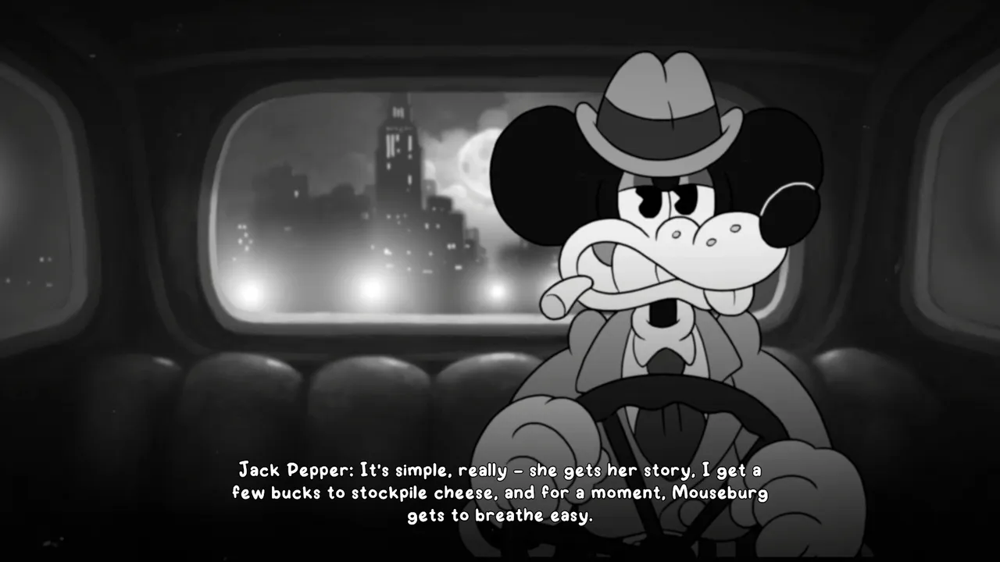
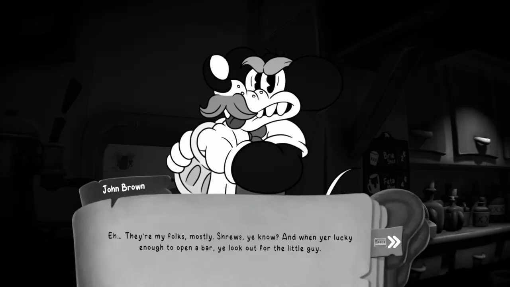
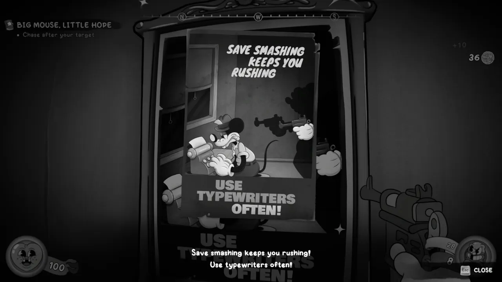

Despite being generally averse to the "boomer shooter" tag on Steam, I actually
liked this game quite a bit.

I'll admit that I bought it 99% for the graphics, but I actually had a good time
playing it. It's fast paced, but it rarely requires any of its myriad movement
abilities during battle (double jump, wall run, glide, and mantle).

Technically there's 12 (!) weapons in the game, though one is a secret I didn't
unlock. This does include "fists" and "dynamite" (grenades), though. The guns
are interesting overall, but I wish they hadn't leaned into a weapon upgrade
system. Some guns feels pretty weak early on, but even if you're looking for
secrets, it's hard to get enough resources to ugprade all of them.

Sadly, the guns you get after the ~~Tommy Gun~~ James Gun are kinda worthless.
The James Gun solves nearly every problem in the game efficiently. The only
other gun that comes close is the Devarnisher---a gun that seemingly shoots
blobs of the "dip" from Who Framed Roger Rabbit. That gun has nearly infinite
range, massive damage, damage-over-time, and decent ammo economy. Plus its alt
fire is basically a grenade launcher. Weirdly, that alt fire is better than the
rocket launcher you get not too much later.

I don't expect the starting pistol to be amazing. The shotgun feels... lacking
in range, even for a shotgun. The Jarhead hypnosis/head popping laser is fun,
but too weak and inefficient. The freeze ray is funny but also not great. And
the chainsaw is just awful. A shame, because it looks cool. I hope they do a
balance tuning to make other weapons more viable, because I got tired of using
the James Gun for almost 100% of fights after getting it. Perhaps the game
would've been more fun with more scarce resources, to push you to use your
massive weapon variety. But I didn't really want the battles themselves to be
too much harder, because I was often running quite low on health in some of the
fights.

Speaking of inconsistency, the bosses were all over the place. Some of them were
downed in a minute with ease, and others were a slog. The game definitely leans
on "dodge the lasers" quite a few times, which gets old fast to me. Personally I
think a game like this would be better with less boss fights.

The game offers a baseball trading card game minigame, but it's no Gwent. The
game is initially very hard to win, but once you buy a few card upgrades, it
becomes trivial. From there you can keep grinding the game earn the 12th gun, or
beat the minigame a whole 50 times to earn an achievement. No thanks.

---

The voice acting is great, and the rubber-hose animated characters are so
lively. The music fits really well too.

When it comes to the story, it's definitely got enough going on to keep me
wanting to flip to the next page, so to speak.

The game is going for a WWII theme where the BMP (Big Mouse Party) is an obvious
stand-in for the Nazis, and the... Shrews... are this game's allegorical Jews.
The game makes it abundantly clear that the BMP is evil and the Shrews are good
people who are consistently taken advantage of by society, but I did feel like
the game was a little incongruent with how serious the subject matter is and how
jokey-jokey the writing is near constantly.

While the BMP sports suspiciously familiar political arm bands, the game
references modern fascism via a dramatic Nazi punching moment (with associated
achievement). It makes a clear point that fascism can arrive in anyone's
neighborhood, and direct action is necessary to keep it at bay. The final
villain even uses the phrase "fake news".

Also, I hope you like cheese jokes. They better brie your favorite. Fondue is
this game's alcohol-during-prohibition substance, though it doesn't do a ton
with the "cheeseleggers" as a plot point.

---

Aside from finding the final level a bit irritating, and the absence of a "level
select" feature in a game that's full of secrets, I really liked this game.
While it got a little wordy in some parts and I found myself skipping dialogue
before it was finished voicing, it was just... a good time! I love when a game
is ~15 hours of fun and well focused.

<figure>
  
  <figcaption>I'd prefer the game without meme references.</figcaption>
</figure>

<figure>
  
  <figcaption>The baseball trading card game.</figcaption>
</figure>

<figure>
  
  <figcaption>Vivian's fake French accent is fun.</figcaption>
</figure>

<figure>
  
  <figcaption>I didn't collect many comics because I saved most of my money for baseball cards.</figcaption>
</figure>

<figure>
  
  <figcaption>Cornelius Stilton (Corny) is your WWI comrade and now politician.</figcaption>
</figure>

<figure>
  
  <figcaption>The Devarnisher is devilishly fun and effective.</figcaption>
</figure>

<figure>
  
  <figcaption>Detective Jack Pepper's voice acting really carries this game's story.</figcaption>
</figure>

<figure>
  
  <figcaption>Shrews are effectively just smaller rats, and the target of discrimination.</figcaption>
</figure>

<figure>
  
  <figcaption>I liked the propaganda poster tutorial for saving the game.</figcaption>
</figure>
