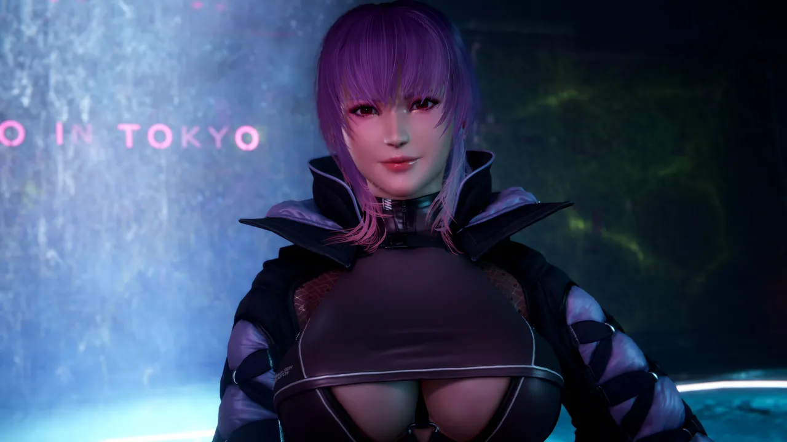
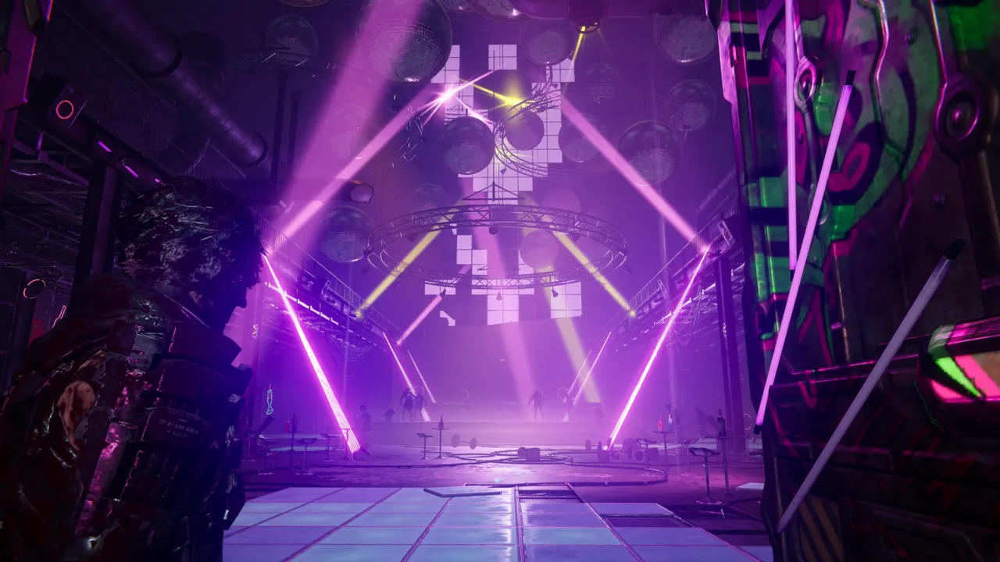
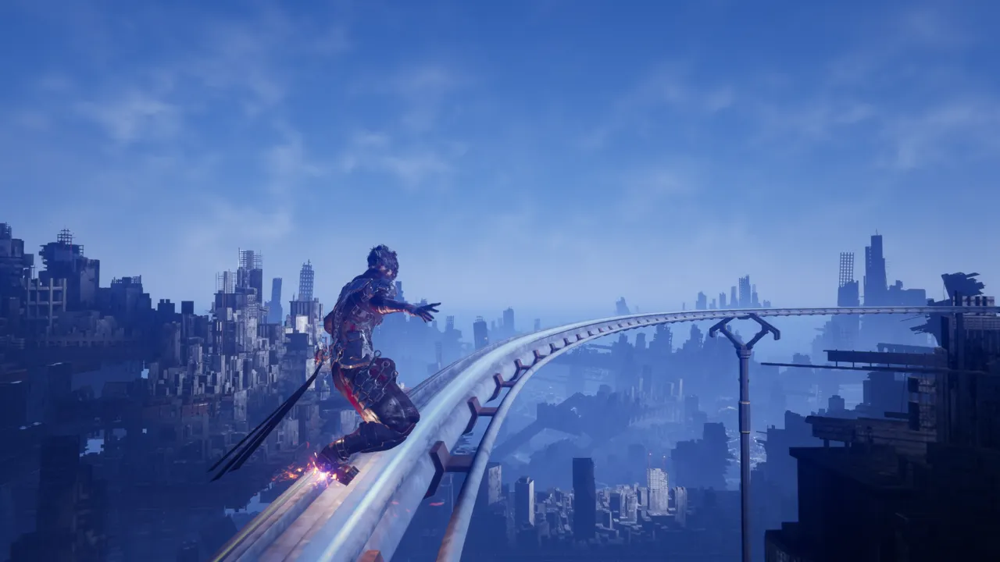
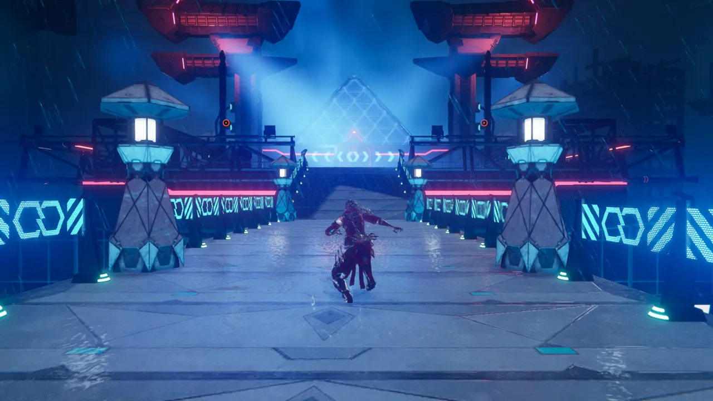
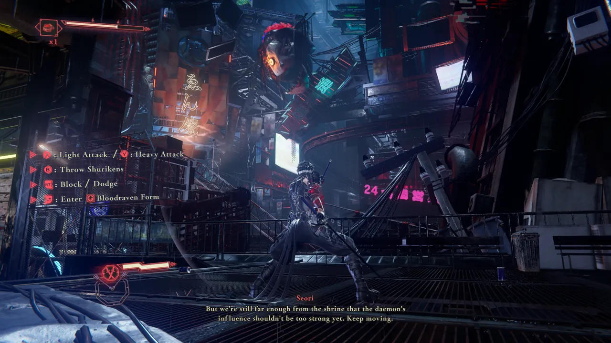
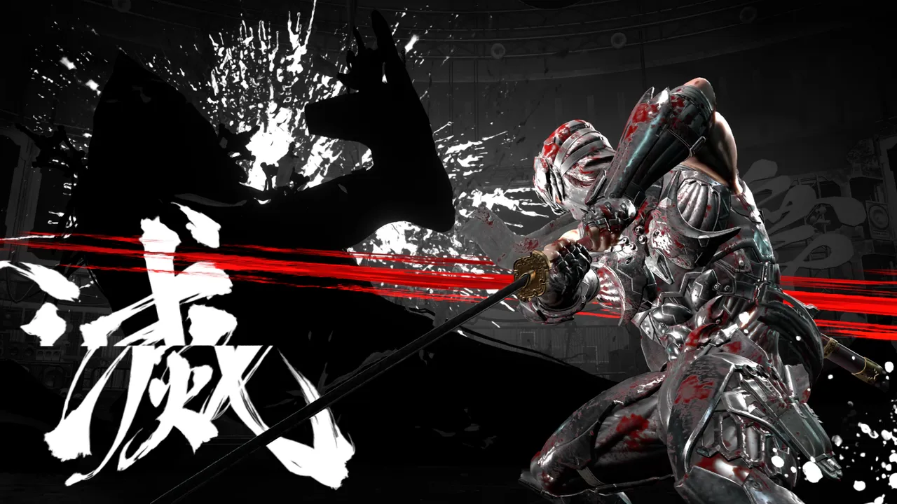

---

In case you missed it, 2025 was Ninja Gaiden's "Year of the Ninja":

- [NINJA GAIDEN 2 Black](https://store.steampowered.com/app/3287520/NINJA_GAIDEN_2_Black/)

- [NINJA GAIDEN: Ragebound](https://store.steampowered.com/app/2542120/NINJA_GAIDEN_Ragebound/)

- [NINJA GAIDEN 4](https://store.steampowered.com/app/2627260/NINJA_GAIDEN_4/)

That's a lot of new video games in one year, and I'm enough of a sucker to have
purchased all three (and even beaten two of them). In fact,
[Ragebound was one of my favorite games of 2025](/blog/2025/review-ninja-gaiden-ragebound/).

## What did I like

The combat is simply amazing in this game. The sword-oriented bosses are
_really_ fun. And most of the mob fights are super engaging, which doesn't
always happen in character action games. The music is bangin', the sound design
is good, and the voice acting is nice too.

## What did I not like

Three of the four weapons you get for Yakumo felt... uninteresting to me. So a
lot of the progression in the story didn't feel fun besides buying new moves for
my base weapon. The grinding/gliding/surfing sections weren't that fun to me.
The giant city-sized boss at the end was a huge bummer, and a few of the
oversized bosses, especially ones that spawned adds, were more irritating than
interesting.

## New protagonist

Like Ragebound, NINJA GAIDEN 4 (NG4) is clearly trying to carve its own niche. A
brand new protagonist (Yakumo), is the star of most of the game, which doesn't
make a difference to me. Ryu is just a guy, and emo edgelord protag vs silent
coolguy isn't gonna make-or-break my character action game. We know the game is
gonna live or die be the gameplay. And I will happily report that by and large
this shares its DNA with other PlatinumGames works like Bayonetta. It's
certainly more visceral, and loaded with series mechanics like obliteration,
gore, and absolutely brutal mobs that want you dead at all costs.

## Difficulty

I died 31 times on Chapter 1; no idea how many were against the boss... but I
hadn't quite internalized the mechanic of using the bloodraven form to
counterattack the boss when it glows red, lol. Or the regular enemies, for that
matter. And I maintain that the "berserk mode tutorial" mob is actually one of
the harder enemy mobs in the normal game, despite being in chapter 1.

I'm not just a glutton for punishment, though. I need a game to make it feel
like:

1. It's my fault
2. It's possible to win
3. It's not wasting too much of my time

For my skill level in action games like, this, #2 is mostly fine, and I tend to
challenge myself more around conservation of healing items. In typical
PlatinumGames fashion, you're graded based on number of deaths _and_ item usage,
so I found myself avoiding item usage... and then dying to a lot of random
mobs---because the "lowly" enemies are actually really tough in this game!
Leading to bad scores on quite a few levels, lol. But that's ok.

As for things being my fault, I'll say this game has a _lot of mechanics_,
bordering on too many. So it was pretty clear that I needed to get more familiar
with most of them in order to even the playing field. Sure enough, this
familiarity translating to increased performance in most fights!

As for time wasting, this game is really good about having fairly frequent
checkpoints, especially with bosses. There are NO boss "runbacks". I'm looking
at you, FromSoftware. Even though every boss in this game has two phases, which
can be a bit annoying for practicing, you can fight the boss again sooooo
quickly. Also, none of the bosses are total HP sponges, at least on normal.

A few boss fights are particularly frustrating and awful, like the frog fight,
or the Dark Dragon---you know the golden rule of boss fights? The bigger the
boss, the worse the fight? When they're the size of a skyscraper, the fight is
just pure trash. Well, PlatinumGames knew this too, and Dark Dragon part one is
on a completely separate checkpoint and NOT available to select in the boss
trial mode lmao. They knew it was just cinematic and bad too. Gross. I had
flashbacks to the final boss of Bayonetta fighting that awful thing.

I think there's a handful of great boss fights in this game:

- DDO Commander
- Kagachi
- Ryu
- Dark Dragon

These are all 1v1 duels against swordsmen your size, with epic tunes in the
background. I've gone back to these fights to play them again for fun, to really
soak in the combat system.

## Other Ninja Gaiden games

I'm under the impression that historically boss fights haven't been the big
attraction of Ninja Gaiden (since the Xbox reboot), though. And I'm pleased to
say that the combat against enemy mobs is super tight and exciting... I just
wish I liked going through the _levels_ as much as I liked fighting the guys in
them. There's a decent amount of "fluff" content in some of the levels designed
to look cool and fill up some amount of 3D "platforming" quota that just doesn't
hit the mark for me at all. Any of the rail grinding stuff, glider sequences, or
surfing areas... it's a cute idea, but it's just not fun. It feels like padding
to me. I guess at least it's not as hard and annoying as the driving and shoot
'em up sections of Bayonetta games, but oh well. Just a little bit of a bore
when replaying a level. Nothing as bad as the puzzle sections of Bayonetta 3
levels...

## Music

Did I mention the soundtrack is amazing? It's not always as memorable as I'd
like, but when it's good, it's great. You can read the PlatinumGames blog where
they talk about the
[sound design](https://www.platinumgames.com/official-blog/article/14000). While
"metalcore" isn't my thing, seeing "djent" listed as an inspiration for a game
soundtrack blew my mind.

> These genres naturally convey intensity, but they also sometimes evoke
> heart-wrenching delicacy and introspective messages. I thought that pairing
> this kind of musical expression with a game about young and powerful ninja
> like Yakumo fighting against the world would feel both incredibly fresh and
> just plain cool, so this was my secret plan.
>
> &ndash; Masahiro Miyauchi

**_YOU TELL 'EM, MASAHIRO._** It was so cool I kinda freaked out a little bit
the first time a djent riff came on during a boss fight. Even though the "vocals
during boss battle" trick has been played in a few games already, it still hits
really hard, too. Check out the
[Kagachi official theme](https://www.youtube.com/watch?v=YqC5ep1O2Gk) to see the
vocal version, knowing that the first half of the fight is just instrumental.
And the [shop theme](https://www.youtube.com/watch?v=z3V00Mj0N68) literally
sounds like Polyphia (one of my favorite bands).

## Performance

I played the game on PC with an NVIDIA RTX 3070 Ti and a beefy Intel Core
i7-13700KF. I initially played the game with my 4K screen, where performance was
simply too sluggish to bear. A fast past action game like this simply can't
tolerate anything lower than rock solid 60 frames per second. So I ran the
entire game at 1080p, which looked just fine, and actually frequently got 120+
fps. Cool to see the game support high refresh rate monitors. The increased
motion clarity is nice for an action game like this, even if it isn't first
person.

## Final thoughts

I think I may have had my fill at this point, at least for a little while. I'll
keep the game installed, in case I want to dip my toes back in for some of these
boss trials or other combat trials. It's really interesting, because at the 16
hour mark, I had just finished the game, and I was feeling a bit jaded about it.
There were definitely some low points (some of the bad bosses) on my mind, and I
was ready to give it a worse review than I'm doing now.

After letting it simmer, and going back to the parts of the game I like... I've
now doubled my playtime, gotten way better at the game, and really increased my
opinion of it. I think it's worth remembering that with a highly skill-based
game like this, you can't rush enjoyment, and 16 hours isn't a lot of time to
learn a new thing.

So how does this compare to other character action greats? Well, I'd say it's
really solid. It doesn't reach the heights of Devil May Cry 5 or Metal Gear
Rising: Revengeance for me, but honestly... It's a really high point for
PlatinumGames? Bayonetta 3 had a lot of problems, and this game is a step in the
right direction, I think.

## About other reviews

One final bone to pick. To whichever reviewer out there said this was the "next
best thing to Revengeance 2", since we're never gonna get a sequel. It's really
funny you say that, because this game is almost flipped from Revegneance to me.
The mob combat is amazing, the bosses mostly aren't, and the story is
forgettable. The complete opposite of Revengenace. Except that they both have
awesome music, lol.

## Gallery

<figure>
  
  <figcaption>Ayane shows up for a brief cameo... perhaps she'll do something in the season pass content? I'll write about it later.</figcaption>
</figure>

<figure>
  
  <figcaption>The boobily-breasted Seori is enemy-turned-companion from Chapter 0. When you finish the game, you'll see why she's wearing a rope harness (it's not just because the character designer was horny).</figcaption>
</figure>

<figure>
  
  <figcaption>I really liked the sound/visuals in the club level</figcaption>
</figure>

<figure>
  
  <figcaption>I didn't enjoy the rail grinding segments of the game...</figcaption>
</figure>

<figure>
  
  
  <figcaption>Future Tokyo is theoretically neon and cool, but mostly just dark blue, wet, and boring.</figcaption>
</figure>

<figure>
  
  <figcaption>The instant kill slice effect is extremely satisfying to watch</figcaption>
</figure>
