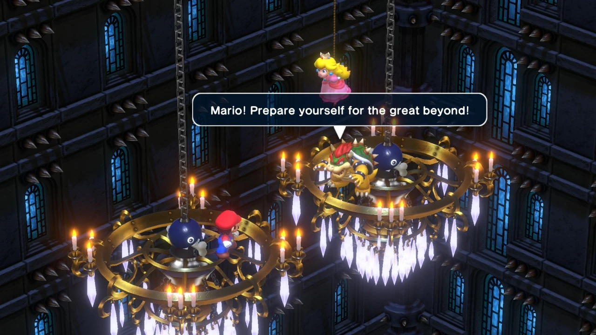
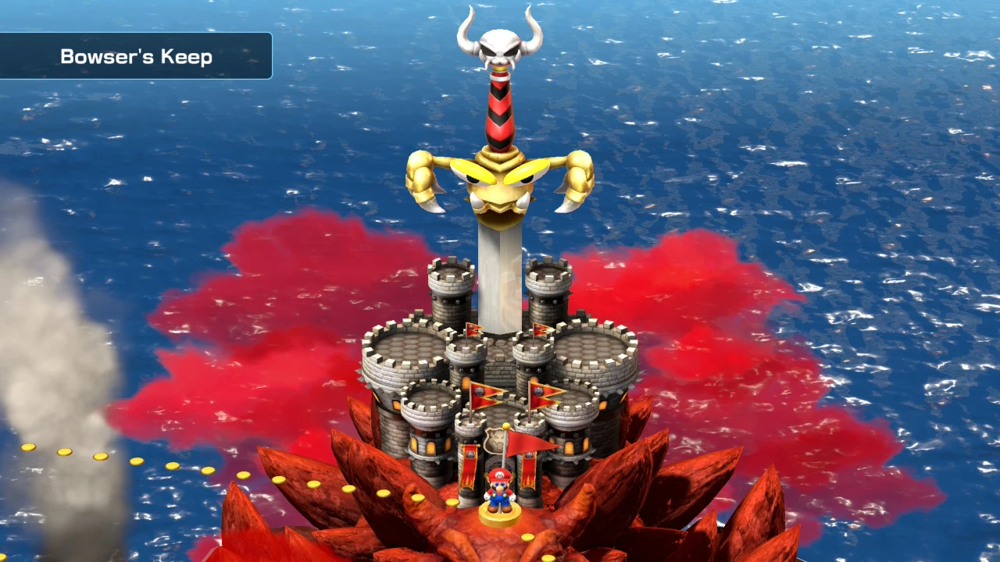
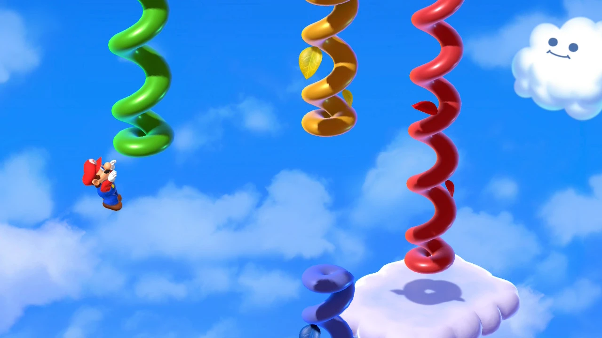
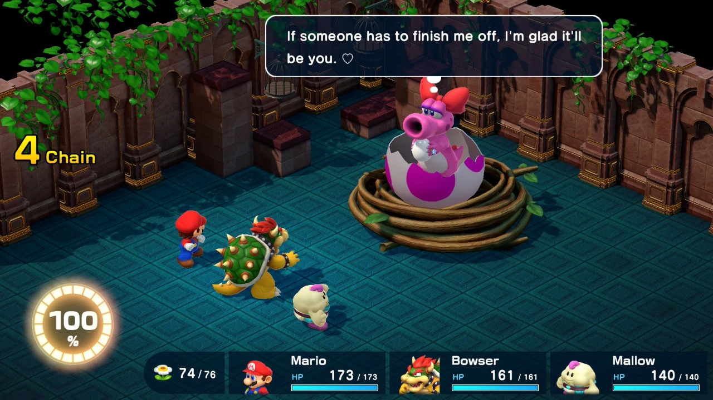

_Super Mario RPG: Legend of the Seven Stars_ (1996) was too much for me to
handle as a kid, much less in a single Blockbuster rental. The nostalgia center
in my brain was screaming "finish the game!" when I saw it in the Switch eShop
as _Super Mario RPG_ (2023).

Much like the later _Paper Mario_, the writing is silly and on point here. It's
that kind of jokey irreverent dialogue you get in _Earthbound_ or even
_Undertale_. I love a good comedy, and this one is timeless.

The new characters, Mallow and Geno, are definitely cute. I think that Geno's
fanbase is perhaps overblowing how cool is he is quite a bit. Not to "yuck their
yum" or anything, but he really doesn't get that much characterization. He's
just kinda there be cool. Which is totally fine. Funny enough, I think Bowser
gets the best writing in the whole party. The mental gymnastics he has to
perform in order to convince himself to work alongside Mario never stopped
amusing me.

For pacing, I completed the game and secret boss (looked up how to find him) in
20 hours on the normal difficulty. I appreciate a game that doesn't overstay its
welcome a lot. Beyond that, there were minigames to get better at (more on that
later), and an entire guantlet of postgame bosses I skipped.

The combat was... well... fun at times, but overall not my jam. I'm not quiet
about not liking timing mechanics in my turn-based RPG mechanics. Mercifully,
the remake will give you a visual cue the next time you use an attack, if you
fail to hit the timing mechanics on your previous use. Annoyingly, most new
weapons you equip have completely different timing than the last, so you're
constantly losing muscle memory. Weapon upgrades are often minor, so until you
practice the new timing mechanics heavily, weapon upgrades often resulted in me
doing less damage on average than before I upgraded. Seriously, the timing
mechanic basically makes your attack a critical hit, so this game is actually
pretty heavily "skill based" in a mechanical sense. To make matters worse, Mario
gets the skill "Super Jump" which lets you hit your opponent **up to 100 times**
if you can keep the rhythm down. Between wireless controllers and poor visual
cues, this is actually quite tough. For good reason, mind you, since getting 100
hit combos consistently would make the game mind numbingly easy and slow the
pace down horrendously.

For whatever reason, the game seems to be balanced such that melee attacks are
by far your best option in most situations against bosses, because so many of
them lack an weaknesses at all, and magic attacks are both expensive and weak
for single target damage if you aren't a timing monster. This made the combat
feel even more dull against bosses a lot of the time.

It's not like I never had fun with the combat, but it was just weird in a way
that still didn't click with me after 20 hours. Once I got Peach (the dedicated
healer), I generally just had her use all the FP (flower points, a party-wide
resource) to heal, while everyone else took turns fishing for critical hit melee
attacks against the boss. Quite tedious if the boss in question wasn't an
ongoing comedic experience.

Don't get me started on the minigames either. None of them were roadblocks
during my journey, but they all felt incredibly janky and unsatisfying. The
Yoshi race in particular is probably the worst rhythm game I've played in my
entire life. You have to tap completely offbeat from the drums, and the
tutorially seems completely bugged to endlessly roast you, demaning you "try
again" (even though I won the race first try).

The music, visuals, and writing absolutely heroically saved this game from being
$60 of regret for me. Instead I'll just mark it down as: good, important, and
flawed.

<figure>
  
  <figcaption>Bowser threatening Mario with the shadow realm...</figcaption>
</figure>

<figure>
  
  <figcaption>This talking sword takes over Bowser's castle almost immediately.</figcaption>
</figure>

<figure>
  
  <figcaption>The cloud level was isometric platforming at its absolute worst.</figcaption>
</figure>

I managed to grab an invisible edge of this beanstalk, leading me to believe
that the cloud level was actually a diabolical level of platforming hell. After
ages of trying, I accidentally activated an _invisible platform_ that
trivialized the jump I'd been wasting so much time on. Classic old school Mario
bullshit lol.

<figure>
  
  <figcaption>Giant Birdo! &hearts;</figcaption>
</figure>
