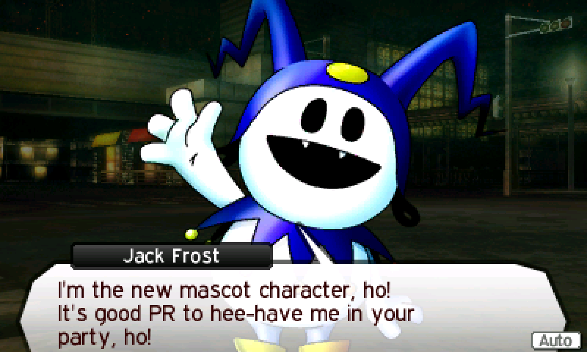
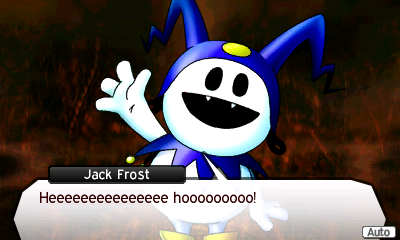
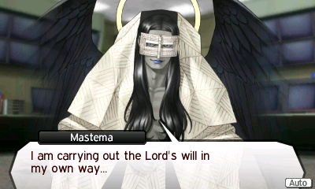
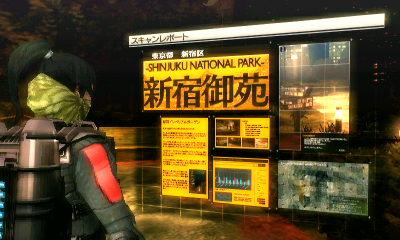

My Shin Megami Tensei (SMT) journey started with SMT IV: Apocalypse. I
ravenously consumed SMT V when it came out on Nintendo Switch. And SMT V:
Vengeance is one of my favorite JRPGs---favorite games---of all time now.

So I'm disappointed to report that SMT IV was just "fine" to me.

First, the story was really slow to start. You spend a _really_ long time in the
starting area, and that's without even doing side quests. At this point, the
game also lives up to the legendary SMT series difficulty. Random mobs were
consistently wiping my party, and the first boss (Minotaur) was absolutely the
first skill check that others warned it would be.

Sadly, nearly every single boss after Minotaur was a complete pushover to me.
You can't select "Hard" in this game until you've beaten it at least once. Which
is too bad, because I think I really needed a more challenging experience. I'm
anything but a master at this series, and basic builds often trivialized bosses.
But many of the bosses were so easy I didn't even change my party at all.

I enjoyed the story starting with meeting the black samurai, but unfortunately
the gameplay was just lacking. Beside the overly easy bosses, the true sin of
this game is the unforgivably bad overworld. Navigating Tokyo is complete hell.
Nothing is labeled on the map until you're standing basically on top of it. And
the label is on the bottom of the screen. The overworld is full of bridges,
tunnels, dead ends, and inescapable battles.

The dungeons are honestly not much better. They tend to be full of one-way
doors, teleporters, and tunnels as well. I love a good labyrinth, but these are
just bland and tedious.

The graphics are unfortunately nearly inscrutable in this game. Most things are
super dark and low contrast A low framerate is far from a crime in a game like
this, but you need to be able to see where things are in order to go to them.
And the dungeon maps damn near lie to you in this game the way they
intentionally make themselves look complete but also fail to annotate doors and
teleporters until you use them.

I will say that the press turn system is absolutely genius, and smirk is a lot
of fun here. It's just a shame that most things here to support it aren't dialed
in right.

<figure>
  
  <figcaption>Jack Frost can break the fourth wall, as a treat.</figcaption>
</figure>

<figure>
  
  <figcaption>Heeeeeeeeeeeeeee hooooooooo!</figcaption>
</figure>

<figure>
  
  <figcaption>I enjoyed Mastema's small role in this game, though not as much as SMT V: Vengeance.</figcaption>
</figure>

<figure>
  
  <figcaption>I loved the graphical effect when you go to a new area for the first time.</figcaption>
</figure>
