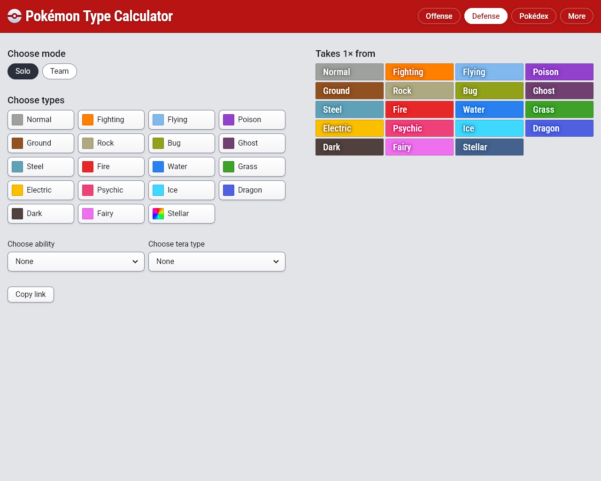
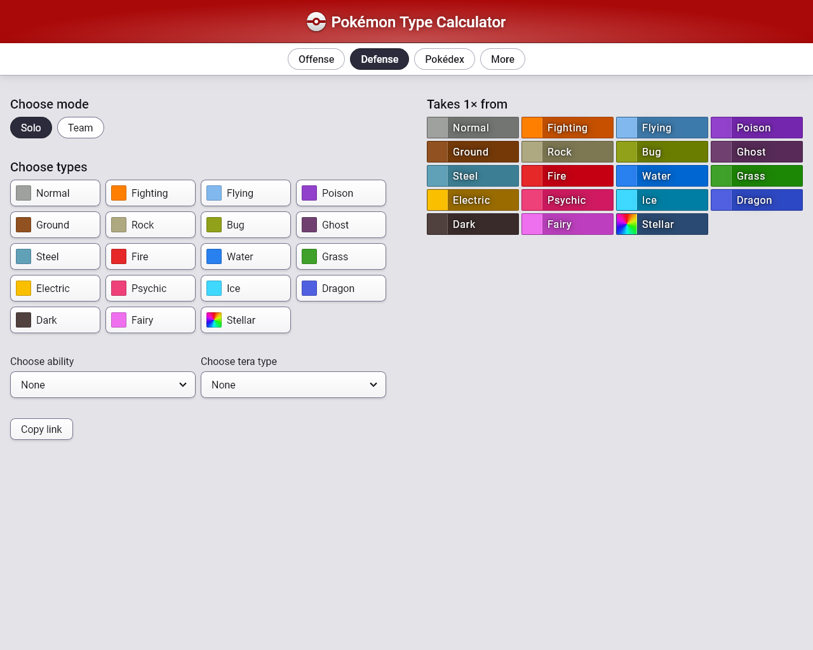
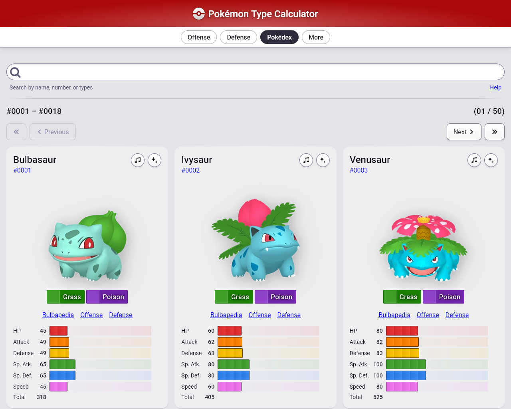
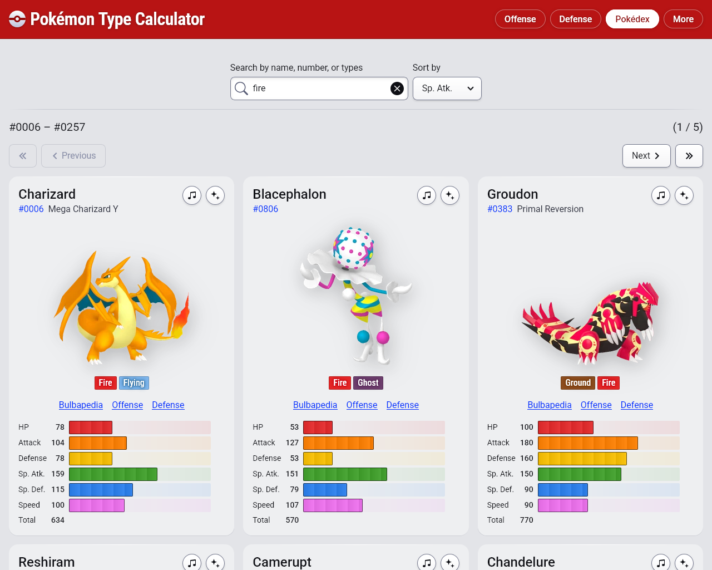
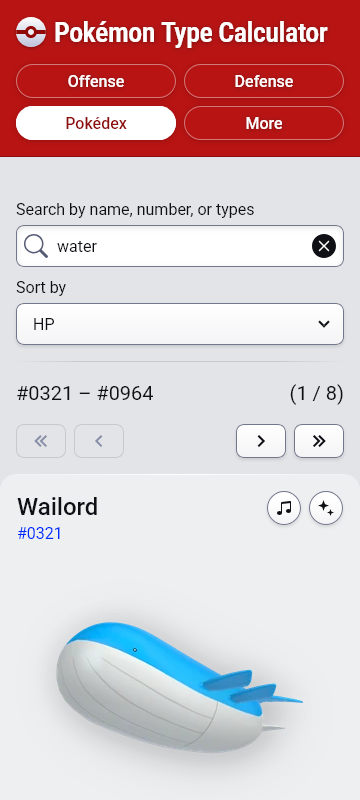

---

<figure>
  
  <figcaption>Defense (new)</figcaption>
</figure>

<figure>
  
  <figcaption>Defense (old)</figcaption>
</figure>

<figure>
  
  <figcaption>Pokédex (old)</figcaption>
</figure>

<figure>
  
  <figcaption>Pokédex (old)</figcaption>
</figure>

<figure>
  
  <figcaption>Sorting</figcaption>
</figure>

<figure>
  
  <figcaption>Dark mode (new)</figcaption>
</figure>

- Dark mode is even darker than before

- Night mode still exists, but this was in service of making the buttons pop

- A fun gradient on the empty progress bars which helps indicate what that area
  will do

---

See [the changes](https://github.com/wavebeem/pkmn.help/pull/329) for yourself
in the pull request.
