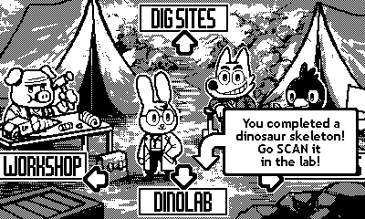
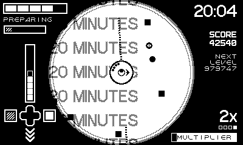
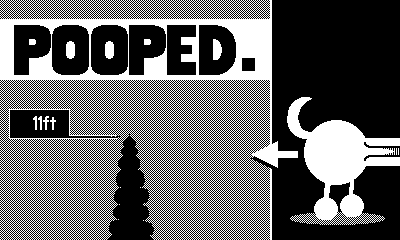
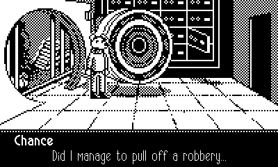

## Overview

[12 games for $39](https://play.date/games/seasons/two/).

## Dig Dig Dino!

<figure>
  
</figure>

A simple game with some minor UX problems that hold it back from perfection.

## Fulcrum Defender

<figure>
  
</figure>

A relaxing shmup. I need to revisit this with the new difficulty options.

## Long Puppy

<figure>
  
  
</figure>

A super weird game that makes good use of the crank. Like Katamari, this game is
more fun with time limits turned off.

## Chance's Lucky Escape

<figure>
  
</figure>

Maybe the easiest point and click adventure game I've played, but the pacing and
writing is great. I had a lot of fun with this one. I played it almost nonstop
until completion.

## Other Games

### Wheelsprung

...

### The Whiteout

...

### Otto's Galactic Groove

...

### Shadowgate PD

...

### CatchaDiablos

...

### Tiny Turnip

...

### Black Hole Havoc

...

### Taria & Como

...

...

### Blippo+

...

## Final Thoughts

...
