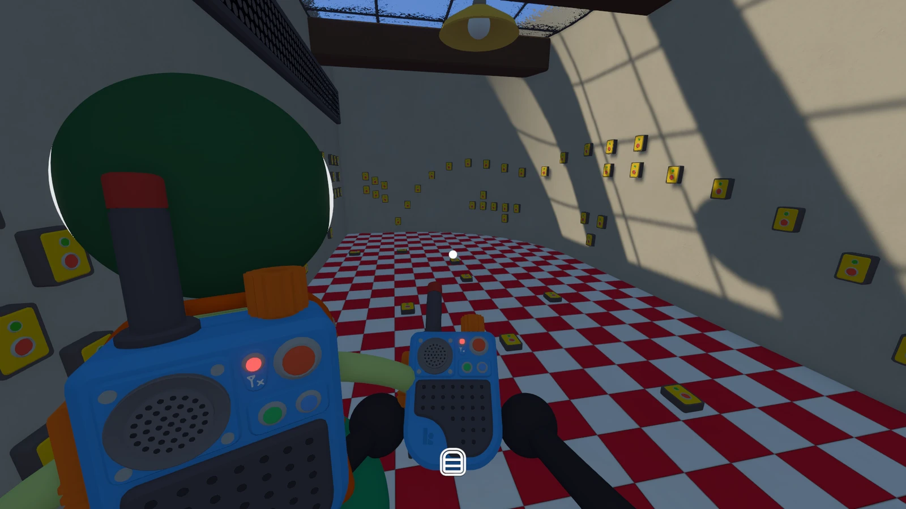

wow, what a game. i guess i could raise a few complaints if i had to. some
puzzles in 4 player mode really only required 2 people---which could lead to
feeling left out.

absurdly charming. really fun to explore. interesting puzzles with real
cooperation. silly. a sense of wonder. i haven't felt this level of deep
emotional response playing a game in a long time. what an incredibly special way
to spend ~20 hours with some friends.

the little characters are so cute and i love the minimalist
customiztion/styling.

<figure>
  
  <figcaption>we all picked fun color schemes for our little guys</figcaption>
</figure>

<figure>
  
  <figcaption>babe its 4pm, guzzling girl juice, transgender ideology 2</figcaption>
</figure>

<figure>
  
  <figcaption>puzzles were not this visually overwhelming on average, to be clear</figcaption>
</figure>

<figure>
  
  <figcaption>what a beautiful area to explore...</figcaption>
</figure>

<figure>
  
  <figcaption>sleeping on the train with friends :)</figcaption>
</figure>
