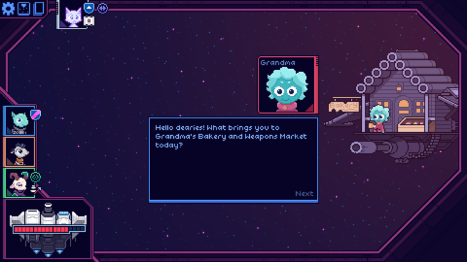
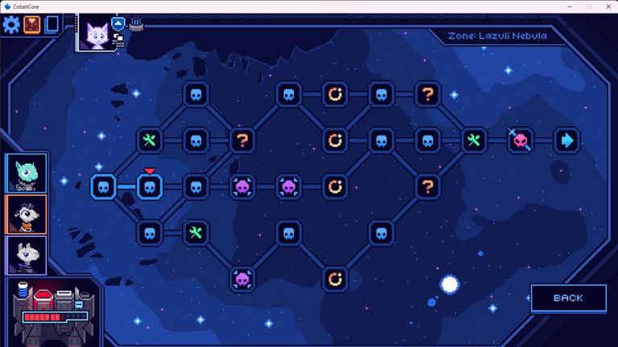
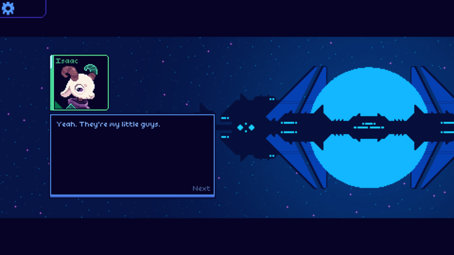
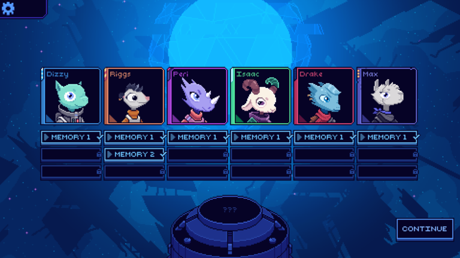
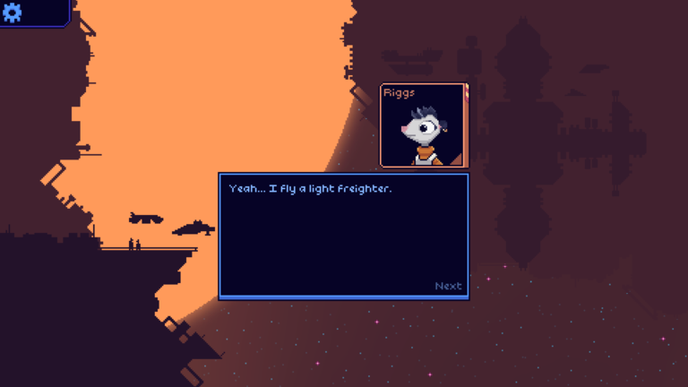
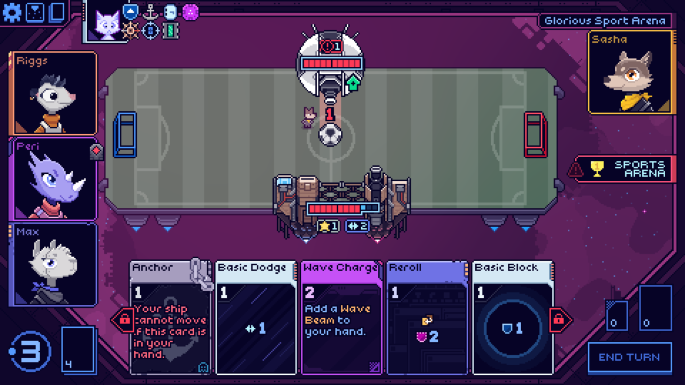
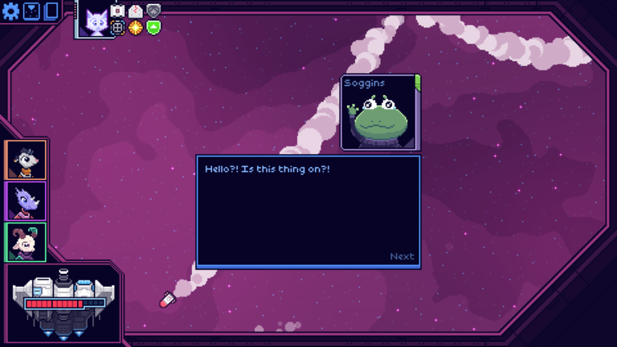
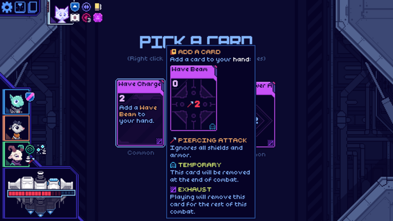

<video src="./gameplay.mp4" width="1280" height="720" controls preload></video>

**A short gameplay example. I wasn't trying very hard, I just wanted to go fast.
Love the music.**

**Grandma is one of many silly characters you'll find at the random events on
the map**

**Each run has you complete three maps with basically the same boss fights each
time**

**Isaac is the cutest character in the game, but I didn't love his playstyle**

**Each run you unlock one memory for one character in your party**

**Riggs has the best writing and is my favorite character in the game**

**Memories play out as short cut scenes**

**You can even play soccer in one of the random encounters by shooting the ball
towards the goal**

**Soggins is one of the funniest characters you encounter, and has a really
unique "battle" mechanic**

**OMG WAVE BEAM MENTIONED (also this card was quite good)**
