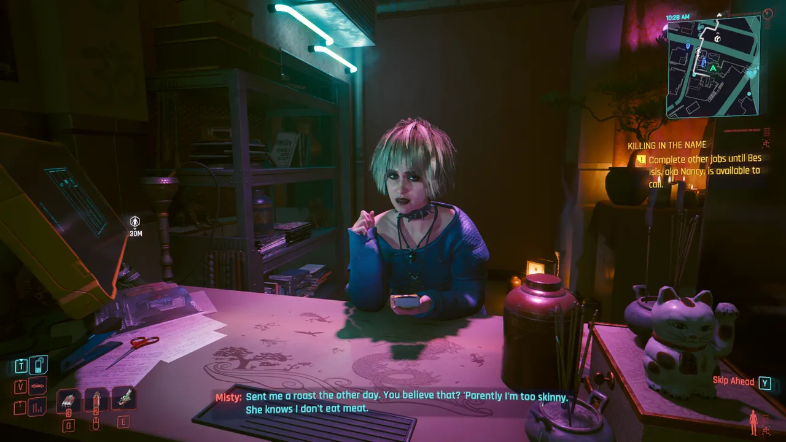

TODO

<figure>
  
  <figcaption>Playing roulette with sexy French criminal Aurore.</figcaption>
</figure>

<figure>
  
  <figcaption>Hanako Arasaka making V a terrible offer.</figcaption>
</figure>

<figure>
  
  <figcaption>My beloved Judy Álvarez...</figcaption>
</figure>

<figure>
  
  <figcaption>Militech mommy Meredith stepped all over my V in negotations...</figcaption>
</figure>

<figure>
  
  <figcaption>Misty the mystic confiding about her new relationship with Mama Welles.</figcaption>
</figure>

<figure>
  
  <figcaption>Johnny Silverhand's old friend Rogue.</figcaption>
</figure>

<figure>
  
  <figcaption>Solomon Reed (Idris Elba) plays a sleeper agent with a dark past.</figcaption>
</figure>

<figure>
  
  <figcaption>Songbird welcomes you to the Phantom Liberty DLC, and she captured my heart by its conclusion...</figcaption>
</figure>

<figure>
  
  <figcaption>Kerry Eurodyne's mission with the Us Cracks must've been inspired by Rob Zombie touring with Baby Metal.</figcaption>
</figure>
