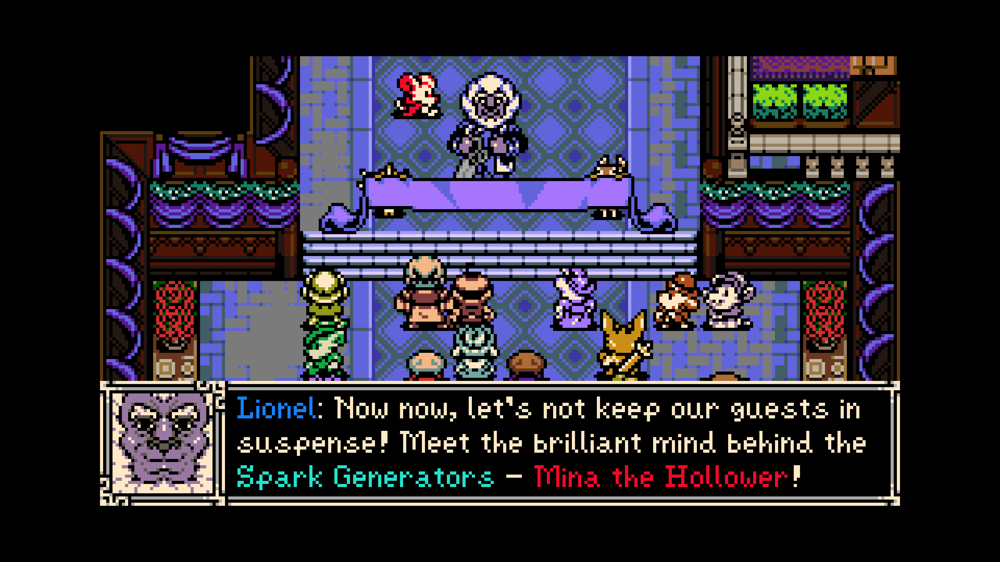
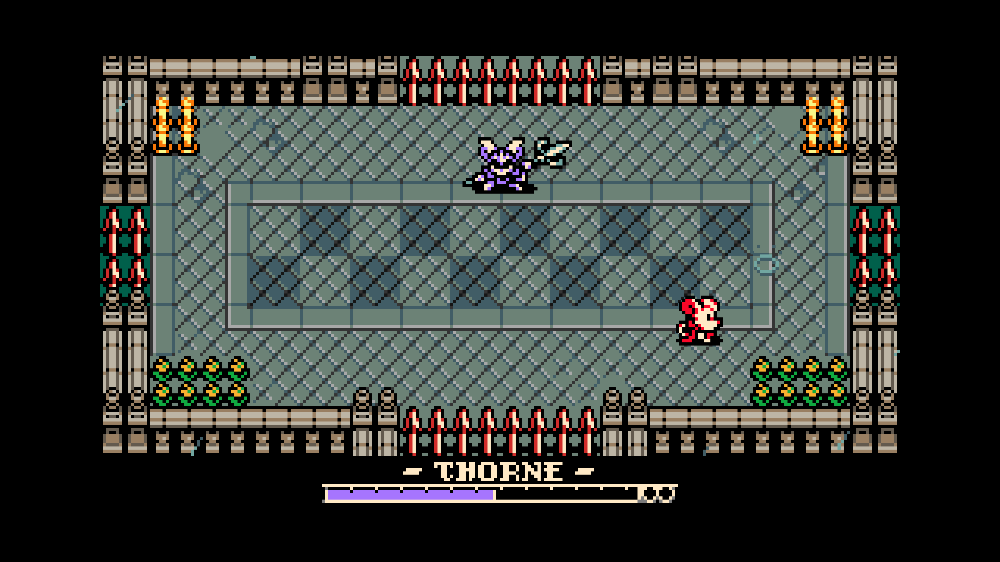
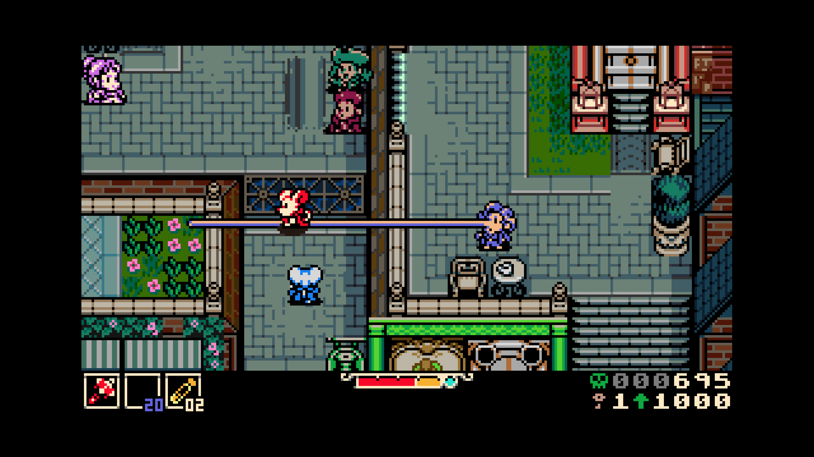
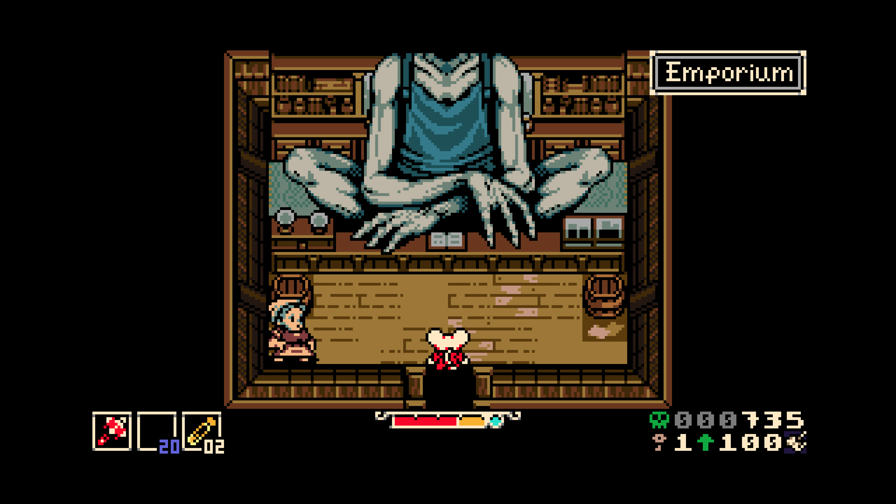

I'm sick to bastard death of games taking inspiration from Dark Souls,
Bloodborne, and Sekiro. FromSoftware has seemingly put a curse on indie devs to
be unable to take a breath without thinking about parries, corpse runs,
multi-stage boss fights, and enemy rich level design where the best strategy is
to just run away like you're in a slasher film.

I should clarify that I actually loved Dark Souls and Bloodborne. I ultimately
disliked Sekiro, but I "put it down" multiple times before giving up one last
time on Sword Saint Isshin.

The analogy I'm going with on this right now is that indie devs seem to think
they're creating the new "peanut butter & jelly sandwich" every time their
genius level intellects dares to combine aspects of disparate games into one
whole. But all too often I feel like they've actually invented the "peanut
butter & sardines" sandwich. And I like sardines! But they have a time and a
place: nowhere near peanut butter, and clearly advertised.

This game's greatest sin to me is looking like it's a love letter to Game Boy
Color era Zelda titles, but playing like something else entirely. And the
graphics are nearly immaculate. The sprite work flooded me with emotions. Though
it does have the minor annoyance of plotting the upscaled pixel art on a native
resolution-sized canvas, causing pixel misalignment issues as you move. But such
sins are forgivable.

---

I almost loved Hollow Knight when I played it, but its bloated influence from
Dark Souls left a sour taste in my mouth. The Castlevania formula I love,
tainted by a game I no longer have the patience for.

The funniest part about this game giving Zelda vibes but then revealing itself
to be severely Souls-like with a heaping portion of ill-advised platforming
is... it's not even the first game I've played with this exact issue. About a
year ago, [Pipistrello and the Cursed Yoyo](/blog/2025/review-pipistrello/) had
me declaring it a game with an identity crisis.

The specifics of Pipistrello vs Mina are quite different, yet my Pros & Cons
list would look very similar at a high level.

It's a real shame I didn't like this game, because I loved Shovel Knight. And
I'm not even much of a Mega Man fan. And just like Shovel Knight, Jake Kaufman
(virt) laid down a masterful soundtrack to enjoy.

---

I'm shelving this game after 6 hours. I beat the tutorial boss three times (once
with each starting weapon), the second mandatory boss, and finished the first(?)
dungeon.

The first two bosses felt like absolute damage sponges, despite me dumping
almost every point into attack. If you're meant to avoid damage through good
positioning, then you sure are awfully slow compared to enemies, with a low
attack range. If you're meant to avoid damage through the "burrowing"
mechanic... well... you have to jump _then_ dive to use it, which means you need
to be a second ahead of the boss. This only really works if you're playing 100%
defensively, since weapon animations make you too sluggish to respond in time
with your burrow.

I only tackled the third boss with cheat codes on ("modifiers" as they're called
in game), a system that generally marks your save file as tainted and disables
achievements. I kept the bosses at full HP and despite my _maximum attack stat_
I was still shocked at how much health the first dungeon boss had. **AND THEN**
it rose from the dead with a new health bar to mark its second form. I laugh
thinking about it.

I hope you don't like puzzles in your Zelda-like, because this game seems to
have eschewed puzzles in favor of platforming. Yes, fucking _platforming_ in a
top down 2D game. It's just as hard to discern as you might imagine. Sure, a few
games had you use Roc's Feather / Roc's Cape to platform, but this is a lot
tougher. And the level designers were _not_ shy about adding a healthy scoop of
enemies on top of your platforming.

Zelda's "Small Keys" have an analogue here with "Kears", but their application
is global---you can take a Kear found in any area and use it for any lock in the
entire game. So rather than having a dungeon you carefully unlock piece by
piece, it's just a stupid currency used to gate you out of global exploration.

Speaking of level design, I was shocked to discover that even non-dungeon areas
are absolutely crawling with monsters. And they're often so strong that the only
reasonable choice is to run away and hope they don't kill you. If you're unlucky
enough to fall to an enemy, they often _steal all your "bones"_ (that's what
your "souls" currency is called here) and hold them hostage, waiting for you to
come back and kill them. Yeah, like they'll grab the bones off the ground so you
can't just run by and get them back.

Each screen is densely populated with enemies, to the point of making the pacing
exhausting. And to make matters worse, there's no map in this game! (Aside:
Apparently you can get a high level "island map" but that's not the same thing).

Healing is probably the worst aspect of this game, though. You have "vials"
which need to be filled with "plasma" to heal. You generate plasma primarily by
damaging enemies. Sure, in Bloodborne you had the "rally" system where attacking
enemies could leech some of your health back, but that was _on top_ of having
straight up healing, not instead of it. Brutal. At least you don't have to grind
for vials in this game like Bloodborne. You do get them back every time you rest
in your burrow (this game's "bonfire").

Classic Castlevania-style subweapons exist as "sidearms" in this game, but I
spent nearly the entire 6 hours with no sidearm because its lost upon death, and
only found in the environment in hidden locations.

Apparently the "trinkets" (equippable items, a la Hollow Knight) can make the
game quite a lot easier, but I hadn't found any meaningful ones before I hung up
my hat on this game.

I'm also fatigued about "leveling up" as a concept in non-RPG games. Zelda and
Metroid use carefully placed secrets to reward your curiosity with extra power.
This game only rewards your skill in combat/persistence with additional combat
prowess.

---

I've seen a lot of people hail the extremely high amount of "modifiers" you can
use to enable an easier (OR harder!) game experience as the perfect way to
balance this game for everyone. I would like these people to consider that
making a game more forgiving of failure is a cheap way of making a game easier.

Imagine a boss can move incredibly quickly, has a jump attack, a feint, and a
ground pound with a massive radius. A move set like this might be a severe
challenge depending on what your character is like. And simply papering over it
with modifiers to give yourself more health, or the boss less, doesn't make the
encounter meaningfully different. An actual "easier" game might have tuned the
boss to move slower, shrunk their attack radius, or removed the feint from their
arsenal. Making me fight the exact same cracked out boss but with twice as many
mistakes allowed feels... hollow (haha).

If you like this game: great! I'm happy for you. My "Dark Souls" era is
extremely over, and I'm lamenting another game that's so lovingly crafted but
filled with decisions I dislike.

<figure>
  
  <figcaption>They said the name of the game!</figcaption>
</figure>

<figure>
  
  <figcaption>The second boss was a skin-of-my-teeth victory.</figcaption>
</figure>

<figure>
  
  <figcaption>A cute/weird guy with a tedious game mechanic.</figcaption>
</figure>

<figure>
  
  <figcaption>He literally breaks a hole in his roof to wave at you.</figcaption>
</figure>
