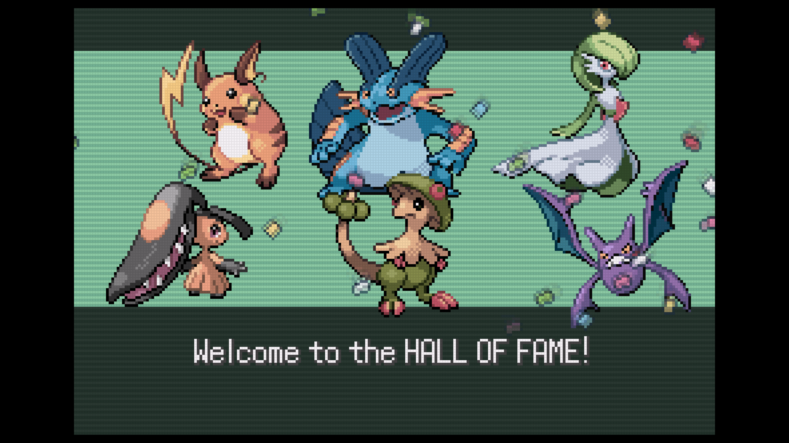
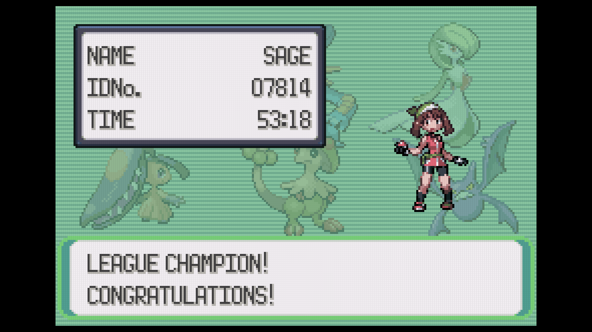

i grew up with pokemon blue version as pokemania was hitting the US. so i can't
rate that fully objectively. but i played both gen2 and gen3 for the first time
as an adult, within the last couple years. so i feel like i can give a less
biased review to those.

whereas pokemon crystal blew me away with how well it held up, emerald just
felt... like an unfinished product to me. the art is just... dopey? obviously it
has more colors, more stuff on screen, etc compared to crystal but... it just
sort of looks off to me? like the pokemon sprites are pretty good, but its right
when the series started to solidify every monster as these perfect objects that
never changed again. which is sad. and more importantl, GOD do the NPCs just
look really awful in this game. particularly the overworld sprites.

music was good, but i prefer the gen1-2 chiptune vibe.

they tried to do something in this game to make it less linear, but honestly i
just didn't care for it at all. it just feels like a lot of meaningless
wandering and backtracking to get through the elite 4 in this game. also, god i
did not care at ALL about team magma was team aqua. they all talked so much and
kept saying the most obnoxious stuff like "haha im gonna blow up a volcano
because its epic" like ok dude w/e can i keep playing pokemon? at least team
rocket was like "im doing crimes lol" these guys are just supervillain idiots.

there's something to be said for gen2 introducing a bunch of boring "its just a
bird" and "its just an octopus" type monsters. gen3 is a bit better about the
creativity, but certainly has its share of stinkers. worse, though, is the
really cool guys they added that feel like complete trash to use. luckily i
didnt suffer with mawile very long, but it was complete dead weight against the
elite 4 after i scooped it up on victory road to replace my HM mule. and wtf
Gardevoir was juice not worth the squeeze.

speaking of HMs, god are they miserable in this game. there's an absolutely
absurd amount. i mean, 3 water HMs to beat the game? give me a freaking break.

gen3 adding abilities and double battles are both obviously huge milestones for
making pokemon battles more interesting... but i just couldn't really get into
this game that much as an RPG compared to crystal.

<figure>
  
  <figcaption>raichu, swampert, gardevoir, mawile, breloom, crobat</figcaption>
</figure>

<figure>
  
  <figcaption>53 hours 18 minutes to complete</figcaption>
</figure>
