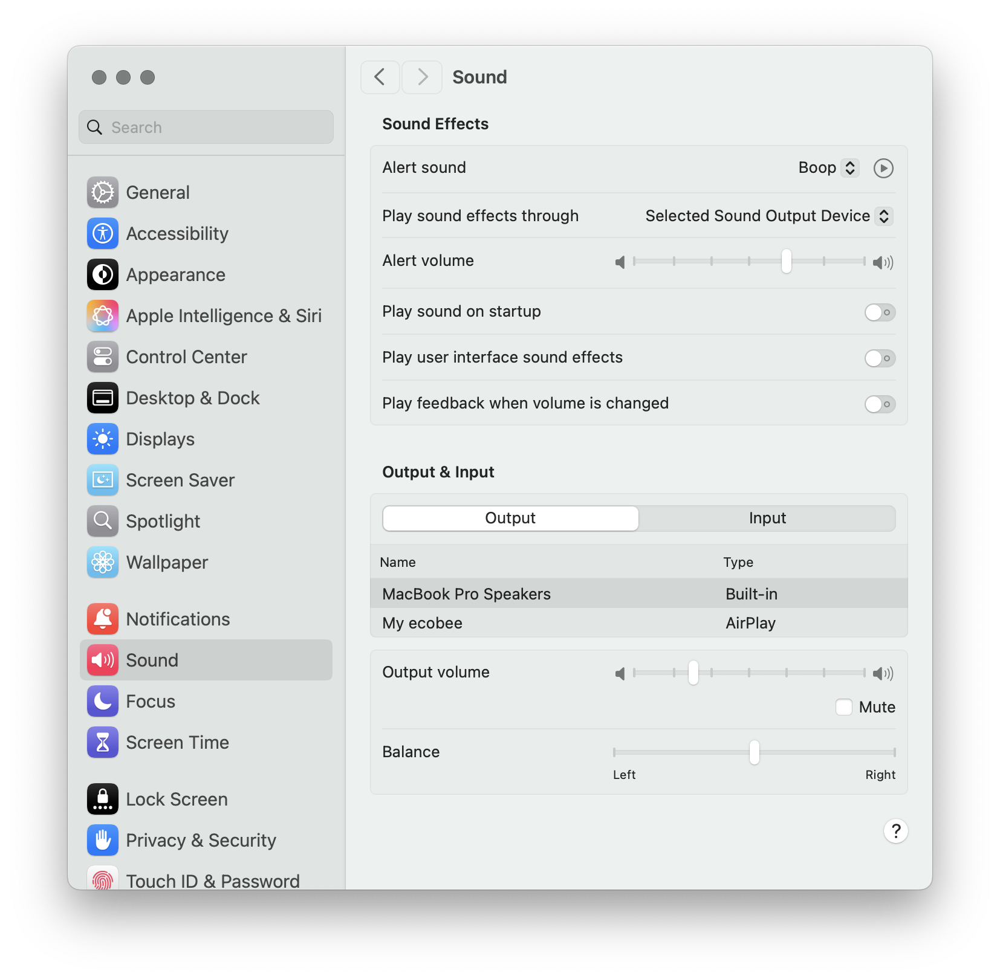
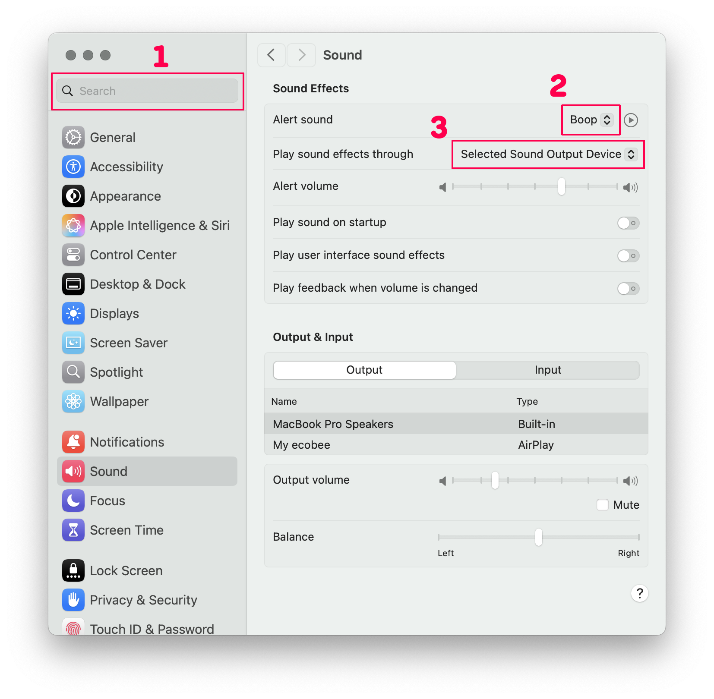
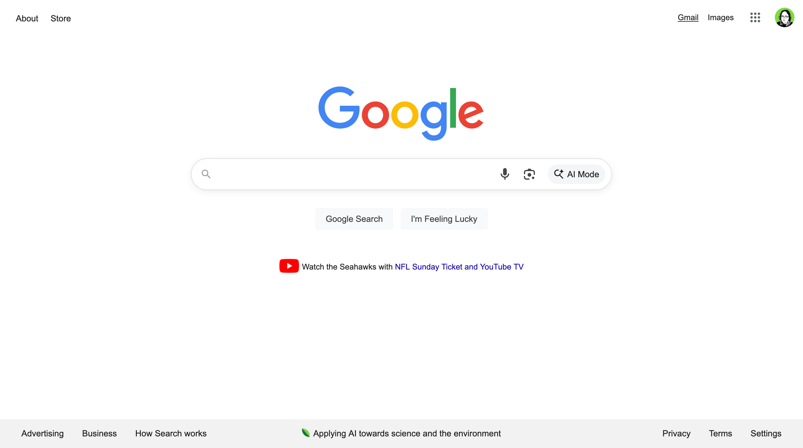
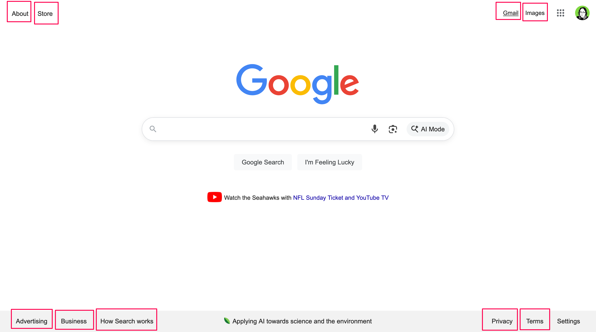
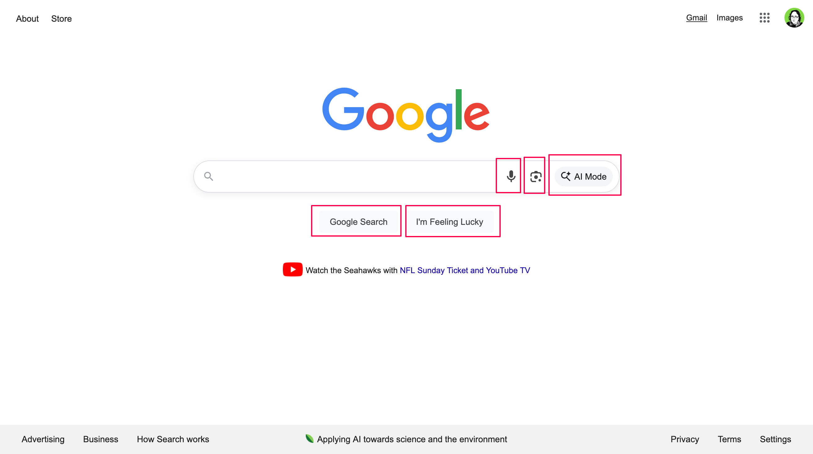
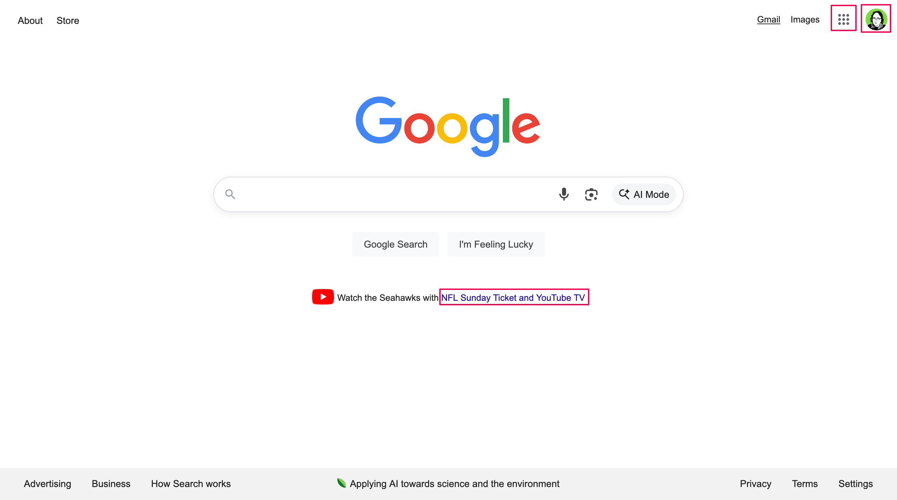

## What's the Problem?

Changing the CSS
[cursor](https://developer.mozilla.org/en-US/docs/Web/CSS/cursor) property is
ugly, distracting, and causes issues determining which page elements are links.

### Bad Example

  <wavebeem-blog-finger-bad>Loading...</wavebeem-blog-finger-bad>

### Good Example

  <wavebeem-blog-finger-good>Loading...</wavebeem-blog-finger-good>

## What If My Users Get Confused About What They Can Click?

Make your buttons look more buttony. I'm not kidding. Not only is this the right
solution on desktop, it's the _only_ solution on mobile. There are no hover
states or cursors on mobile.

It's not a bad idea to add a hover state on desktop, but it's _totally
optional_. And it should be _subtle_ when you do it. Don't go from white to
black, or other high contrast changes. Ideally don't change size either. Even a
very subtle background color change is plenty, like 1-2% lightness difference.
And don't animate hover styles! It makes the UI feel laggy and unresponsive.

## macOS Hover Appearance

Let's start by examining familiar desktop interfaces and their hover styles.

<figure>
  
  <figcaption>macOS System Preferences (Sequoia 15.6.1)</figcaption>
</figure>

<figure>
  
  <figcaption>(1) text cursor; (2, 3) regular select background on hover</figcaption>
</figure>

macOS barely uses any hover effects, including alternate cursors. In the System
Preferences app, only text fields (1) and "ghost" selects (2, 3) have any visual
change on hover.

And yet... do you have a hard time figuring out what's clickable in this app? I
generally don't. I think this interface is far from a paragon of good design
(that's a different post), but it gets the job done.

## Even google.com Doesn't Do It Right

<figure>
  
  <figcaption>google.com</figcaption>
</figure>

<figure>
  
  <figcaption>google.com: links</figcaption>
</figure>

These elements are truly links. You click them, and your browser navigates to a
new page. All of the various ways of opening links works here: left click, right
click + open in new tab, control-click, command-click, and long-press.

<figure>
  
  <figcaption>google.com: buttons</figcaption>
</figure>

These elements are buttons... mostly. Clicking them performs an action, such as
submitting your search query... well, except for the microphone icon (voice
search) and the camera icon (image search)... those just take you to new pages
in a way that could be done with a link. Oops!

<figure>
  
  <figcaption>google.com: failed links that act like buttons</figcaption>
</figure>

These two strange links in the top right seem like failed instances of
[progressive enhancement](https://en.wikipedia.org/wiki/Progressive_enhancement):
if JavaScript weren't present, they would link you to... somewhat related pages
to accomplish your task. However, upon closer inspection... they are poor
substitutes. The "apps" menu takes you to a
[Google promotional page](https://about.google/products/) that doesn't take into
account your user settings. And the account menu is even worse: if you follow
the link... you just get an account switcher page! When JavaScript is present,
you get a settings menu, and links to other related pages.

Both of these links have the `pointer` cursor, but they shouldn't really be
links. You can right click and open these links in a new tab, but
command-clicking uses the JavaScript menu functionality added to them instead.

The NFL link in the center of the page? It's inexplicably an `<a>` tag
completely missing an `href`, despite that it seems to merely navigate the page
on click.

## When Should I Use the Pointer Cursor?

I think that the CSS
[cursor](https://developer.mozilla.org/en-US/docs/Web/CSS/cursor) property
should almost never be set. If something is a link, it should use the
[anchor element](https://developer.mozilla.org/en-US/docs/Web/HTML/Reference/Elements/a)
(`<a>`), which gets this cursor automatically when `href` is set as well.

### Links

Links should generally take you to a new page (using HTTP GET) automatically by
virtue of their markup (`<a href="...">`). Links cause the browser's URL to
change.

### Buttons

Buttons may either modify the existing page (e.g. open a modal dialog) or submit
a form. The form may result in a new page loading (typically by issuing an HTTP
POST request).

While a button could be used to call `location.href = "..."` to navigate the
page... this isn't an ideal use of a button, since links already do this job
better.

### Progressive Enhancement

For progressively enhanced web pages, it can be desirable to have a link to a
different page upgrade to a button that performs an on-page action.

In this case, the initial HTML should be `<a href="fallback-page">`, and the JS
would ideally replace this with a `<button>` tag. If it's challenging to replace
the link with a button, you could _remove_ the `href` and attach the click
listener... but you run the risk of confusing people with the slightly different
keyboard behavior of links and buttons (buttons activate on Space OR Enter, but
links only activate on Enter).

### What About Links That Look Like Buttons?

They're still links. If it's an `<a href="...">`, just leave the default pointer
cursor on it. This communicates that it can still be opened in a new tab, or
copied as a link. The only issue here is that a keyboard user might try to
activate the link with Space, which only works on buttons. You could add a
[keydown](https://developer.mozilla.org/en-US/docs/Web/API/Element/keydown_event)
listener, but I'm not sure if that's a best practice.

### What About Buttons That Look Like Links?

Definitely don't put the cursor pointer on these! I think these sorts of
elements should make their functionality obvious by placement or text content.
Making this text blue or underlined can confuse people into treating it like a
link.
